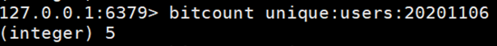
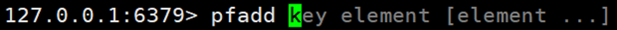

# 一、相关知识

Redis是单线程+多路IO复用技术

多路复用是指使用一个线程来检查多个文件描述符（Socket）的就绪状态，比如调用select和poll函数，传入多个文件描述符，如果有一个文件描述符就绪，则返回，否则阻塞直到超时。得到就绪状态后进行真正的操作可以在同一个线程里执行，也可以启动线程执行（比如使用线程池）

# 二、常用五大数据类型

查看常见 redis 操作命令

http://www.redis.cn/commands.html

## 2.1 键（key）

### 2.1.1 常见命令

`keys *` 查看当前库所有key  (匹配：keys *1)

`set k1 mary` k1为键，mary为值

`exists key` 判断某个key是否存在

`type key` 查看你的key是什么类型

`del key` 删除指定的key数据

`unlink key`  根据value选择非阻塞删除。仅将keys从keyspace元数据中删除，真正的删除会在后续异步操作。

`expire key 10`  10秒钟：为给定的key设置过期时间

`ttl key` 查看还有多少秒过期，-1表示永不过期，-2表示已过期

`select` 命令切换数据库

`dbsize` 查看当前数据库的key的数量

`flushdb` 清空当前库

`flushall` 通杀全部库

## 2.2 字符串（String）

String类型是Redis最基本的数据类型，一个Redis中字符串value最多可以是512M

### 2.2.1 常见命令

`set <key><value>`添加键值对

> *NX：当数据库中key不存在时，可以将key-value添加数据库
>
> *XX：当数据库中key存在时，可以将key-value添加数据库，与NX参数互斥
>
> *EX：key的超时秒数
>
> *PX：key的超时毫秒数，与EX互斥
>
> 相同的key，会覆盖

`get  <key>`查询对应键值

`append <key><value>`将给定的`<value>`追加到原值的末尾

`strlen <key>`获得值的长度

`setnx <key><value>`只有在 key 不存在时，设置 key 的值（不能做覆盖）

`incr <key>` 将 key 中储存的数字值增1，只能对数字值操作，如果为空，新增值为1

`decr <key>` 将 key 中储存的数字值减1，只能对数字值操作，如果为空，新增值为-1

`incrby / decrby  <key><步长>` 将 key 中储存的数字值增减。自定义步长。

> 所谓**原子**操作是指不会被线程调度机制打断的操作；
>
> 这种操作一旦开始，就一直运行到结束，中间不会有任何 context switch （切换到另一个线程）。
>
> （1）在单线程中， 能够在单条指令中完成的操作都可以认为是"原子操作"，因为中断只能发生于指令之间。
>
> （2）在多线程中，不能被其它进程（线程）打断的操作就叫原子操作。Redis单命令的原子性主要得益于Redis的单线程。

`mset <key1><value1><key2><value2> ..... ` 同时设置一个或多个 key-value对 

`mget <key1><key2><key3> .....` 同时获取一个或多个 value 

`msetnx <key1><value1><key2><value2> ..... ` 同时设置一个或多个 key-value 对，当且仅当所有给定 key 都不存在。

**原子性，有一个失败则都失败**

`getrange <key><起始位置><结束位置>` 获得值的范围，类似java中的substring，**前包，后包**

`setrange  <key><起始位置><value>` 用 `<value>` 覆写`<key>`所储存的字符串值，从<起始位置>开始(**索引从0开始**)。

`setex <key><过期时间><value>` 设置键值的同时，设置过期时间，单位秒。

`getset <key><value>` 以新换旧，设置了新值同时获得旧值。

### 2.2.2 数据结构

String的数据结构为**简单动态字符串**(Simple Dynamic String,缩写SDS)。是可以修改的字符串，内部结构实现上类似于Java的ArrayList，采用预分配冗余空间的方式来减少内存的频繁分配.


如图中所示，内部为当前字符串实际分配的空间capacity一般要高于实际字符串长度len。当字符串长度小于1M时，扩容都是**加倍现有的空间**，如果超过1M，**扩容时一次只会多扩1M的空间。需要注意的是字符串最大长度为512M。**

## 2.3 列表（List）

**单键多值**

Redis 列表是简单的字符串列表，按照插入顺序排序。你可以添加一个元素到列表的头部（左边）或者尾部（右边）。

它的**底层实际是个双向链表**，对两端的操作性能很高，通过索引下标的操作中间的节点性能会较差。

### 2.3.1 常见命令

`push/rpush <key><value1><value2><value3> ....` 从左边/右边插入一个或多个值。

`lpop/rpop <key>` 从左边/右边吐出一个值。值在键在，值光键亡。

`rpoplpush <key1><key2>`从`<key1>`列表右边吐出一个值，插到`<key2>`列表左边。

`lrange <key><start><stop>` 按照索引下标获得元素(从左到右)

`lrange mylist 0 -1`  0左边第一个，-1右边第一个，（0-1表示获取所有）

`lindex <key><index>` 按照索引下标获得元素(从左到右)

`llen <key>` 获得列表长度

`linsert <key> before <value><newvalue>`在`<value>`的前面插入`<newvalue>`插入值

`lrem <key><n><value>`从左边删除n个value(从左到右)

`lset<key><index><value>`将列表key下标为index的值替换成value

### 2.3.2 数据结构

List的数据结构为**快速链表quickList**。

首先在**列表元素较少的情况下会使用一块连续的内存存储**，这个结构是**ziplist**，也即是压缩列表。

它将所有的元素紧挨着一起存储，分配的是一块连续的内存。

**当数据量比较多的时候才会改成quicklist**。

因为**普通的链表需要的附加指针空间太大，会比较浪费空间**。比如这个列表里存的只是int类型的数据，结构上还需要两个额外的指针prev和next。


**Redis将链表和ziplist结合起来组成了quicklist。也就是将多个ziplist使用双向指针串起来使用**。这样既满足了快速的插入删除性能，又不会出现太大的空间冗余。

## 2.4 集合（Set）

Redis set对外提供的功能与list类似是一个列表的功能，特殊之处在于set是可以**自动排重**的，当你需要存储一个列表数据，又不希望出现重复数据时，set是一个很好的选择，并且set提供了判断某个成员是否在一个set集合内的重要接口，这个也是list所不能提供的。 

Redis的Set是string类型的无序集合。它底层其实是一个value为null的hash表，所以添加，删除，查找的**复杂度都是O(1)**。Field记录值，后面的zset value记录分数。

一个算法，随着数据的增加，执行时间的长短，如果是O(1)，数据增加，查找数据的时间不变

### 2.4.1 常用命令

`sadd <key><value1><value2> .....` 将一个或多个 member 元素加入到集合 key 中，已经存在的 member 元素将被忽略

`smembers <key>` 取出该集合的所有值。

`sismember <key><value>`判断集合`<key>`是否为含有该`<value>`值，有1，没有0

`scard<key>`返回该集合的元素个数。

`srem <key><value1><value2> ....` 删除集合中的某个元素。

`spop <key>`**随机从该集合中吐出一个值。**

`srandmember <key><n>`随机从该集合中取出n个值。不会从集合中删除 。

`smove <source><destination>value`把集合中一个值从一个集合移动到另一个集合

`sinter <key1><key2>`返回两个集合的交集元素。

`sunion <key1><key2>`返回两个集合的并集元素。

`sdiff <key1><key2>`返回两个集合的**差集**元素(key1中的，不包含key2中的)

### 2.4.2 数据结构

Set数据结构是dict字典，字典是用哈希表实现的。

Java中HashSet的内部实现使用的是HashMap，只不过所有的value都指向同一个对象。Redis的set结构也是一样，它的内部也使用hash结构，所有的value都指向同一个内部值。

## 2.5 哈希（Hash）

Redis hash 是一个键值对集合。

Redis hash是一个string类型的**field**和**value**的映射表，hash特别适合用于存储对象。

类似Java里面的Map<String,Object>

### 2.5.1 常见命令

`hset <key><field><value>`给`<key>`集合中的 `<field>`键赋值`<value>`

`hget <key1><field>`从`<key1>`集合`<field>`取出 value 

`hmset <key1><field1><value1><field2><value2>...` 批量设置hash的值

`hexists<key1><field>`查看哈希表 key 中，给定域 field 是否存在。 

`hkeys <key>`列出该hash集合的所有field

`hvals <key>`列出该hash集合的所有value

`hincrby <key><field><increment>`为哈希表 key 中的域 field 的值加上增量 1  -1

`hsetnx <key><field><value>`将哈希表 key 中的域 field 的值设置为 value ，当且仅当域 field 不存在 

### 2.5.2 数据结构

Hash类型对应的数据结构是两种：**ziplist（压缩列表）**，**hashtable（哈希表）**。当field-value长度较短且个数较少时，使用ziplist，否则使用hashtable。

## **2.6 有序集合Zset（sorted set）** 

Redis**有序集合zset**与**普通集合set非常相似，是一个没有重复元素的字符串集合**。

不同之处是有序集合的每个成员都关联了一个**评分（score）**,这个评分（score）被用来按照从最低分到最高分的方式排序集合中的成员。集合的成员是唯一的，但是评分可以是重复了 。

因为元素是有序的, 所以你也可以很快的根据评分（score）或者次序（position）来获取一个范围的元素。

访问有序集合的中间元素也是非常快的,因此你能够使用有序集合作为一个没有重复成员的智能列表。

### 2.6.1 常见命令

`zadd <key><score1><value1><score2><value2>…` 将一个或多个 member 元素及其 score 值加入到有序集 key 当中。

`zrange <key><start><stop> [WITHSCORES]` 返回有序集 key 中，下标在`<start><stop>`之间的元素，带`WITHSCORES`，可以让分数一起和值返回到结果集。

`zrangebyscore key minmax [withscores] [limit offset count]`

返回有序集 key 中，所有 score 值介于 min 和 max 之间(包括等于 min 或 max )的成员。有序集成员按 score 值递增(从小到大)次序排列。 

`zrevrangebyscore key maxmin [withscores] [limit offset count]` 同上，改为从大到小排列。

`zincrby <key><increment><value>`  为元素的score加上增量

`zrem <key><value>` 删除该集合下，指定值的元素

`zcount <key><min><max>` 统计该集合，分数区间内的元素个数 

`zrank <key><value>` 返回该值在集合中的排名，从0开始。

### 2.6.2 数据结构

SortedSet(zset)是Redis提供的一个非常特别的数据结构，**一方面它等价于Java的数据结构Map<String, Double>**，可以给**每一个元素value赋予一个权重score**，另一方面它又类似于**TreeSet**，内部的元素会按照权重score进行排序，可以得到每个元素的名次，还可以通过score的范围来获取元素的列表。

zset底层使用了两个数据结构

（1）hash，**hash的作用就是关联元素value和权重score**，保障元素value的唯一性，可以通过元素value找到相应的score值。

（2）跳跃表，**跳跃表的目的在于给元素value排序，根据score的范围获取元素列表**。

### 2.6.3 跳跃表（跳表）

**Redis采用的是跳跃表。跳跃表效率堪比红黑树，实现远比红黑树简单。**

#### 1) 实例

对比有序链表和跳跃表，从链表中查询出51

（1）  有序链表


要查找值为51的元素，需要从第一个元素开始依次查找、比较才能找到。共需要6次比较。

（2）  跳跃表


从第2层开始，1节点比51节点小，向后比较。

21节点比51节点小，继续向后比较，后面就是NULL了，所以从21节点向下到第1层

在第1层，41节点比51节点小，继续向后，61节点比51节点大，所以从41向下

在第0层，51节点为要查找的节点，节点被找到，共查找4次。

# 三、Redis的发布和订阅

## 3.1 什么是发布和订阅

Redis 发布订阅 (pub/sub) 是一种消息通信模式：发送者 (pub) 发送消息，订阅者 (sub) 接收消息。

Redis 客户端可以订阅任意数量的频道。

## 3.2 Redis的发布和订阅

1、客户端可以订阅频道如下图


2、当给这个频道发布消息后，消息就会发送给订阅的客户端


## 3.3 发布订阅命令行实现

1、 打开一个客户端订阅channel1

​	**SUBSCRIBE channel1**

2、打开另一个客户端，给channel1发布消息hello

​	publish channel1 hello


​	返回的1是订阅者数量

3、打开第一个客户端可以看到发送的消息

​	

​	注：发布的消息没有持久化，如果在订阅的客户端收不到hello，只能收到订阅后发布的消息

# 四、Redis 新数据类型

## 4.1 Bitmaps

### 4.1.1 简介

现代计算机用二进制（位） 作为信息的基础单位， 1个字节等于8位， 例如“abc”字符串是由3个字节组成， 但实际在计算机存储时将其用二进制表示， “abc”分别对应的ASCII码分别是97、 98、 99， 对应的二进制分别是01100001、 01100010和01100011，如下图


合理地使用操作位能够有效地提高内存使用率和开发效率。

Redis提供了Bitmaps这个“数据类型”可以实现对位的操作：

（1）  Bitmaps本身不是一种数据类型， 实际上它就是字符串（key-value） ， 但是它可以对字符串的位进行操作。

（2）  Bitmaps单独提供了一套命令， 所以在Redis中使用Bitmaps和使用字符串的方法不太相同。 可以把Bitmaps想象成一个以位为单位的数组， 数组的每个单元只能存储0和1， 数组的下标在Bitmaps中叫做偏移量。


### 4.1.2 命令

1、setbit

（1）格式

`setbit<key><offset><value>`设置Bitmaps中某个偏移量的值（0或1）

           

*offset:偏移量从0开始

（2）实例

每个独立用户是否访问过网站存放在Bitmaps中， 将访问的用户记做1， 没有访问的用户记做0， 用偏移量作为用户的id。

设置键的第offset个位的值（从0算起） ， 假设现在有20个用户，userid=1， 6， 11， 15， 19的用户对网站进行了访问， 那么当前Bitmaps初始化结果如图


unique:users:20201106代表2020-11-06这天的独立访问用户的Bitmaps


注：很多应用的用户id以一个指定数字（例如10000） 开头， 直接将用户id和Bitmaps的偏移量对应势必会造成一定的浪费， 通常的做法是每次做setbit操作时将用户id减去这个指定数字。

在第一次初始化Bitmaps时， 假如偏移量非常大， 那么整个初始化过程执行会比较慢， 可能会造成Redis的阻塞。

2、getbit

（1）格式

`getbit<key><offset>`获取Bitmaps中某个偏移量的值


获取键的第offset位的值（从0开始算）

2）实例

获取id=8的用户是否在2020-11-06这天访问过， 返回0说明没有访问过：


注：因为100根本不存在，所以也是返回0

3、bitcount

统计**字符串**被设置为1的bit数。一般情况下，给定的整个字符串都会被进行计数，通过指定额外的 start 或 end 参数，可以让计数只在特定的位上进行。start 和 end 参数的设置，都可以使用负数值：比如 -1 表示最后一个位，而 -2 表示倒数第二个位，start、end 是指bit组的字节的下标数，二者皆包含。

1）格式

`bitcount<key>[start end]` 统计字符串从start字节到end字节比特值为1的数量

2）实例

计算2022-11-06这天的独立访问用户数量



start和end代表起始和结束字节数， 下面操作计算用户id在第1个字节到第3个字节之间的独立访问用户数， 对应的用户id是11， 15， 19。


4、bitop

(1)格式

bitop and(or/not/xor) <destkey> [key…]


bitop是一个复合操作， 它可以做多个Bitmaps的and（交集） 、 or（并集） 、 not（非） 、 xor（异或） 操作并将结果保存在destkey中。

(2)实例

```
2020-11-04 日访问网站的userid=1,2,5,9。
setbit unique:users:20201104 1 1
setbit unique:users:20201104 2 1
setbit unique:users:20201104 5 1
setbit unique:users:20201104 9 1

2020-11-03 日访问网站的userid=0,1,4,9。
setbit unique:users:20201103 0 1
setbit unique:users:20201103 1 1
setbit unique:users:20201103 4 1
setbit unique:users:20201103 9 1

计算出两天都访问过网站的用户数量
bitop and unique:users:and:20201104_03
unique:users:20201103unique:users:20201104
```


计算出任意一天都访问过网站的用户数量（例如月活跃就是类似这种），可以使用or求并集


## 4.2 HyperLogLog

### 4.2.1 简介

在工作当中，我们经常会遇到与统计相关的功能需求，**比如统计网站PV（PageView页面访问量）,可以使用Redis的incr、incrby轻松实现。**

但像UV（UniqueVisitor，独立访客）、独立IP数、搜索记录数等需要去重和计数的问题如何解决？这种求集合中不重复元素个数的问题称为基数问题。

解决基数问题有很多种方案：

（1）数据存储在MySQL表中，使用**distinct count计算不重复个数**

（2）**使用Redis提供的hash、set、bitmaps等数据结构来处理**

以上的方案结果精确，但随着数据不断增加，导致占用空间越来越大，对于非常大的数据集是不切实际的。

**能否能够降低一定的精度来平衡存储空间？Redis推出了HyperLogLog**

**Redis HyperLogLog 是用来做基数统计的算法**，HyperLogLog 的优点是，**在输入元素的数量或者体积非常非常大时，计算基数所需的空间总是固定的、并且是很小的。**

在 Redis 里面，每个 HyperLogLog 键只需要花费 12 KB 内存，就可以计算接近 2^64 个不同元素的基数。这和计算基数时，元素越多耗费内存就越多的集合形成鲜明对比。

但是，因为 HyperLogLog 只会根据输入元素来计算基数，而不会储存输入元素本身，所以HyperLogLog 不能像集合那样，返回输入的各个元素。

什么是基数?

比如数据集 {1, 3, 5, 7, 5, 7, 8}， 那么这个数据集的基数集为 {1, 3, 5 ,7, 8}, 基数(不重复元素)为5。 基数估计就是在误差可接受的范围内，快速计算基数。

### 4.2.2 命令

1、pfadd 

（1）格式

`pfadd <key>< element> [element ...]`  添加指定元素到 HyperLogLog 中



（2）实例


将所有元素添加到指定HyperLogLog数据结构中。如果执行命令后HLL估计的**近似基数发生变化，则返回1，否则返回0**。

2、pfcount

（1）格式

`pfcount<key> [key ...]` 计算HLL的近似基数，可以计算多个HLL，比如用HLL存储每天的UV，计算一周的UV可以使用7天的UV合并计算即可


（2）实例


3、pfmerge

（1）格式

`pfmerge<destkey><sourcekey> [sourcekey ...]` 将一个或多个HLL合并后的结果存储在另一个HLL中，比如每月活跃用户可以使用每天的活跃用户来合并计算可得


（2）实例


## 4.3. Geospatial

### 4.3.1 简介

**Redis 3.2 中增加了对GEO类型的支持。**GEO，Geographic，地理信息的缩写。该类型，就是元素的2维坐标，在地图上就是经纬度。redis基于该类型，**提供了经纬度设置，查询，范围查询，距离查询，经纬度Hash等常见操作**。

### 4.3.2 命令

1、geoadd

（1）格式

`geoadd<key>< longitude><latitude><member> [longitude latitude member...]`  添加地理位置（经度，纬度，名称）


（2）实例


两极无法直接添加，一般会下载城市数据，直接通过 Java 程序一次性导入。

有效的经度从 -180 度到 180 度。有效的纬度从 -85.05112878 度到 85.05112878 度。

当坐标位置超出指定范围时，该命令将会返回一个错误。

已经添加的数据，是无法再次往里面添加的。

2、geopos

（1）格式

`geopos <key><member> [member...]` 获得指定地区的坐标值


（2）实例


3、geodist

（1）格式

`geodist<key><member1><member2> [m|km|ft|mi ]` 获取两个位置之间的直线距离


（2）实例

获取两个位置之间的直线距离


> 单位：
>
> m 表示单位为米[默认值]。
>
> km 表示单位为千米。
>
> mi 表示单位为英里。
>
> ft 表示单位为英尺。
>
> 如果用户没有显式地指定单位参数， 那么 GEODIST 默认使用米作为单位

4、georadius

（1）格式

`georadius<key>< longitude><latitude>radius m|km|ft|mi`  以给定的经纬度为中心，找出某一半径内的元素


> 经度 纬度 距离 单位

（2）实例


# 五、Redis事务（锁机制，秒杀）

## 5.1 Redis 事务定义

**Redis事务的主要作用就是串联多个命令防止别的命令插队。**

## 5.2 Multi、Exec、discard

从**输入Multi命令开始**，输入的命令都会依次进入命令队列中，**但不会执行，直到输入Exec后**，Redis会将之前的命令队列中的命令依次执行。

组队的过程中可以通过discard来放弃组队。 


## 5.3 事务的错误处理

**组队中某个命令出现了报告错误，执行时整个的所有队列都会被取消。**


**如果执行阶段某个命令报出了错误，则只有报错的命令不会被执行，而其他的命令都会执行，不会回滚。**


## 5.4 事务冲突的问题

### 5.4.1 悲观锁


**悲观锁(Pessimistic Lock)**, 顾名思义，就是很悲观，每次去拿数据的时候都认为别人会修改，所以每次在拿数据的时候都会上锁，这样别人想拿这个数据就会block直到它拿到锁。**传统的关系型数据库里边就用到了很多这种锁机制**，比如**行锁**，**表锁**等，**读锁**，**写锁**等，都是在做操作之前先上锁。

我一旦拿到它就上锁！别人都拿不到！也没法读

### 5.4.2 乐观锁


**乐观锁(Optimistic Lock),** 顾名思义，就是很乐观，每次去拿数据的时候都认为别人不会修改，所以不会上锁，但是在更新的时候会判断一下在此期间别人有没有去更新这个数据，可以使用版本号等机制。**乐观锁适用于多读的应用类型，这样可以提高吞吐量**。Redis就是利用这种check-and-set机制实现事务的。

我监视它开始到开始操作它之间，它如果变了，我就不操作了！！

### 5.4.3 WATCH key [key ...]

在执行multi之前，先执行watch key1 [key2],可以监视一个(或多个) key (得到该key的版本号)，如果在事务**执行之前这个(或这些) key 被其他命令所改动，那么事务将被打断。（发现数据库中的版本号与watch中得到的不一样）**


### 5.4.4 unwatch

取消 WATCH 命令对所有 key 的监视。

如果在执行 WATCH 命令之后，EXEC 命令或DISCARD 命令先被执行了的话，那么就不需要再执行UNWATCH 了。

http://doc.redisfans.com/transaction/exec.html

### 5.4.5 Redis事务的三特性

Ø 单独的隔离操作 

* 事务中的所有命令都会序列化、按顺序地执行。(保证一个事务内部的命令不会乱！！)事务在执行的过程中，不会被其他客户端发送来的命令请求所打断。

Ø 没有隔离级别的概念 

* 队列中的命令没有提交之前都不会实际被执行，因为事务提交前任何指令都不会被实际执行

Ø 不保证原子性 

* 事务中如果有一条命令执行失败，其后的命令仍然会被执行，没有回滚 

# 六、Redis 主从复制

## 6.1 是什么

主机数据更新后根据配置和策略， 自动同步到备机的master/slaver机制，**Master以写为主，Slave以读为主**

## 6.2 能干嘛

* 读写分离，性能扩展（主机专注写操作，从机专注读操作！）
* 容灾快速恢复（一台从服务器挂了，可以去另外的从服务器！）


## 6.3 怎么使用

* 拷贝多个redis.conf文件include(写绝对路径)
* 开启daemonize yes
* Pid文件名字pidfile
* 指定端口port
* Log文件名字
* dump.rdb名字dbfilename
* Appendonly 关掉或者换名字
* （在根目录创建/myredis文件夹）

1）新建redis6379.conf，填写以下内容

```
include /myredis/redis.conf
pidfile /var/run/redis_6379.pid
port 6379
dbfilename dump6379.rdb
```

2）新建redis6380.conf，填写以下内容

```
include /myredis/redis.conf
pidfile /var/run/redis_6380.pid
port 6380
dbfilename dump6380.rdb
```

3）新建redis6381.conf，填写以下内容

```
include /myredis/redis.conf
pidfile /var/run/redis_6381.pid
port 6381
dbfilename dump6381.rdb
```

> slave-priority 10
>
> 设置从机的优先级，值越小，优先级越高，用于选举主机时使用。默认100

4）启动三台redis服务器


5）查看系统进程，看看三台服务器是否启动


6）查看三台主机运行情况


> info replication
>
> 打印主从复制的相关信息

7）**配从(库)不配主(库)**

`slaveof <ip><port>`

成为某个实例的从服务器，在进入该服务器后，执行上述指令指定主机！

1. 在6380和6381上执行: slaveof 127.0.0.1 6379


2. 在主机上写，在从机上可以读取数据

在从机上写数据报错


3. 主机挂掉，重启就行，一切如初

4. 从机重启需重设：slaveof 127.0.0.1 6379（重新指定主服务器）


重启从服务器，从服务器向主机主动发送请求；

其他写操作，都是主服务器向从服务器发送的请求；

可以将配置增加到文件中。永久生效。


# 七、Redis应用问题解决

## 7.1 缓存穿透

