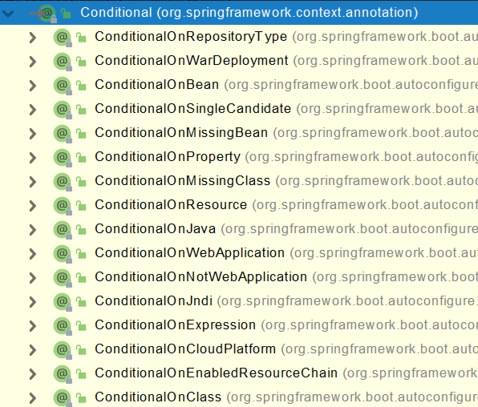
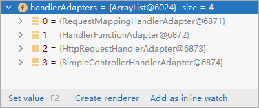

# 前置知识

**正文内容请从05基础入门开始看，以上仅仅作为前置补充**

## 一、IOC

### 1.1、IOC容器

#### 1.1.1、IOC思想

IOC：Inversion of Control，翻译过来是反转控制。

**反转控制方式获取资源**

反转控制的思想完全颠覆了应用程序组件获取资源的传统方式：反转了资源的获取方向——改由容器主 动的将资源推送给需要的组件，开发人员不需要知道容器是如何创建资源对象的，只需要提供接收资源 的方式即可，极大的降低了学习成本，提高了开发的效率。这种行为也称为查找的被动形式。

**DI：依赖注入**

DI：Dependency Injection，翻译过来是依赖注入。 DI 是 IOC 的另一种表述方式：即组件以一些预先定义好的方式（例如：setter 方法）接受来自于容器 的资源注入。相对于IOC而言，这种表述更直接。 所以结论是：IOC 就是一种反转控制的思想， 而 DI 是对 IOC 的一种具体实现。

#### 1.1.2、IOC容器在Spring中的实现

IOC 容器中管理的组件也叫做 bean。在创建 bean 之前，首先需要创建 IOC 容器。Spring 提供了 IOC 容器的两种实现方式：

**①BeanFactory**

这是 IOC 容器的基本实现，是 Spring 内部使用的接口。面向 Spring 本身，不提供给开发人员使用。 

**②ApplicationContext**

BeanFactory 的子接口，提供了更多高级特性。面向 Spring 的使用者，几乎所有场合都使用 ApplicationContext 而不是底层的 BeanFactory。

**③ApplicationContext的主要实现类**


| 类型名                          | 简介                                                         |
| ------------------------------- | ------------------------------------------------------------ |
| ClassPathXmlApplicationContext  | 通过读取类路径下的 XML 格式的配置文件创建 IOC 容器对象       |
| FileSystemXmlApplicationContext | 通过文件系统路径读取 XML 格式的配置文件创建 IOC 容器对象     |
| ConfigurableApplicationContext  | ApplicationContext 的子接口，包含一些扩展方法 refresh() 和 close() ，让 ApplicationContext 具有启动、 关闭和刷新上下文的能力。 |
| WebApplicationContext           | 专门为 Web 应用准备，基于 Web 环境创建 IOC 容器对象，并将对象引入存入 ServletContext 域中。 |

### 1.2、@Autowired工作流程


* 首先根据所需要的组件类型到IOC容器中查找
  * 能够找到唯一的bean：直接执行装配
  * 如果完全找不到匹配这个类型的bean：装配失败
  * 和所需类型匹配的bean不止一个
    * 没有@Qualifier注解：根据@Autowired标记位置成员变量的变量名作为bean的id进行匹配
      * 能够找到：执行装配
      * 找不到：装配失败
    * 使用@Qualifier注解：根据@Qualifier注解中指定的名称作为bean的id进行匹配
      * 能够找到：执行装配
      * 找不到：装配失败

> @Autowired中有属性required，默认值为true，因此在自动装配无法找到相应的bean时，会装配失败 
>
> 可以将属性required的值设置为true，则表示能装就装，装不上就不装，此时自动装配的属性为默认值 
>
> 但是实际开发时，基本上所有需要装配组件的地方都是必须装配的，用不上这个属性。

## 二、AOP

### 2.1、AOP概念及相关术语

#### 2.1.1、概述

AOP（Aspect Oriented Programming）是一种设计思想，是软件设计领域中的面向切面编程，它是面 向对象编程的一种补充和完善，它以通过预编译方式和运行期动态代理方式实现在不修改源代码的情况 下给程序动态统一添加额外功能的一种技术。

#### 2.1.2、相关术语

**①横切关注点**

从每个方法中抽取出来的同一类非核心业务。在同一个项目中，我们可以使用多个横切关注点对相关方法进行多个不同方面的增强。


**②通知**

每一个横切关注点上要做的事情都需要写一个方法来实现，这样的方法就叫通知方法。

* 前置通知：在被代理的目标方法前执行 
* 返回通知：在被代理的目标方法成功结束后执行（寿终正寝） 
* 异常通知：在被代理的目标方法异常结束后执行（死于非命） 
* 后置通知：在被代理的目标方法最终结束后执行（盖棺定论） 
* 环绕通知：使用try...catch...finally结构围绕整个被代理的目标方法，包括上面四种通知对应的所有位置


**③切面**

封装通知方法的类。


**④目标**

被代理的目标对象。

**⑤代理**

向目标对象应用通知之后创建的代理对象。

**⑥连接点**

这也是一个纯逻辑概念，不是语法定义的。

把方法排成一排，每一个横切位置看成x轴方向，把方法从上到下执行的顺序看成y轴，x轴和y轴的交叉点就是连接点。


**⑦切入点**

定位连接点的方式。 

每个类的方法中都包含多个连接点，所以连接点是类中客观存在的事物（从逻辑上来说）。 

如果把连接点看作数据库中的记录，那么切入点就是查询记录的 SQL 语句。 

Spring 的 AOP 技术可以通过切入点定位到特定的连接点。 

切点通过 org.springframework.aop.Pointcut 接口进行描述，它使用类和方法作为连接点的查询条件。

#### 2.1.3、作用

* 简化代码：把方法中固定位置的重复的代码抽取出来，让被抽取的方法更专注于自己的核心功能， 提高内聚性。 
* 代码增强：把特定的功能封装到切面类中，看哪里有需要，就往上套，被套用了切面逻辑的方法就被切面给增强了。

### 2.2、基于注解的AOP

#### 2.2.1、技术说明


* 动态代理（InvocationHandler）：JDK原生的实现方式，需要被代理的目标类必须实现接口。因为这个技术要求代理对象和目标对象实现同样的接口（兄弟两个拜把子模式）。
* cglib：通过继承被代理的目标类（认干爹模式）实现代理，所以不需要目标类实现接口。
* AspectJ：本质上是静态代理，将代理逻辑“织入”被代理的目标类编译得到的字节码文件，所以最 终效果是动态的。weaver就是织入器。Spring只是借用了AspectJ中的注解。

#### 2.2.2、准备工作

**①添加依赖**

在IOC所需依赖基础上再加入下面依赖即可：

```xml
<dependency>    
    <groupId>org.springframework.boot</groupId>    
    <artifactId>spring-boot-starter-aop</artifactId>
</dependency>
```

在application.properties中加入配置

```xml
spring.aop.auto=true
```

**②准备被代理的目标资源**

接口：

```java
public interface Calculator {
    int add(int i, int j);
    int sub(int i, int j);
    int mul(int i, int j);
    int div(int i, int j);
}
```

实现类：

```java
@Component
public class CalculatorPureImpl implements Calculator {
    @Override
    public int add(int i, int j) {
        int result = i + j;
        System.out.println("方法内部 result = " + result);
        return result;
    }
    @Override
    public int sub(int i, int j) {
        int result = i - j;
        System.out.println("方法内部 result = " + result);
        return result;
    }
    @Override
    public int mul(int i, int j) {
        int result = i * j;
        System.out.println("方法内部 result = " + result);
        return result;
    }
    @Override
    public int div(int i, int j) {
        int result = i / j;
        System.out.println("方法内部 result = " + result);
        return result;
    }
}
```

#### 2.2.3、创建切面类并配置

```java
// @Aspect表示这个类是一个切面类
@Aspect
// @Component注解保证这个切面类能够放入IOC容器
@Component
public class LogAspect {
    @Before("execution(public int com.atguigu.aop.annotation.CalculatorImpl.*(..))")
    public void beforeMethod(JoinPoint joinPoint){
        String methodName = joinPoint.getSignature().getName();
        String args = Arrays.toString(joinPoint.getArgs());
        System.out.println("Logger-->前置通知，方法名："+methodName+"，参数："+args);
    }
    
    @After("execution(* com.atguigu.aop.annotation.CalculatorImpl.*(..))")
    public void afterMethod(JoinPoint joinPoint){
        String methodName = joinPoint.getSignature().getName();
        System.out.println("Logger-->后置通知，方法名："+methodName);
    }
    
    @AfterReturning(value = "execution(* com.atguigu.aop.annotation.CalculatorImpl.*(..))", returning = "result")
    public void afterReturningMethod(JoinPoint joinPoint, Object result){
        String methodName = joinPoint.getSignature().getName();
        System.out.println("Logger-->返回通知，方法名："+methodName+"，结果："+result);
    }
    
    @AfterThrowing(value = "execution(* com.atguigu.aop.annotation.CalculatorImpl.*(..))", throwing = "ex")
    public void afterThrowingMethod(JoinPoint joinPoint, Throwable ex){
        String methodName = joinPoint.getSignature().getName();
        System.out.println("Logger-->异常通知，方法名："+methodName+"，异常："+ex);
    }
    
    @Around("execution(* com.atguigu.aop.annotation.CalculatorImpl.*(..))")
    public Object aroundMethod(ProceedingJoinPoint joinPoint){
        String methodName = joinPoint.getSignature().getName();
        String args = Arrays.toString(joinPoint.getArgs());
        Object result = null;
        try {
        	System.out.println("环绕通知-->目标对象方法执行之前");
        	//目标对象（连接点）方法的执行
        	result = joinPoint.proceed();
        	System.out.println("环绕通知-->目标对象方法返回值之后");
        } catch (Throwable throwable) {
        	throwable.printStackTrace();
        	System.out.println("环绕通知-->目标对象方法出现异常时");
        } finally {
        	System.out.println("环绕通知-->目标对象方法执行完毕");
        }
        return result;
    }
}
```

> 各种通知的执行顺序：
>
> * 前置通知 
> * 目标操作 
> * 返回通知或异常通知 
> * 后置通知

#### 2.2.4、切入点表达式语法

**①作用**


**②语法细节**

* 用*号代替“权限修饰符”和“返回值”部分表示“权限修饰符”和“返回值”不限
* 在包名的部分，一个“*”号只能代表包的层次结构中的一层，表示这一层是任意的。
  * 例如：*.Hello匹配com.Hello，不匹配com.atguigu.Hello
* 在包名的部分，使用“*..”表示包名任意、包的层次深度任意
* 在类名的部分，类名部分整体用*号代替，表示类名任意
* 在类名的部分，可以使用*号代替类名的一部分
  * 例如：*Service匹配所有名称以Service结尾的类或接口
* 在方法名部分，可以使用*号表示方法名任意
* 在方法名部分，可以使用*号代替方法名的一部分
  * 例如：*Operation匹配所有方法名以Operation结尾的方法
* 在方法参数列表部分，使用(..)表示参数列表任意
* 在方法参数列表部分，使用(int,..)表示参数列表以一个int类型的参数开头
* 在方法参数列表部分，基本数据类型和对应的包装类型是不一样的
  * 切入点表达式中使用 int 和实际方法中 Integer 是不匹配的
* 在方法返回值部分，如果想要明确指定一个返回值类型，那么必须同时写明权限修饰符
  * 例如：execution(public int ..Service.*(.., int)) 正确
  * 例如：execution(* int ..Service.*(.., int)) 错误


#### 2.2.5、重用切入点表达式

**①声明**

```java
@Pointcut("execution(* com.atguigu.aop.annotation.*.*(..))")
public void pointCut(){}
```

**②在同一个切面中使用**

```java
@Before("pointCut()")
public void beforeMethod(JoinPoint joinPoint){
    String methodName = joinPoint.getSignature().getName();
    String args = Arrays.toString(joinPoint.getArgs());
    System.out.println("Logger-->前置通知，方法名："+methodName+"，参数："+args);
}
```

**③在不同切面中使用**

```java
@Before("com.atguigu.aop.CommonPointCut.pointCut()")
public void beforeMethod(JoinPoint joinPoint){
    String methodName = joinPoint.getSignature().getName();
    String args = Arrays.toString(joinPoint.getArgs());
    System.out.println("Logger-->前置通知，方法名："+methodName+"，参数："+args);
}
```

#### 2.2.6、获取通知的相关信息

**①获取连接点信息**

获取连接点信息可以在通知方法的参数位置设置JoinPoint类型的形参

```java
@Before("execution(public int com.atguigu.aop.annotation.CalculatorImpl.*(..))")
public void beforeMethod(JoinPoint joinPoint){
    //获取连接点的签名信息
    String methodName = joinPoint.getSignature().getName();
    //获取目标方法到的实参信息
    String args = Arrays.toString(joinPoint.getArgs());
    System.out.println("Logger-->前置通知，方法名："+methodName+"，参数："+args);
}
```

**②获取目标方法的返回值**

@AfterReturning中的属性returning，用来将通知方法的某个形参，接收目标方法的返回值

```java
@AfterReturning(value = "execution(* com.atguigu.aop.annotation.CalculatorImpl.*(..))", returning = "result")
public void afterReturningMethod(JoinPoint joinPoint, Object result){
    String methodName = joinPoint.getSignature().getName();
    System.out.println("Logger-->返回通知，方法名："+methodName+"，结果："+result);
}
```

**③获取目标方法的异常**

@AfterThrowing中的属性throwing，用来将通知方法的某个形参，接收目标方法的异常

```java
@AfterThrowing(value = "execution(* com.atguigu.aop.annotation.CalculatorImpl.*(..))", throwing = "ex")
public void afterThrowingMethod(JoinPoint joinPoint, Throwable ex){
    String methodName = joinPoint.getSignature().getName();
    System.out.println("Logger-->异常通知，方法名："+methodName+"，异常："+ex);
}
```

#### 2.2.7、环绕通知

```java
@Around("execution(* com.atguigu.aop.annotation.CalculatorImpl.*(..))")
public Object aroundMethod(ProceedingJoinPoint joinPoint){
    String methodName = joinPoint.getSignature().getName();
    String args = Arrays.toString(joinPoint.getArgs());
    Object result = null;
    try {
        System.out.println("环绕通知-->目标对象方法执行之前");
        //目标方法的执行，目标方法的返回值一定要返回给外界调用者
        result = joinPoint.proceed();
        System.out.println("环绕通知-->目标对象方法返回值之后");
    } catch (Throwable throwable) {
        throwable.printStackTrace();
        System.out.println("环绕通知-->目标对象方法出现异常时");
    } finally {
    	System.out.println("环绕通知-->目标对象方法执行完毕");
    }
    return result;
}
```

#### 2.2.8、切面的优先级

相同目标方法上同时存在多个切面时，切面的优先级控制切面的内外嵌套顺序。

* 优先级高的切面：外面
* 优先级低的切面：里面

使用@Order注解可以控制切面的优先级：

* @Order(较小的数)：优先级高
* @Order(较大的数)：优先级低

## 三、声明式事务

### 3.1、声明式事务概念

#### 3.1.1、编程式事务

事务功能的相关操作全部通过自己编写代码来实现：

```java
Connection conn = ...;
try {
    // 开启事务：关闭事务的自动提交
    conn.setAutoCommit(false);
    // 核心操作
    // 提交事务
    conn.commit();
}catch(Exception e){
    // 回滚事务
    conn.rollBack();
}finally{
    // 释放数据库连接
    conn.close();
}
```

编程式的实现方式存在缺陷：

* 细节没有被屏蔽：具体操作过程中，所有细节都需要程序员自己来完成，比较繁琐。
* 代码复用性不高：如果没有有效抽取出来，每次实现功能都需要自己编写代码，代码就没有得到复用。

#### 3.1.2、声明式事务

既然事务控制的代码有规律可循，代码的结构基本是确定的，所以框架就可以将固定模式的代码抽取出来，进行相关的封装。

封装起来后，我们只需要在配置文件中进行简单的配置即可完成操作。

### 3.2、基于注解的声明式事务

#### 3.2.1、准备工作

**① 在TransactionalApplication启动类上添加@EnableTransactionManagement注解开启事务：**

```java
@SpringBootApplication
//开启事务
@EnableTransactionManagement
public class TransactionalApplication {

    public static void main(String[] args) {
        SpringApplication.run(TransactionalApplication.class, args);
    }

}
```

**② 在Seervice实现方法上添加@Transactional注解**

#### 3.2.2、事务属性

**1. 只读**

对一个查询操作来说，如果我们把它设置成只读，就能够明确告诉数据库，这个操作不涉及写操作。这 样数据库就能够针对查询操作来进行优化。

```java
@Transactional(readOnly = true)
public void buyBook(Integer bookId, Integer userId) {
    //查询图书的价格
    Integer price = bookDao.getPriceByBookId(bookId);
    //更新图书的库存
    bookDao.updateStock(bookId);
    //更新用户的余额
    bookDao.updateBalance(userId, price);
    //System.out.println(1/0);
}
```

> 注意：
>
> 对增删改操作设置只读会抛出下面异常： Caused by: java.sql.SQLException: Connection is read-only. Queries leading to data modification are not allowed

**2. 超时**

超时回滚，释放资源。

```java
@Transactional(timeout = 3)
public void buyBook(Integer bookId, Integer userId) {
    try {
    	TimeUnit.SECONDS.sleep(5);
    } catch (InterruptedException e) {
    	e.printStackTrace();
    }
    //查询图书的价格
    Integer price = bookDao.getPriceByBookId(bookId);
    //更新图书的库存
    bookDao.updateStock(bookId);
    //更新用户的余额
    bookDao.updateBalance(userId, price);
    //System.out.println(1/0);
}
```

执行过程中抛出异常： 

org.springframework.transaction.TransactionTimedOutException: Transaction timed out

**3. 回滚策略**

声明式事务默认只针对运行时异常回滚，编译时异常不回滚。 

可以通过@Transactional中相关属性设置回滚策略。

* rollbackFor属性：需要设置一个Class类型的对象
* rollbackForClassName属性：需要设置一个字符串类型的全类名
* noRollbackFor属性：需要设置一个Class类型的对象
* rollbackFor属性：需要设置一个字符串类型的全类名

```java
@Transactional(noRollbackFor = ArithmeticException.class)
    //@Transactional(noRollbackForClassName = "java.lang.ArithmeticException")
    public void buyBook(Integer bookId, Integer userId) {
    //查询图书的价格
    Integer price = bookDao.getPriceByBookId(bookId);
    //更新图书的库存
    bookDao.updateStock(bookId);
    //更新用户的余额
    bookDao.updateBalance(userId, price);
    System.out.println(1/0);
}
```

设置的回滚策略是，当出现ArithmeticException不发生回滚，因此购买图书的操作正常执行

**4. 事务隔离级别**

SQL标准中规定了多种事务隔离级别，不同隔离级别对应不同 的干扰程度，隔离级别越高，数据一致性就越好，但并发性越弱。

隔离级别一共有四种：

* 读未提交：READ UNCOMMITTED

  允许Transaction01读取Transaction02未提交的修改。

* 读已提交：READ COMMITTED

  要求Transaction01只能读取Transaction02已提交的修改。

* 可重复读：REPEATABLE READ

  确保Transaction01可以多次从一个字段中读取到相同的值，即Transaction01执行期间禁止其它事务对这个字段进行更新。

* 串行化：SERIALIZABLE

  确保Transaction01可以多次从一个表中读取到相同的行，在Transaction01执行期间，禁止其它事务对这个表进行添加、更新、删除操作。可以避免任何并发问题，但性能十分低下。

各个隔离级别解决并发问题的能力见下表:


各种数据库产品对事务隔离级别的支持程度：


使用方式:

```java
@Transactional(isolation = Isolation.DEFAULT) // 使用数据库默认的隔离级别
@Transactional(isolation = Isolation.READ_UNCOMMITTED) // 读未提交
@Transactional(isolation = Isolation.READ_COMMITTED) // 读已提交
@Transactional(isolation = Isolation.REPEATABLE_READ) // 可重复读
@Transactional(isolation = Isolation.SERIALIZABLE) // 串行化
```

**事务传播行为**

当事务方法被另一个事务方法调用时，必须指定事务应该如何传播。例如：方法可能继续在现有事务中运行，也可能开启一个新事务，并在自己的事务中运行。

1. 创建接口CheckoutService

```java
public interface CheckoutService {
	void checkout(Integer[] bookIds, Integer userId);
}
```

2. 创建实现类CheckoutServiceImpl

```java
@Service
public class CheckoutServiceImpl implements CheckoutService {
    @Autowired
    private BookService bookService;
    
    @Override
    @Transactional
    //一次购买多本图书
    public void checkout(Integer[] bookIds, Integer userId) {
        for (Integer bookId : bookIds) {
        	bookService.buyBook(bookId, userId);
        }
    }
}
```

3. 在BookController中添加方法

```java
@Autowired
private CheckoutService checkoutService;

public void checkout(Integer[] bookIds, Integer userId){
    checkoutService.checkout(bookIds, userId);
}
```

在数据库中将用户的余额修改为100元

可以通过@Transactional中的propagation属性设置事务传播行为修改BookServiceImpl中buyBook()上，注解@Transactional的propagation属性

@Transactional(propagation = Propagation.REQUIRED)，默认情况，表示如果当前线程上有已经开启的事务可用，那么就在这个事务中运行。经过观察，购买图书的方法buyBook()在checkout()中被调 用，checkout()上有事务注解，因此在此事务中执行。所购买的两本图书的价格为80和50，而用户的余额为100，因此在购买第二本图书时余额不足失败，导致整个checkout()回滚，即只要有一本书买不了，就都买不了

@Transactional(propagation = Propagation.REQUIRES_NEW)，表示不管当前线程上是否有已经开启的事务，都要开启新事务。同样的场景，每次购买图书都是在buyBook()的事务中执行，因此第一本图书购买成功，事务结束，第二本图书购买失败，只在第二次的buyBook()中回滚，购买第一本图书不受影响，即能买几本就买几本。

> 传播机制类型
>
> **PROPAGATION_REQUIRED (默认)**
>
> - 支持当前事务，如果当前没有事务，则新建事务
> - 如果当前存在事务，则加入当前事务，合并成一个事务
>
> **REQUIRES_NEW**
>
> - 新建事务，如果当前存在事务，则把当前事务挂起
> - 这个方法会独立提交事务，不受调用者的事务影响，父级异常，它也是正常提交
>
> **NESTED**
>
> - 如果当前存在事务，它将会成为父级事务的一个子事务，方法结束后并没有提交，只有等父事务结束才提交
> - 如果当前没有事务，则新建事务
> - 如果它异常，父级可以捕获它的异常而不进行回滚，正常提交
> - 但如果父级异常，它必然回滚，这就是和 `REQUIRES_NEW` 的区别
>
> **SUPPORTS**
>
> - 如果当前存在事务，则加入事务
> - 如果当前不存在事务，则以非事务方式运行，这个和不写没区别
>
> **NOT_SUPPORTED**
>
> - 以非事务方式运行
> - 如果当前存在事务，则把当前事务挂起
>
> **MANDATORY**
>
> - 如果当前存在事务，则运行在当前事务中
> - 如果当前无事务，则抛出异常，也即父级方法必须有事务
>
> **NEVER**
>
> - 以非事务方式运行，如果当前存在事务，则抛出异常，即父级方法必须无事务

# 05、基础入门-SpringBoot-HelloWorld

## 一. 系统要求

- Java 8 & 兼容 java14
- Maven 3.3+ 
- IntelliJ IDEA 2019.1.2

### 1.1 Maven配置文件

新添内容（conf/settings.xml）：


```xml
<mirrors>
	<mirror>
		<id>nexus-aliyun</id>
		<mirrorOf>central</mirrorOf>
		<name>Nexus aliyun</name>
		<url>http://maven.aliyun.com/nexus/content/groups/public</url>
	</mirror>
</mirrors>

<profiles>
	<profile>
		<id>jdk-1.8</id>

		<activation>
			<activeByDefault>true</activeByDefault>
			<jdk>1.8</jdk>
		</activation>

		<properties>
			<maven.compiler.source>1.8</maven.compiler.source>
			<maven.compiler.target>1.8</maven.compiler.target>
			<maven.compiler.compilerVersion>1.8</maven.compiler.compilerVersion>
		</properties>
	</profile>
</profiles>
```

## 二. HelloWorld项目

需求：浏览发送/hello请求，响应 “Hello，Spring Boot 2”

### 2.1、创建maven工程

### 2.2、引入依赖

```xml
<parent>
    <groupId>org.springframework.boot</groupId>
    <artifactId>spring-boot-starter-parent</artifactId>
    <version>2.3.8.RELEASE</version>
</parent>

<dependencies>
    <dependency>
        <groupId>org.springframework.boot</groupId>
        <artifactId>spring-boot-starter-web</artifactId>
    </dependency>
</dependencies>
```

### 2.3、创建主程序

```java
/**
 * 主程序类
 * @SpringBootApplication：这是一个SpringBoot应用
 */
@SpringBootApplication
public class MainApplication {

    public static void main(String[] args) {
        SpringApplication.run(MainApplication.class,args);
    }
}
```

### 2.4、编写业务

```java
/**
 * @RestController = @Controller + @ResponseBody
 */
@RestController
public class HelloController {
    @RequestMapping("/hello")
    public String handle01(){
        return "Hello, SpringBoot2";
    }
}
```

### 2.5、测试

- 运行`MainApplication`类
- 浏览器输入`http://localhost:8080/hello`，将会输出`Hello, Spring Boot 2!`。

### 2.6、简化配置

resources下创建application.properties

```properties
server.port=8080
```

[更多配置信息](https://docs.spring.io/spring-boot/docs/2.3.7.RELEASE/reference/html/appendix-application-properties.html#common-application-properties-server)

### 2.7、简化部署

```xml
<build>
     <plugins>
         <plugin>
             <groupId>org.springframework.boot</groupId>
             <artifactId>spring-boot-maven-plugin</artifactId>
         </plugin>
     </plugins>
</build>
```


把项目打成jar包，直接在目标服务器执行即可。

注意点：

- 取消掉cmd的快速编辑模式

启动命令：

```cmd
java -jar boot-01-helloworld-1.0-SNAPSHOT.jar
```

# 06-07、基础入门篇-SpringBoot-依赖管理特性与自动配置特性

## 一. 了解自动配置原理

### 1、SpringBoot特点

#### 1.1、依赖管理

* 父项目做依赖管理

```xml
<!-- 依赖管理 -->    
<parent>
    <groupId>org.springframework.boot</groupId>
    <artifactId>spring-boot-starter-parent</artifactId>
    <version>2.3.8.RELEASE</version>
</parent>

<!-- 他的父项目 --> 
<parent>
    <groupId>org.springframework.boot</groupId>
    <artifactId>spring-boot-dependencies</artifactId>
    <version>2.3.8.RELEASE</version>
</parent>

<!-- 几乎声明了所有开发中常用的依赖的版本号,自动版本仲裁机制 -->
```

- 开发导入starter场景启动器

```xml
<!-- 1、见到很多 spring-boot-starter-* ： *就某种场景 --> 
<!-- 2、只要引入starter，这个场景的所有常规需要的依赖我们都自动引入 --> 
<!-- 3、SpringBoot所有支持的场景 --> 
<!-- https://docs.spring.io/spring-boot/docs/current/reference/html/using-spring-boot.html#using-boot-starter --> 
<!-- 4、见到的  *-spring-boot-starter： 第三方为我们提供的简化开发的场景启动器。 --> 
<!-- 5、所有场景启动器最底层的依赖 --> 
<dependency>
  <groupId>org.springframework.boot</groupId>
  <artifactId>spring-boot-starter</artifactId>
  <version>2.3.8.RELEASE</version>
  <scope>compile</scope>
</dependency>
```

- 无需关注版本号，自动版本仲裁

  * 引入依赖默认都可以不写版本
  * 引入非版本仲裁的jar，要写版本号。

- 可以修改默认版本号

  * 查看spring-boot-dependencies里面规定当前依赖的版本用的 key。

  * 在当前项目里面重写配置。

    ```xml
    <properties>
        <mysql.version>5.1.43</mysql.version>
    </properties>
    ```

IDEA快捷键：

- `ctrl + shift + alt + U`：以图的方式显示项目中依赖之间的关系。
- `alt + ins`：相当于Eclipse的 Ctrl + N，创建新类，新包等。

#### 1.2、自动配置

- 自动配好Tomcat
  * 引入Tomcat依赖
  * 配置Tomcat

- ```xml
  <dependency>
      <groupId>org.springframework.boot</groupId>
      <artifactId>spring-boot-starter-tomcat</artifactId>
      <version>2.3.8.RELEASE</version>
      <scope>compile</scope>
  </dependency>
  ```

- 自动配好SpringMVC

- - 引入SpringMVC全套组件
  - 自动配好SpringMVC常用组件（功能）

- 自动配好Web常见功能，如：字符编码问题

- - SpringBoot帮我们配置好了所有web开发的常见场景

- 默认的包结构

- - 主程序所在包及其下面的所有子包里面的组件都会被默认扫描进来
  - 无需以前的包扫描配置
  - 想要改变扫描路径，@SpringBootApplication(scanBasePackages=**"com.atguigu"**)

- - - 或者@ComponentScan 指定扫描路径

```java
@SpringBootApplication
// 等同于
@SpringBootConfiguration
@EnableAutoConfiguration
@ComponentScan("com.atguigu.boot")
```

- 各种配置拥有默认值

- - 默认配置最终都是映射到某个类上，如：MultipartProperties
  - 配置文件的值最终会绑定每个类上，这个类会在容器中创建对象

- 按需加载所有自动配置项

- - 非常多的starter
  - 引入了哪些场景这个场景的自动配置才会开启
  - SpringBoot所有的自动配置功能都在 spring-boot-autoconfigure 包里面

# 08-12、底层注解-@Configuration详解、@Import导入组件、@Conditional条件装配、@ImportResource导入Spring配置文件与底层注解-@ConfigurationProperties配置绑定

## 一、容器功能

### 1.1、组件添加

**1、@Configuration**

- 基本使用
- **Full模式与Lite模式**

- - 示例
  - 最佳实战

- - - 配置 类组件之间无依赖关系用Lite模式加速容器启动过程，减少判断
    - 配置类组件之间有依赖关系，方法会被调用得到之前单实例组件，用Full模式

```java
#############################Configuration使用示例######################################################
/**
 * 1、配置类里面使用@Bean标注在方法上给容器注册组件，默认也是单实例的
 * 2、配置类本身也是组件
 * 3、proxyBeanMethods：代理bean的方法
 *      Full(proxyBeanMethods = true)、【保证每个@Bean方法被调用多少次返回的组件都是单实例的】
 *      Lite(proxyBeanMethods = false)【每个@Bean方法被调用多少次返回的组件都是新创建的】
 *      组件依赖必须使用Full模式默认。其他默认是否Lite模式
 *
 *
 *
 */
 
@Configuration(proxyBeanMethods = false) //告诉SpringBoot这是一个配置类 == 配置文件
public class MyConfig {

    /**
     * Full:外部无论对配置类中的这个组件注册方法调用多少次获取的都是之前注册容器中的单实例对象
     * @return
     */
    @Bean //给容器中添加组件。以方法名作为组件的id。返回类型就是组件类型。返回的值，就是组件在容器中的实例
    public User user01(){
        User zhangsan = new User("zhangsan", 18);
        //user组件依赖了Pet组件
        zhangsan.setPet(tomcatPet());
        return zhangsan;
    }

    @Bean("tom")
    public Pet tomcatPet(){
        return new Pet("tomcat");
    }
}


################################@Configuration测试代码如下########################################
@SpringBootConfiguration
@EnableAutoConfiguration
@ComponentScan("com.atguigu.boot")
public class MainApplication {

    public static void main(String[] args) {
        //1、返回我们IOC容器
        ConfigurableApplicationContext run = SpringApplication.run(MainApplication.class, args);

        //2、查看容器里面的组件
        String[] names = run.getBeanDefinitionNames();
        for (String name : names) {
            System.out.println(name);
        }

        //3、从容器中获取组件

        Pet tom01 = run.getBean("tom", Pet.class);

        Pet tom02 = run.getBean("tom", Pet.class);

        System.out.println("组件："+(tom01 == tom02));


        //4、com.atguigu.boot.config.MyConfig$$EnhancerBySpringCGLIB$$51f1e1ca@1654a892
        MyConfig bean = run.getBean(MyConfig.class);
        System.out.println(bean);

        //如果@Configuration(proxyBeanMethods = true)代理对象调用方法。SpringBoot总会检查这个组件是否在容器中有。
        //保持组件单实例
        User user = bean.user01();
        User user1 = bean.user01();
        System.out.println(user == user1);


        User user01 = run.getBean("user01", User.class);
        Pet tom = run.getBean("tom", Pet.class);

        System.out.println("用户的宠物："+(user01.getPet() == tom));
    }
}
```

IDEA快捷键：

- `Alt + Ins`:生成getter，setter、构造器等代码。
- `Ctrl + Alt + B`:查看类的具体实现代码。

**2、@Bean、@Component、@Controller、@Service、@Repository**

**3、@ComponentScan、@Import**

```java
/*
 * 4、@Import({User.class, DBHelper.class})
 *      给容器中自动创建出这两个类型的组件、默认组件的名字就是全类名
 */
@Import({User.class, DBHelper.class})
@Configuration(proxyBeanMethods = false) //告诉SpringBoot这是一个配置类 == 配置文件
public class MyConfig {
}
```

@Import 高级用法： https://www.bilibili.com/video/BV1gW411W7wy?p=8

**4、@Conditional**

条件装配：满足Conditional指定的条件，则进行组件注入



```java
=====================测试条件装配==========================
@Configuration(proxyBeanMethods = false) //告诉SpringBoot这是一个配置类 == 配置文件
//@ConditionalOnBean(name = "tom")
@ConditionalOnMissingBean(name = "tom")
public class MyConfig {
    /**
     * Full:外部无论对配置类中的这个组件注册方法调用多少次获取的都是之前注册容器中的单实例对象
     * @return
     */

    @Bean //给容器中添加组件。以方法名作为组件的id。返回类型就是组件类型。返回的值，就是组件在容器中的实例
    public User user01(){
        User zhangsan = new User("zhangsan", 18);
        //user组件依赖了Pet组件
        zhangsan.setPet(tomcatPet());
        return zhangsan;
    }

    @Bean("tom22")
    public Pet tomcatPet(){
        return new Pet("tomcat");
    }
}

public static void main(String[] args) {
    //1、返回我们IOC容器
    ConfigurableApplicationContext run = SpringApplication.run(MainApplication.class, args);

    //2、查看容器里面的组件
    String[] names = run.getBeanDefinitionNames();
    for (String name : names) {
        System.out.println(name);
    }

    boolean tom = run.containsBean("tom");
    System.out.println("容器中Tom组件："+tom);

    boolean user01 = run.containsBean("user01");
    System.out.println("容器中user01组件："+user01);

    boolean tom22 = run.containsBean("tom22");
    System.out.println("容器中tom22组件："+tom22);
}
```

### 1.2、原生配置文件引入

**1、@ImportResource**

```xml
======================beans.xml=========================
<?xml version="1.0" encoding="UTF-8"?>
<beans xmlns="http://www.springframework.org/schema/beans"
       xmlns:xsi="http://www.w3.org/2001/XMLSchema-instance"
       xmlns:context="http://www.springframework.org/schema/context"
       xsi:schemaLocation="http://www.springframework.org/schema/beans http://www.springframework.org/schema/beans/spring-beans.xsd http://www.springframework.org/schema/context https://www.springframework.org/schema/context/spring-context.xsd">

    <bean id="haha" class="com.atguigu.boot.bean.User">
        <property name="name" value="zhangsan"></property>
        <property name="age" value="18"></property>
    </bean>

    <bean id="hehe" class="com.atguigu.boot.bean.Pet">
        <property name="name" value="tomcat"></property>
    </bean>
</beans>
```

```java
@ImportResource("classpath:beans.xml")
public class MyConfig {}
```

测试类：

```java
public static void main(String[] args) {
    //1、返回我们IOC容器
    ConfigurableApplicationContext run = SpringApplication.run(MainApplication.class, args);

	boolean haha = run.containsBean("haha");
	boolean hehe = run.containsBean("hehe");
	System.out.println("haha："+haha);//true
	System.out.println("hehe："+hehe);//true
}
```

### 1.3、配置绑定

如何使用Java读取到properties文件中的内容，并且把它封装到JavaBean中，以供随时使用；

```java
public class getProperties {
    public static void main(String[] args) throws FileNotFoundException, IOException {
        Properties pps = new Properties();
        pps.load(new FileInputStream("a.properties"));
        Enumeration enum1 = pps.propertyNames();//得到配置文件的名字
        while(enum1.hasMoreElements()) {
            String strKey = (String) enum1.nextElement();
            String strValue = pps.getProperty(strKey);
            System.out.println(strKey + "=" + strValue);
            //封装到JavaBean。
        }
    }
}
```

**1、@ConfigurationProperties**

```java
/**
 * 只有在容器中的组件，才会拥有SpringBoot提供的强大功能
 */
@Component
@ConfigurationProperties(prefix = "mycar")
public class Car {

    private String brand;
    private Integer price;

    public String getBrand() {
        return brand;
    }

    public void setBrand(String brand) {
        this.brand = brand;
    }

    public Integer getPrice() {
        return price;
    }

    public void setPrice(Integer price) {
        this.price = price;
    }

    @Override
    public String toString() {
        return "Car{" +
                "brand='" + brand + '\'' +
                ", price=" + price +
                '}';
    }
}
```

**2、@EnableConfigurationProperties + @ConfigurationProperties**

```java
@EnableConfigurationProperties(Car.class)
//1、开启Car配置绑定功能
//2、把这个Car这个组件自动注册到容器中
public class MyConfig {
}
```

```java
@ConfigurationProperties(prefix = "mycar")
public class Car {
...
}
```

**3、@Component + @ConfigurationProperties**

假设有配置文件application.properties

```properties
mycar.brand=BYD
mycar.price=100000
```

只有在容器中的组件，才会拥有SpringBoot提供的强大功能

```java
@Component
@ConfigurationProperties(prefix = "mycar")
public class Car {
...
}
```

# 13-15、自动配置-自动包规则原理、初始加载自动配置类、自动配置流程

## 一、自动配置原理入门

### 1.1、引导加载自动配置类

```java
@SpringBootConfiguration
@EnableAutoConfiguration
@ComponentScan(
    excludeFilters = {@Filter(
    type = FilterType.CUSTOM,
    classes = {TypeExcludeFilter.class}
), @Filter(
    type = FilterType.CUSTOM,
    classes = {AutoConfigurationExcludeFilter.class}
)}
)
public @interface SpringBootApplication {}
```

#### 1、@SpringBootConfiguration

@Configuration。代表当前是一个配置类

```java
@Target(ElementType.TYPE)
@Retention(RetentionPolicy.RUNTIME)
@Documented
@Configuration
public @interface SpringBootConfiguration {
    @AliasFor(
        annotation = Configuration.class
    )
    boolean proxyBeanMethods() default true;
}
```

#### 2、@ComponentScan

指定扫描哪些，Spring注解；

#### 3、@EnableAutoConfiguration

```java
@AutoConfigurationPackage
@Import({AutoConfigurationImportSelector.class})
public @interface EnableAutoConfiguration {}
```

1. **@AutoConfigurationPackage**

自动配置包？指定了默认的包规则

```java
@Import({Registrar.class})
public @interface AutoConfigurationPackage {}
```

```java
static class Registrar implements ImportBeanDefinitionRegistrar, DeterminableImports {
    Registrar() {
    }

    public void registerBeanDefinitions(AnnotationMetadata metadata, BeanDefinitionRegistry registry) {
        AutoConfigurationPackages.register(registry, (String[])(new AutoConfigurationPackages.PackageImports(metadata)).getPackageNames().toArray(new String[0]));
    }

    public Set<Object> determineImports(AnnotationMetadata metadata) {
        return Collections.singleton(new AutoConfigurationPackages.PackageImports(metadata));
    }
}
```

Registrar 中的registerBeanDefinitons方法的metadate参数指的是注解源，new PackaImports（metadata）导入包中的组件，getPackageNames（）获得包名，toArray封装到数组中。最终注册进去。

2. **@Import(AutoConfigurationImportSelector.class)**

1、利用`getAutoConfigurationEntry(annotationMetadata);`给容器中批量导入一些组件
2、调用`List\<String> configurations = getCandidateConfigurations(annotationMetadata, attributes)`获取到所有需要导入到容器中的配置类
3、利用工厂加载 `Map<String, List\<String>> loadSpringFactories(@Nullable ClassLoader classLoader)；`得到所有的组件
4、从`META-INF/spring.factories`位置来加载一个文件。
	默认扫描我们当前系统里面所有`META-INF/spring.factories`位置的文件
    `spring-boot-autoconfigure-2.3.8.RELEASE.jar`包里面也有`META-INF/spring.factories`

```java
public String[] selectImports(AnnotationMetadata annotationMetadata) {
    if (!this.isEnabled(annotationMetadata)) {
        return NO_IMPORTS;
    } else {
        AutoConfigurationImportSelector.AutoConfigurationEntry autoConfigurationEntry = this.getAutoConfigurationEntry(annotationMetadata);
        return StringUtils.toStringArray(autoConfigurationEntry.getConfigurations());
    }
}
```

```java
protected AutoConfigurationImportSelector.AutoConfigurationEntry getAutoConfigurationEntry(AnnotationMetadata annotationMetadata) {
    if (!this.isEnabled(annotationMetadata)) {
        return EMPTY_ENTRY;
    } else {
        // attributes 包含值 1.exclude -> {String[0]@3683} [] 2.excludeName -> {String[0]@3685} []
        AnnotationAttributes attributes = this.getAttributes(annotationMetadata);
        // configurations值见下图
        List<String> configurations = this.getCandidateConfigurations(annotationMetadata, attributes);
        configurations = this.removeDuplicates(configurations);
        Set<String> exclusions = this.getExclusions(annotationMetadata, attributes);
        this.checkExcludedClasses(configurations, exclusions);
        configurations.removeAll(exclusions);
        configurations = this.getConfigurationClassFilter().filter(configurations);
        this.fireAutoConfigurationImportEvents(configurations, exclusions);
        return new AutoConfigurationImportSelector.AutoConfigurationEntry(configurations, exclusions);
    }
}
```

```java
protected List<String> getCandidateConfigurations(AnnotationMetadata metadata, AnnotationAttributes attributes) {
    List<String> configurations = SpringFactoriesLoader.loadFactoryNames(this.getSpringFactoriesLoaderFactoryClass(), this.getBeanClassLoader());
    Assert.notEmpty(configurations, "No auto configuration classes found in META-INF/spring.factories. If you are using a custom packaging, make sure that file is correct.");
    return configurations;
}
```

```java
public static List<String> loadFactoryNames(Class<?> factoryType, @Nullable ClassLoader classLoader) {
    String factoryTypeName = factoryType.getName();
    return (List)loadSpringFactories(classLoader).getOrDefault(factoryTypeName, Collections.emptyList());
}
```

```java
private static Map<String, List<String>> loadSpringFactories(@Nullable ClassLoader classLoader) {
    MultiValueMap<String, String> result = (MultiValueMap)cache.get(classLoader);
    if (result != null) {
        return result;
    } else {
        try {
            // 从"META-INF/spring.factories"位置来加载一个文件，默认扫描当前系统所有这个位置的文件
            Enumeration<URL> urls = classLoader != null ? classLoader.getResources("META-INF/spring.factories") : ClassLoader.getSystemResources("META-INF/spring.factories");
            LinkedMultiValueMap result = new LinkedMultiValueMap();

            while(urls.hasMoreElements()) {
                URL url = (URL)urls.nextElement();
                UrlResource resource = new UrlResource(url);
                Properties properties = PropertiesLoaderUtils.loadProperties(resource);
                Iterator var6 = properties.entrySet().iterator();

                while(var6.hasNext()) {
                    Entry<?, ?> entry = (Entry)var6.next();
                    String factoryTypeName = ((String)entry.getKey()).trim();
                    String[] var9 = StringUtils.commaDelimitedListToStringArray((String)entry.getValue());
                    int var10 = var9.length;

                    for(int var11 = 0; var11 < var10; ++var11) {
                        String factoryImplementationName = var9[var11];
                        result.add(factoryTypeName, factoryImplementationName.trim());
                    }
                }
            }

            cache.put(classLoader, result);
            return result;
        } catch (IOException var13) {
            throw new IllegalArgumentException("Unable to load factories from location [META-INF/spring.factories]", var13);
        }
    }
}
```


```xml
<!-- 文件里面写死了spring-boot一启动就要给容器中加载的所有配置类 -->
spring-boot-autoconfigure-2.3.8.RELEASE.jar/META-INF/spring.factories
# Auto Configure
org.springframework.boot.autoconfigure.EnableAutoConfiguration=\
org.springframework.boot.autoconfigure.admin.SpringApplicationAdminJmxAutoConfiguration,\
org.springframework.boot.autoconfigure.aop.AopAutoConfiguration,\
org.springframework.boot.autoconfigure.amqp.RabbitAutoConfiguration,\
org.springframework.boot.autoconfigure.batch.BatchAutoConfiguration,\
org.springframework.boot.autoconfigure.cache.CacheAutoConfiguration,\
org.springframework.boot.autoconfigure.cassandra.CassandraAutoConfiguration,\
org.springframework.boot.autoconfigure.context.ConfigurationPropertiesAutoConfiguration,\
org.springframework.boot.autoconfigure.context.LifecycleAutoConfiguration,\
org.springframework.boot.autoconfigure.context.MessageSourceAutoConfiguration,\
org.springframework.boot.autoconfigure.context.PropertyPlaceholderAutoConfiguration,\
org.springframework.boot.autoconfigure.couchbase.CouchbaseAutoConfiguration,\
org.springframework.boot.autoconfigure.dao.PersistenceExceptionTranslationAutoConfiguration,\
org.springframework.boot.autoconfigure.data.cassandra.CassandraDataAutoConfiguration,\
org.springframework.boot.autoconfigure.data.cassandra.CassandraReactiveDataAutoConfiguration,\
org.springframework.boot.autoconfigure.data.cassandra.CassandraReactiveRepositoriesAutoConfiguration,\
org.springframework.boot.autoconfigure.data.cassandra.CassandraRepositoriesAutoConfiguration,\
org.springframework.boot.autoconfigure.data.couchbase.CouchbaseDataAutoConfiguration,\
org.springframework.boot.autoconfigure.data.couchbase.CouchbaseReactiveDataAutoConfiguration,\
org.springframework.boot.autoconfigure.data.couchbase.CouchbaseReactiveRepositoriesAutoConfiguration,\
org.springframework.boot.autoconfigure.data.couchbase.CouchbaseRepositoriesAutoConfiguration,\
org.springframework.boot.autoconfigure.data.elasticsearch.ElasticsearchDataAutoConfiguration,\
org.springframework.boot.autoconfigure.data.elasticsearch.ElasticsearchRepositoriesAutoConfiguration,\
org.springframework.boot.autoconfigure.data.elasticsearch.ReactiveElasticsearchRepositoriesAutoConfiguration,\
org.springframework.boot.autoconfigure.data.elasticsearch.ReactiveElasticsearchRestClientAutoConfiguration,\
org.springframework.boot.autoconfigure.data.jdbc.JdbcRepositoriesAutoConfiguration,\
org.springframework.boot.autoconfigure.data.jpa.JpaRepositoriesAutoConfiguration,\
org.springframework.boot.autoconfigure.data.ldap.LdapRepositoriesAutoConfiguration,\
org.springframework.boot.autoconfigure.data.mongo.MongoDataAutoConfiguration,\
org.springframework.boot.autoconfigure.data.mongo.MongoReactiveDataAutoConfiguration,\
org.springframework.boot.autoconfigure.data.mongo.MongoReactiveRepositoriesAutoConfiguration,\
org.springframework.boot.autoconfigure.data.mongo.MongoRepositoriesAutoConfiguration,\
org.springframework.boot.autoconfigure.data.neo4j.Neo4jDataAutoConfiguration,\
org.springframework.boot.autoconfigure.data.neo4j.Neo4jRepositoriesAutoConfiguration,\
org.springframework.boot.autoconfigure.data.solr.SolrRepositoriesAutoConfiguration,\
org.springframework.boot.autoconfigure.data.r2dbc.R2dbcDataAutoConfiguration,\
org.springframework.boot.autoconfigure.data.r2dbc.R2dbcRepositoriesAutoConfiguration,\
org.springframework.boot.autoconfigure.data.r2dbc.R2dbcTransactionManagerAutoConfiguration,\
org.springframework.boot.autoconfigure.data.redis.RedisAutoConfiguration,\
org.springframework.boot.autoconfigure.data.redis.RedisReactiveAutoConfiguration,\
org.springframework.boot.autoconfigure.data.redis.RedisRepositoriesAutoConfiguration,\
org.springframework.boot.autoconfigure.data.rest.RepositoryRestMvcAutoConfiguration,\
org.springframework.boot.autoconfigure.data.web.SpringDataWebAutoConfiguration,\
org.springframework.boot.autoconfigure.elasticsearch.ElasticsearchRestClientAutoConfiguration,\
org.springframework.boot.autoconfigure.flyway.FlywayAutoConfiguration,\
org.springframework.boot.autoconfigure.freemarker.FreeMarkerAutoConfiguration,\
org.springframework.boot.autoconfigure.groovy.template.GroovyTemplateAutoConfiguration,\
org.springframework.boot.autoconfigure.gson.GsonAutoConfiguration,\
org.springframework.boot.autoconfigure.h2.H2ConsoleAutoConfiguration,\
org.springframework.boot.autoconfigure.hateoas.HypermediaAutoConfiguration,\
org.springframework.boot.autoconfigure.hazelcast.HazelcastAutoConfiguration,\
org.springframework.boot.autoconfigure.hazelcast.HazelcastJpaDependencyAutoConfiguration,\
org.springframework.boot.autoconfigure.http.HttpMessageConvertersAutoConfiguration,\
org.springframework.boot.autoconfigure.http.codec.CodecsAutoConfiguration,\
org.springframework.boot.autoconfigure.influx.InfluxDbAutoConfiguration,\
org.springframework.boot.autoconfigure.info.ProjectInfoAutoConfiguration,\
org.springframework.boot.autoconfigure.integration.IntegrationAutoConfiguration,\
org.springframework.boot.autoconfigure.jackson.JacksonAutoConfiguration,\
org.springframework.boot.autoconfigure.jdbc.DataSourceAutoConfiguration,\
org.springframework.boot.autoconfigure.jdbc.JdbcTemplateAutoConfiguration,\
org.springframework.boot.autoconfigure.jdbc.JndiDataSourceAutoConfiguration,\
org.springframework.boot.autoconfigure.jdbc.XADataSourceAutoConfiguration,\
org.springframework.boot.autoconfigure.jdbc.DataSourceTransactionManagerAutoConfiguration,\
org.springframework.boot.autoconfigure.jms.JmsAutoConfiguration,\
org.springframework.boot.autoconfigure.jmx.JmxAutoConfiguration,\
org.springframework.boot.autoconfigure.jms.JndiConnectionFactoryAutoConfiguration,\
org.springframework.boot.autoconfigure.jms.activemq.ActiveMQAutoConfiguration,\
org.springframework.boot.autoconfigure.jms.artemis.ArtemisAutoConfiguration,\
org.springframework.boot.autoconfigure.jersey.JerseyAutoConfiguration,\
org.springframework.boot.autoconfigure.jooq.JooqAutoConfiguration,\
org.springframework.boot.autoconfigure.jsonb.JsonbAutoConfiguration,\
org.springframework.boot.autoconfigure.kafka.KafkaAutoConfiguration,\
org.springframework.boot.autoconfigure.availability.ApplicationAvailabilityAutoConfiguration,\
org.springframework.boot.autoconfigure.ldap.embedded.EmbeddedLdapAutoConfiguration,\
org.springframework.boot.autoconfigure.ldap.LdapAutoConfiguration,\
org.springframework.boot.autoconfigure.liquibase.LiquibaseAutoConfiguration,\
org.springframework.boot.autoconfigure.mail.MailSenderAutoConfiguration,\
org.springframework.boot.autoconfigure.mail.MailSenderValidatorAutoConfiguration,\
org.springframework.boot.autoconfigure.mongo.embedded.EmbeddedMongoAutoConfiguration,\
org.springframework.boot.autoconfigure.mongo.MongoAutoConfiguration,\
org.springframework.boot.autoconfigure.mongo.MongoReactiveAutoConfiguration,\
org.springframework.boot.autoconfigure.mustache.MustacheAutoConfiguration,\
org.springframework.boot.autoconfigure.orm.jpa.HibernateJpaAutoConfiguration,\
org.springframework.boot.autoconfigure.quartz.QuartzAutoConfiguration,\
org.springframework.boot.autoconfigure.r2dbc.R2dbcAutoConfiguration,\
org.springframework.boot.autoconfigure.rsocket.RSocketMessagingAutoConfiguration,\
org.springframework.boot.autoconfigure.rsocket.RSocketRequesterAutoConfiguration,\
org.springframework.boot.autoconfigure.rsocket.RSocketServerAutoConfiguration,\
org.springframework.boot.autoconfigure.rsocket.RSocketStrategiesAutoConfiguration,\
org.springframework.boot.autoconfigure.security.servlet.SecurityAutoConfiguration,\
org.springframework.boot.autoconfigure.security.servlet.UserDetailsServiceAutoConfiguration,\
org.springframework.boot.autoconfigure.security.servlet.SecurityFilterAutoConfiguration,\
org.springframework.boot.autoconfigure.security.reactive.ReactiveSecurityAutoConfiguration,\
org.springframework.boot.autoconfigure.security.reactive.ReactiveUserDetailsServiceAutoConfiguration,\
org.springframework.boot.autoconfigure.security.rsocket.RSocketSecurityAutoConfiguration,\
org.springframework.boot.autoconfigure.security.saml2.Saml2RelyingPartyAutoConfiguration,\
org.springframework.boot.autoconfigure.sendgrid.SendGridAutoConfiguration,\
org.springframework.boot.autoconfigure.session.SessionAutoConfiguration,\
org.springframework.boot.autoconfigure.security.oauth2.client.servlet.OAuth2ClientAutoConfiguration,\
org.springframework.boot.autoconfigure.security.oauth2.client.reactive.ReactiveOAuth2ClientAutoConfiguration,\
org.springframework.boot.autoconfigure.security.oauth2.resource.servlet.OAuth2ResourceServerAutoConfiguration,\
org.springframework.boot.autoconfigure.security.oauth2.resource.reactive.ReactiveOAuth2ResourceServerAutoConfiguration,\
org.springframework.boot.autoconfigure.solr.SolrAutoConfiguration,\
org.springframework.boot.autoconfigure.task.TaskExecutionAutoConfiguration,\
org.springframework.boot.autoconfigure.task.TaskSchedulingAutoConfiguration,\
org.springframework.boot.autoconfigure.thymeleaf.ThymeleafAutoConfiguration,\
org.springframework.boot.autoconfigure.transaction.TransactionAutoConfiguration,\
org.springframework.boot.autoconfigure.transaction.jta.JtaAutoConfiguration,\
org.springframework.boot.autoconfigure.validation.ValidationAutoConfiguration,\
org.springframework.boot.autoconfigure.web.client.RestTemplateAutoConfiguration,\
org.springframework.boot.autoconfigure.web.embedded.EmbeddedWebServerFactoryCustomizerAutoConfiguration,\
org.springframework.boot.autoconfigure.web.reactive.HttpHandlerAutoConfiguration,\
org.springframework.boot.autoconfigure.web.reactive.ReactiveWebServerFactoryAutoConfiguration,\
org.springframework.boot.autoconfigure.web.reactive.WebFluxAutoConfiguration,\
org.springframework.boot.autoconfigure.web.reactive.error.ErrorWebFluxAutoConfiguration,\
org.springframework.boot.autoconfigure.web.reactive.function.client.ClientHttpConnectorAutoConfiguration,\
org.springframework.boot.autoconfigure.web.reactive.function.client.WebClientAutoConfiguration,\
org.springframework.boot.autoconfigure.web.servlet.DispatcherServletAutoConfiguration,\
org.springframework.boot.autoconfigure.web.servlet.ServletWebServerFactoryAutoConfiguration,\
org.springframework.boot.autoconfigure.web.servlet.error.ErrorMvcAutoConfiguration,\
org.springframework.boot.autoconfigure.web.servlet.HttpEncodingAutoConfiguration,\
org.springframework.boot.autoconfigure.web.servlet.MultipartAutoConfiguration,\
org.springframework.boot.autoconfigure.web.servlet.WebMvcAutoConfiguration,\
org.springframework.boot.autoconfigure.websocket.reactive.WebSocketReactiveAutoConfiguration,\
org.springframework.boot.autoconfigure.websocket.servlet.WebSocketServletAutoConfiguration,\
org.springframework.boot.autoconfigure.websocket.servlet.WebSocketMessagingAutoConfiguration,\
org.springframework.boot.autoconfigure.webservices.WebServicesAutoConfiguration,\
org.springframework.boot.autoconfigure.webservices.client.WebServiceTemplateAutoConfiguration
```

### 1.2、按需开启自动配置项

虽然我们127个场景的所有自动配置启动的时候默认全部加载，但是`xxxxAutoConfiguration`

按照条件装配规则（`@Conditional`），最终会按需配置。

如`AopAutoConfiguration`类：

```java
@Configuration(
    proxyBeanMethods = false
)
@ConditionalOnProperty(
    prefix = "spring.aop",
    name = "auto",
    havingValue = "true",
    matchIfMissing = true
)
public class AopAutoConfiguration {
    public AopAutoConfiguration() {
    }
}
```

### 1.3、修改默认配置

```java
@Bean
@ConditionalOnBean(MultipartResolver.class)  //容器中有这个类型组件
@ConditionalOnMissingBean(name = DispatcherServlet.MULTIPART_RESOLVER_BEAN_NAME) //容器中没有这个名字 multipartResolver 的组件
public MultipartResolver multipartResolver(MultipartResolver resolver) {
    //给@Bean标注的方法传入了对象参数，这个参数的值就会从容器中找。
    //SpringMVC multipartResolver。防止有些用户配置的文件上传解析器不符合规范
    // Detect if the user has created a MultipartResolver but named it incorrectly
    return resolver;
}
// 给容器中加入了文件上传解析器；
```

SpringBoot默认会在底层配好所有的组件。但是如果用户自己配置了以用户的优先

```java
@Bean
@ConditionalOnMissingBean
public CharacterEncodingFilter characterEncodingFilter() {
}
```

总结：

- SpringBoot先加载所有的自动配置类  xxxxxAutoConfiguration
- 每个自动配置类按照条件进行生效，默认都会绑定配置文件指定的值。xxxxProperties里面拿。xxxProperties和配置文件进行了绑定
- 生效的配置类就会给容器中装配很多组件
- 只要容器中有这些组件，相当于这些功能就有了
- 定制化配置

- - 用户直接自己@Bean替换底层的组件
  - 用户去看这个组件是获取的配置文件什么值就去修改。

**xxxxxAutoConfiguration ---> 组件  --->** **xxxxProperties里面拿值  ----> application.properties**

# 16-19、最佳实践-SpringBoot应用如何编写、Lombok简化开发、dev-tools、Spring Initailizr

## 一、最佳实践

- 引入场景依赖
  - [官方文档](https://docs.spring.io/spring-boot/docs/current/reference/html/using-spring-boot.html#using-boot-starter)

- 查看自动配置了哪些（选做）
  - 自己分析，引入场景对应的自动配置一般都生效了
  - 配置文件中debug=true开启自动配置报告。
    - Negative（不生效）
    - Positive（生效）

- 是否需要修改
  - 参照文档修改配置项
    - [官方文档](https://docs.spring.io/spring-boot/docs/current/reference/html/appendix-application-properties.html#common-application-properties)
    - 自己分析。xxxxProperties绑定了配置文件的哪些。
  - 自定义加入或者替换组件
    - @Bean、@Component…
  - 自定义器 XXXXXCustomizer；
  - …

## 二、开发小技巧

### 2.1 Lombok简化开发

简化JavaBean开发

spring boot已经管理Lombok。引入依赖：

```xml
<dependency>
     <groupId>org.projectlombok</groupId>
     <artifactId>lombok</artifactId>
</dependency>
```

IDEA中File->Settings->Plugins，搜索安装Lombok插件。

```java
===============================简化JavaBean开发===================================
@NoArgsConstructor
//@AllArgsConstructor
@Data
@ToString
@EqualsAndHashCode
public class User {

    private String name;
    private Integer age;

    private Pet pet;

    public User(String name,Integer age){
        this.name = name;
        this.age = age;
    }


}


================================简化日志开发===================================
@Slf4j
@RestController
public class HelloController {
    @RequestMapping("/hello")
    public String handle01(@RequestParam("name") String name){
        log.info("请求进来了....");
        return "Hello, Spring Boot 2!"+"你好："+name;
    }
}
```

### 2.2 dev-tools

> Spring Boot includes an additional set of tools that can make the application development experience a little more pleasant. The `spring-boot-devtools` module can be included in any project to provide additional development-time features.——[link](https://docs.spring.io/spring-boot/docs/2.3.8.RELEASE/reference/html/using-spring-boot.html#using-boot-devtools)
>
> Applications that use `spring-boot-devtools` automatically restart whenever files on the classpath change. This can be a useful feature when working in an IDE, as it gives a very fast feedback loop for code changes. By default, any entry on the classpath that points to a directory is monitored for changes. Note that certain resources, such as static assets and view templates, [do not need to restart the application](https://docs.spring.io/spring-boot/docs/2.3.8.RELEASE/reference/html/using-spring-boot.html#using-boot-devtools-restart-exclude).——[link](https://docs.spring.io/spring-boot/docs/2.3.8.RELEASE/reference/html/using-spring-boot.html#using-boot-devtools-restart)
>
> As DevTools monitors classpath resources, the only way to trigger a restart is to update the classpath. The way in which you cause the classpath to be updated depends on the IDE that you are using:
>
> In Eclipse, saving a modified file causes the classpath to be updated and triggers a restart.
> In IntelliJ IDEA, building the project (`Build -> Build Project`)(shortcut: Ctrl+F9) has the same effect.

添加依赖：

```xml
<dependencies>
    <dependency>
        <groupId>org.springframework.boot</groupId>
        <artifactId>spring-boot-devtools</artifactId>
        <optional>true</optional>
    </dependency>
</dependencies>
```

在IDEA中，项目或者页面修改以后：Ctrl+F9。

### 2.3 Spring Initailizr（项目初始化向导）


# 20-21、核心功能篇-配置文件-yaml的用法、自定义类绑定的配置提示

## 一、文件类型

### 1.1 properties

同以前的properties用法

### 1.2 yaml

#### 1.2.1 简介

AML 是 "YAML Ain't Markup Language"（YAML 不是一种标记语言）的递归缩写。在开发的这种语言时，YAML 的意思其实是："Yet Another Markup Language"（仍是一种标记语言）。 

非常适合用来做以数据为中心的配置文件。

#### 1.2.2 基本语法

- key: value；kv之间有空格
- 大小写敏感
- 使用缩进表示层级关系
- 缩进不允许使用tab，只允许空格
- 缩进的空格数不重要，只要相同层级的元素左对齐即可
- '#'表示注释
- 字符串无需加引号，如果要加，''与""表示字符串内容 会被 转义/不转义

#### 1.2.3 数据类型

- 字面量：单个的、不可再分的值。date、boolean、string、number、null

  ```yaml
  k: v
  ```

- 对象：键值对的集合。map、hash、set、object 

  ```yaml
  # 行内写法：  
  k: {k1:v1,k2:v2,k3:v3}
  # 或
  k: 
    k1: v1
    k2: v2
    k3: v3
  ```

- 数组：一组按次序排列的值。array、list、queue

  ```yaml
  # 行内写法：  
  k: [v1,v2,v3]
  #或者
  k:
   - v1
   - v2
   - v3
  ```

#### 1.2.4 示例

```java
@ConfigurationProperties(prefix = "person")
@Component
@Data
@ToString
public class Person {
	private String userName;
	private Boolean boss;
	private Date birth;
	private Integer age;
	private Pet pet;
	private String[] interests;
	private List<String> animal;
	private Map<String, Object> score;
	private Set<Double> salaries;
	private Map<String, List<Pet>> allPets;
}

@Data
@ToString
public class Pet {
	private String name;
	private Double weight;
}
```

```yaml
# yaml表示以上对象
person:
  userName: zhangsan
  boss: false
  birth: 2019/12/12 20:12:33
  age: 18
  pet: 
    name: tomcat
    weight: 23.4
  interests: [篮球,游泳]
  animal: 
    - jerry
    - mario
  score:
    english: 
      first: 30
      second: 40
      third: 50
    math: [131,140,148]
    chinese: {first: 128,second: 136}
  salarys: [3999,4999.98,5999.99]
  allPets:
    sick:
      - {name: tom}
      - {name: jerry,weight: 47}
    health: [{name: mario,weight: 47}]
```

运行会有报错，需要注释掉pom.xml中的mybatis与redis的包，之后重新运行。

## 二、配置提示

自定义的类和配置文件绑定一般没有提示。

```xml
<dependency>
    <groupId>org.springframework.boot</groupId>
    <artifactId>spring-boot-configuration-processor</artifactId>
    <optional>true</optional>
</dependency>


 <build>
     <plugins>
         <plugin>
             <groupId>org.springframework.boot</groupId>
             <artifactId>spring-boot-maven-plugin</artifactId>
             <configuration>
                 <excludes>
                     <exclude>
                         <groupId>org.springframework.boot</groupId>
                         <artifactId>spring-boot-configuration-processor</artifactId>
                     </exclude>
                 </excludes>
             </configuration>
         </plugin>
     </plugins>
</build>
```

# 22-24 web场景-web开发简介、静态资源规则与定制化、welcome与favicon功能


## 一、SpringMVC自动配置概览

Spring Boot provides auto-configuration for Spring MVC that **works well with most applications.(大多场景我们都无需自定义配置)**

The auto-configuration adds the following features on top of Spring’s defaults:

- Inclusion of `ContentNegotiatingViewResolver` and `BeanNameViewResolver` beans.

- - 内容协商视图解析器和BeanName视图解析器

- Support for serving static resources, including support for WebJars (covered [later in this document](https://docs.spring.io/spring-boot/docs/current/reference/html/spring-boot-features.html#boot-features-spring-mvc-static-content))).

- - 静态资源（包括webjars）

- Automatic registration of `Converter`, `GenericConverter`, and `Formatter` beans.

- - 自动注册 `Converter，GenericConverter，Formatter `

- Support for `HttpMessageConverters` (covered [later in this document](https://docs.spring.io/spring-boot/docs/current/reference/html/spring-boot-features.html#boot-features-spring-mvc-message-converters)).

- - 支持 `HttpMessageConverters` （后来我们配合内容协商理解原理）

- Automatic registration of `MessageCodesResolver` (covered [later in this document](https://docs.spring.io/spring-boot/docs/current/reference/html/spring-boot-features.html#boot-features-spring-message-codes)).

- - 自动注册 `MessageCodesResolver` （国际化用）

- Static `index.html` support.

- - 静态index.html 页支持

- Custom `Favicon` support (covered [later in this document](https://docs.spring.io/spring-boot/docs/current/reference/html/spring-boot-features.html#boot-features-spring-mvc-favicon)).

- - 自定义 `Favicon`  

- Automatic use of a `ConfigurableWebBindingInitializer` bean (covered [later in this document](https://docs.spring.io/spring-boot/docs/current/reference/html/spring-boot-features.html#boot-features-spring-mvc-web-binding-initializer)).

- - 自动使用 `ConfigurableWebBindingInitializer` ，（DataBinder负责将请求数据绑定到JavaBean上）

> If you want to keep those Spring Boot MVC customizations and make more [MVC customizations](https://docs.spring.io/spring/docs/5.2.9.RELEASE/spring-framework-reference/web.html#mvc) (interceptors, formatters, view controllers, and other features), you can add your own `@Configuration` class of type `WebMvcConfigurer` but **without** `@EnableWebMvc`.
>
> **不用@EnableWebMvc注解。使用** `**@Configuration**` **+** `**WebMvcConfigurer**` **自定义规则**

> If you want to provide custom instances of `RequestMappingHandlerMapping`, `RequestMappingHandlerAdapter`, or `ExceptionHandlerExceptionResolver`, and still keep the Spring Boot MVC customizations, you can declare a bean of type `WebMvcRegistrations` and use it to provide custom instances of those components.
>
> **声明** `**WebMvcRegistrations**` **改变默认底层组件**

> If you want to take complete control of Spring MVC, you can add your own `@Configuration` annotated with `@EnableWebMvc`, or alternatively add your own `@Configuration`-annotated `DelegatingWebMvcConfiguration` as described in the Javadoc of `@EnableWebMvc`.
>
> **使用** `**@EnableWebMvc+@Configuration+DelegatingWebMvcConfiguration 全面接管SpringMVC**`

## 二、简单功能分析

### 2.1 静态资源访问

#### 1. 静态资源目录

只要静态资源放在类路径下： called `/static` (or `/public` or `/resources` or `/META-INF/resources`

访问 ： 当前项目根路径/ + 静态资源名 


原理： 静态映射/**。

请求进来，先去找Controller看能不能处理。不能处理的所有请求又都交给静态资源处理器。静态资源也找不到则响应404页面


改变默认的静态资源路径

```yaml
spring:
  mvc:
    static-path-pattern: /res/**

  resources:
    static-locations: [classpath:/haha/]
```

#### 2. 静态资源访问前缀

默认无前缀

```yaml
spring:
  mvc:
    static-path-pattern: /res/**
```

当前项目 + static-path-pattern + 静态资源名 = 静态资源文件夹下找

#### 3. webjar

自动映射 /[webjars](http://localhost:8080/webjars/jquery/3.5.1/jquery.js)/**

https://www.webjars.org/

```xml
 <dependency>
     <groupId>org.webjars</groupId>
     <artifactId>jquery</artifactId>
     <version>3.5.1</version>
</dependency>
```

访问地址：[http://localhost:8080/webjars/**jquery/3.5.1/jquery.js**](http://localhost:8080/webjars/jquery/3.5.1/jquery.js)   后面地址要按照依赖里面的包路径

### 2.2 欢迎页支持

- 静态资源路径下  index.html

- - 可以配置静态资源路径
  - 但是不可以配置静态资源的访问前缀。否则导致 index.html不能被默认访问

```yaml
spring:
#  mvc:
#    static-path-pattern: /res/**   这个会导致welcome page功能失效

  resources:
    static-locations: [classpath:/haha/]
```

- controller能处理/index

### 2.3 自定义 `Favicon`

favicon.ico 放在静态资源目录下即可。

```yaml
spring:
#  mvc:
#    static-path-pattern: /res/**   这个会导致 Favicon 功能失效
```

# 25、web场景-源码分析-静态资源管理

- SpringBoot启动默认加载 xxxAutoConfiguration 类（自动配置类）
- SpringMVC功能的自动配置类`WebMvcAutoConfiguration`，生效

分析源码的版本为：springboot 2.7.2

```java
@AutoConfiguration(
    after = {DispatcherServletAutoConfiguration.class, TaskExecutionAutoConfiguration.class, ValidationAutoConfiguration.class}
)
@ConditionalOnWebApplication(
    type = Type.SERVLET
)
@ConditionalOnClass({Servlet.class, DispatcherServlet.class, WebMvcConfigurer.class})
@ConditionalOnMissingBean({WebMvcConfigurationSupport.class})
@AutoConfigureOrder(-2147483638)
public class WebMvcAutoConfiguration {}
```

- 给容器中配置的内容：
  - 配置文件的相关属性的绑定：WebMvcProperties==**spring.mvc**、WebProperties==**spring.web**

```java
@Configuration(
        proxyBeanMethods = false
    )
@Import({EnableWebMvcConfiguration.class})
@EnableConfigurationProperties({WebMvcProperties.class, WebProperties.class})
@Order(0)
public static class WebMvcAutoConfigurationAdapter implements WebMvcConfigurer, ServletContextAware {}
```

**配置类只有一个有参构造器**

```java
/**
	1. 有参构造器所有参数的值都会从容器中确定
	2. WebProperties webProperties：获取与spring.mvc绑定的对象
	3. WebMvcProperties mvcProperties：获取与spring.web绑定的对象
	4. ListableBeanFactory beanFactory: Spring的beanFactory
	5. HttpMessageConverters: 找到所有的HttpMessageConverters
	6. ResourceHandlerRegistrationCustomizer: 找到资源处理器的自定义器
	7. DispatcherServletPath: 找到ServletPath路径
	8. ServletRegistrationBean: 给应用注册Servlet、Filter...
*/
public WebMvcAutoConfigurationAdapter(WebProperties webProperties, WebMvcProperties mvcProperties, ListableBeanFactory beanFactory, ObjectProvider<HttpMessageConverters> messageConvertersProvider, ObjectProvider<ResourceHandlerRegistrationCustomizer> resourceHandlerRegistrationCustomizerProvider, ObjectProvider<DispatcherServletPath> dispatcherServletPath, ObjectProvider<ServletRegistrationBean<?>> servletRegistrations) {
    this.resourceProperties = webProperties.getResources();
    this.mvcProperties = mvcProperties;
    this.beanFactory = beanFactory;
    this.messageConvertersProvider = messageConvertersProvider;
    this.resourceHandlerRegistrationCustomizer = (ResourceHandlerRegistrationCustomizer)resourceHandlerRegistrationCustomizerProvider.getIfAvailable();
    this.dispatcherServletPath = dispatcherServletPath;
    this.servletRegistrations = servletRegistrations;
    this.mvcProperties.checkConfiguration();
}
```

**资源处理的默认规则**

```java
public void addResourceHandlers(ResourceHandlerRegistry registry) {
    if (!this.resourceProperties.isAddMappings()) {
        logger.debug("Default resource handling disabled");
    } else {
        this.addResourceHandler(registry, "/webjars/**", "classpath:/META-INF/resources/webjars/");
        this.addResourceHandler(registry, this.mvcProperties.getStaticPathPattern(), (registration) -> {
            registration.addResourceLocations(this.resourceProperties.getStaticLocations());
            if (this.servletContext != null) {
                ServletContextResource resource = new ServletContextResource(this.servletContext, "/");
                registration.addResourceLocations(new Resource[]{resource});
            }

        });
    }
}
```

根据上述代码，我们可以同过配置禁止所有静态资源规则。

```yaml
spring:
#  mvc:
#    static-path-pattern: /res/**

  resources:
    add-mappings: false   # 禁用所有静态资源规则
```

**静态资源规则**

```java
@ConfigurationProperties("spring.web")
public class WebProperties {
    public static class Resources {
        private static final String[] CLASSPATH_RESOURCE_LOCATIONS = new String[]{"classpath:/META-INF/resources/", "classpath:/resources/", "classpath:/static/", "classpath:/public/"};
        private String[] staticLocations;
        public Resources() {
            this.staticLocations = CLASSPATH_RESOURCE_LOCATIONS;
            this.addMappings = true;
            this.customized = false;
            this.chain = new Chain();
            this.cache = new Cache();
        }
    }
}
```

**欢迎页的处理规则**

```java
// HandlerMapping: 处理器映射。保存了每一个Handle能处理哪些请求。

public static class EnableWebMvcConfiguration extends DelegatingWebMvcConfiguration implements ResourceLoaderAware {
    @Bean
    public WelcomePageHandlerMapping welcomePageHandlerMapping(ApplicationContext applicationContext, FormattingConversionService mvcConversionService, ResourceUrlProvider mvcResourceUrlProvider) {
        WelcomePageHandlerMapping welcomePageHandlerMapping = new WelcomePageHandlerMapping(new TemplateAvailabilityProviders(applicationContext), applicationContext, this.getWelcomePage(), this.mvcProperties.getStaticPathPattern());
        welcomePageHandlerMapping.setInterceptors(this.getInterceptors(mvcConversionService, mvcResourceUrlProvider));
        welcomePageHandlerMapping.setCorsConfigurations(this.getCorsConfigurations());
        return welcomePageHandlerMapping;
    }
}
```

`WelcomePageHandlerMapping`的构造方法如下：

```java
final class WelcomePageHandlerMapping extends AbstractUrlHandlerMapping {
    WelcomePageHandlerMapping(TemplateAvailabilityProviders templateAvailabilityProviders, ApplicationContext applicationContext, Resource welcomePage, String staticPathPattern) {
        if (welcomePage != null && "/**".equals(staticPathPattern)) {
            logger.info("Adding welcome page: " + welcomePage);
            this.setRootViewName("forward:index.html");
        } else if (this.welcomeTemplateExists(templateAvailabilityProviders, applicationContext)) {
            logger.info("Adding welcome page template: index");
            this.setRootViewName("index");
        }
    }
}
```

这构造方法内的代码也解释了web场景-welcome与favicon功能中配置`static-path-pattern`了，welcome页面和小图标失效的问题。

# 26-28、请求处理-源码分析

## 一、Rest映射及源码解析

- @xxxMapping；
  * @GetMapping
  * @PostMapping
  * @PutMapping
  * @DeleteMapping
- Rest风格支持（*使用**HTTP**请求方式动词来表示对资源的操作*）

- - *以前：/getUser*  *获取用户*    */deleteUser* *删除用户*   */editUser*  *修改用户*      */saveUser* *保存用户*
  - *现在： /user*    *GET-获取用户*    *DELETE-删除用户*     *PUT-修改用户*      *POST-保存用户*
  - 核心Filter；HiddenHttpMethodFilter

- - - 用法： 表单method=post，隐藏域 _method=put
    - SpringBoot中手动开启

- - 扩展：如何把_method 这个名字换成我们自己喜欢的。

```java
@RequestMapping(value = "/user",method = RequestMethod.GET)
public String getUser(){
    return "GET-张三";
}

@RequestMapping(value = "/user",method = RequestMethod.POST)
public String saveUser(){
    return "POST-张三";
}


@RequestMapping(value = "/user",method = RequestMethod.PUT)
public String putUser(){
    return "PUT-张三";
}

@RequestMapping(value = "/user",method = RequestMethod.DELETE)
public String deleteUser(){
    return "DELETE-张三";
}
```

**开启页面表单的Rest功能**

```yaml
spring:
  mvc:
    hiddenmethod:
      filter:
        enabled: true   #开启页面表单的Rest功能
```

**欢迎页**

```html
<form action="/user" method="get">
    <input value="REST-GET提交" type="submit" />
</form>

<form action="/user" method="post">
    <input value="REST-POST提交" type="submit" />
</form>

<form action="/user" method="post">
    <input name="_method" type="hidden" value="DELETE"/>
    <input value="REST-DELETE 提交" type="submit"/>
</form>

<form action="/user" method="post">
    <input name="_method" type="hidden" value="PUT" />
    <input value="REST-PUT提交"type="submit" />
<form>
```

Rest原理（表单提交要使用REST的时候）

- 表单提交会带上**_method=PUT**
- **请求过来被**HiddenHttpMethodFilter拦截

- - 请求是否正常，并且是POST

- - - 获取到**_method**的值。
    - 兼容以下请求；**PUT**.**DELETE**.**PATCH**
    - **原生request（post），包装模式requesWrapper重写了getMethod方法，返回的是传入的值。**
    - **过滤器链放行的时候用wrapper。以后的方法调用getMethod是调用requesWrapper的。**

**Rest使用客户端工具，**

- 如PostMan直接发送Put、delete等方式请求，无需Filter。

```java
@Bean
@ConditionalOnMissingBean({HiddenHttpMethodFilter.class})
@ConditionalOnProperty(
    prefix = "spring.mvc.hiddenmethod.filter",
    name = {"enabled"}
)
public OrderedHiddenHttpMethodFilter hiddenHttpMethodFilter() {
    return new OrderedHiddenHttpMethodFilter();
}

// 可以看到matchIfMissing默认为false
public @interface ConditionalOnProperty {
    String[] value() default {};

    String prefix() default "";

    String[] name() default {};

    String havingValue() default "";

    boolean matchIfMissing() default false;
}
```

**OrderedHiddenHttpMethodFilter类**

```java
public class OrderedHiddenHttpMethodFilter extends HiddenHttpMethodFilter implements OrderedFilter {}
```

**HiddenHttpMethodFilter类**

```java
/**
	1.表单因为只能发送get与post请求，所以需要用到包装模式requestWrapper重写getMethod方法。
	2.但是Rest使用客户端工具，如PostMan直接发送PUT、DELETE等方式请求，无需Filter。
*/
public class HiddenHttpMethodFilter extends OncePerRequestFilter {
    private static final List<String> ALLOWED_METHODS;
    public static final String DEFAULT_METHOD_PARAM = "_method";
    private String methodParam = "_method";

    public HiddenHttpMethodFilter() {
    }

    public void setMethodParam(String methodParam) {
        Assert.hasText(methodParam, "'methodParam' must not be empty");
        this.methodParam = methodParam;
    }
    
    protected void doFilterInternal(HttpServletRequest request, HttpServletResponse response, FilterChain filterChain) throws ServletException, IOException {
        HttpServletRequest requestToUse = request;
        // 要求request.getMethod()获得的是POST请求才能使用Rest映射
        if ("POST".equals(request.getMethod()) && request.getAttribute("javax.servlet.error.exception") == null) {
            // this.methodParam = "_method"
            String paramValue = request.getParameter(this.methodParam);
            if (StringUtils.hasLength(paramValue)) {
                String method = paramValue.toUpperCase(Locale.ENGLISH);
                if (ALLOWED_METHODS.contains(method)) {
                    // 原生request(post)，包装模式requestWrapper重写了getMethod方法，返回的是传入的值。
                    requestToUse = new HttpMethodRequestWrapper(request, method);
                }
            }
        }
		// 过滤器链放行的时候用wrapper，以后的方法调用getMethod时调用requestWrapper的。
        filterChain.doFilter((ServletRequest)requestToUse, response);
    }

    static {
        ALLOWED_METHODS = Collections.unmodifiableList(Arrays.asList(HttpMethod.PUT.name(), HttpMethod.DELETE.name(), HttpMethod.PATCH.name()));
    }

    private static class HttpMethodRequestWrapper extends HttpServletRequestWrapper {
        private final String method;

        public HttpMethodRequestWrapper(HttpServletRequest request, String method) {
            super(request);
            this.method = method;
        }

        public String getMethod() {
            return this.method;
        }
    }
}
```

## 二、改变默认的_method

```java
@Configuration(proxyBeanMethods = false)
@ConditionalOnWebApplication(type = Type.SERVLET)
@ConditionalOnClass({ Servlet.class, DispatcherServlet.class, WebMvcConfigurer.class })
@ConditionalOnMissingBean(WebMvcConfigurationSupport.class)
@AutoConfigureOrder(Ordered.HIGHEST_PRECEDENCE + 10)
@AutoConfigureAfter({ DispatcherServletAutoConfiguration.class, TaskExecutionAutoConfiguration.class,
		ValidationAutoConfiguration.class })
public class WebMvcAutoConfiguration {

    ...
    
    @Bean
    @ConditionalOnMissingBean(HiddenHttpMethodFilter.class)
    @ConditionalOnProperty(prefix = "spring.mvc.hiddenmethod.filter", name = "enabled", matchIfMissing = false)
    public OrderedHiddenHttpMethodFilter hiddenHttpMethodFilter() {
        return new OrderedHiddenHttpMethodFilter();
    }
    
    ...
}
```

@ConditionalOnMissingBean(HiddenHttpMethodFilter.class)意味着在没有HiddenHttpMethodFilter时，才执行hiddenHttpMethodFilter()。因此，我们可以自定义filter，改变默认的\_method。

```java
@Configuration(proxyBeanMethods = false)
public class WebConfig {

    @Bean
    public HiddenHttpMethodFilter hiddenHttpMethodFilter(){
        HiddenHttpMethodFilter methodFilter = new HiddenHttpMethodFilter();
        methodFilter.setMethodParam("_m");
        return methodFilter;
    }
}
```

## 三、请求映射原理

> IDEA操作：
>
> ​	ctrl + F12 打开内部类的结构
>
> ​	ctrl + N 进行搜索
>
> ​	ctrl + H 打开继承树

SpringMVC功能分析都从 `org.springframework.web.servlet.DispatcherServlet` -> `doDispatch()`


```java
public abstract class FrameworkServlet extends HttpServletBean implements ApplicationContextAware {	
	protected final void doGet(HttpServletRequest request, HttpServletResponse response) throws ServletException, IOException {
        this.processRequest(request, response);
    }
    
    protected final void processRequest(HttpServletRequest request, HttpServletResponse response) throws ServletException, IOException {
        long startTime = System.currentTimeMillis();
        Throwable failureCause = null;
        LocaleContext previousLocaleContext = LocaleContextHolder.getLocaleContext();
        LocaleContext localeContext = this.buildLocaleContext(request);
        RequestAttributes previousAttributes = RequestContextHolder.getRequestAttributes();
        ServletRequestAttributes requestAttributes = this.buildRequestAttributes(request, response, previousAttributes);
        WebAsyncManager asyncManager = WebAsyncUtils.getAsyncManager(request);
        asyncManager.registerCallableInterceptor(FrameworkServlet.class.getName(), new RequestBindingInterceptor());
        this.initContextHolders(request, localeContext, requestAttributes);

        try {
            // 在子类DispatcherServlet实现了该方法
            this.doService(request, response);
        } catch (IOException | ServletException var16) {
            failureCause = var16;
            throw var16;
        } catch (Throwable var17) {
            failureCause = var17;
            throw new NestedServletException("Request processing failed", var17);
        } finally {
            this.resetContextHolders(request, previousLocaleContext, previousAttributes);
            if (requestAttributes != null) {
                requestAttributes.requestCompleted();
            }

            this.logResult(request, response, (Throwable)failureCause, asyncManager);
            this.publishRequestHandledEvent(request, response, startTime, (Throwable)failureCause);
        }
    }
}
```

在子类DispatcherServlet实现了该方法

```java
public class DispatcherServlet extends FrameworkServlet {
    protected void doService(HttpServletRequest request, HttpServletResponse response) throws Exception {
        
        // ...

        try {
            // 做转发
            this.doDispatch(request, response);
        } finally {
            if (!WebAsyncUtils.getAsyncManager(request).isConcurrentHandlingStarted() && attributesSnapshot != null) {
                this.restoreAttributesAfterInclude(request, attributesSnapshot);
            }
            if (this.parseRequestPath) {
                ServletRequestPathUtils.setParsedRequestPath(previousRequestPath, request);
            }
        }
    }
    
    protected void doDispatch(HttpServletRequest request, HttpServletResponse response) throws Exception {
        HttpServletRequest processedRequest = request;
        HandlerExecutionChain mappedHandler = null;
        // 是否为文件上传请求
        boolean multipartRequestParsed = false;
        // 是否异步
        WebAsyncManager asyncManager = WebAsyncUtils.getAsyncManager(request);

        try {
            try {
                ModelAndView mv = null;
                Exception dispatchException = null;

                try {
                    processedRequest = this.checkMultipart(request);
                    multipartRequestParsed = processedRequest != request;
                    
                    // 找到当前请求使用哪个 Handler (controller的方法) 处理
                    mappedHandler = this.getHandler(processedRequest);
                    if (mappedHandler == null) {
                        this.noHandlerFound(processedRequest, response);
                        return;
                    }

                    // ...
                } 
                // ...
            }
        } 
    }
}
```

详细运行图：


**mappedHandler = this.getHandler(processedRequest)**

```java
@Nullable
protected HandlerExecutionChain getHandler(HttpServletRequest request) throws Exception {
    if (this.handlerMappings != null) {
        Iterator var2 = this.handlerMappings.iterator();

        while(var2.hasNext()) {
            HandlerMapping mapping = (HandlerMapping)var2.next();
            HandlerExecutionChain handler = mapping.getHandler(request);
            if (handler != null) {
                return handler;
            }
        }
    }

    return null;
}
```


**RequestMappingHandlerMapping: 保存了所有 @RequestMapping 和 handler 的映射规则**


```java
@Nullable
public final HandlerExecutionChain getHandler(HttpServletRequest request) throws Exception {
    Object handler = this.getHandlerInternal(request);
    if (handler == null) {
        handler = this.getDefaultHandler();
    }

    if (handler == null) {
        return null;
    } else {
        if (handler instanceof String) {
            String handlerName = (String)handler;
            handler = this.obtainApplicationContext().getBean(handlerName);
        }

        if (!ServletRequestPathUtils.hasCachedPath(request)) {
            this.initLookupPath(request);
        }

        HandlerExecutionChain executionChain = this.getHandlerExecutionChain(handler, request);
        if (this.logger.isTraceEnabled()) {
            this.logger.trace("Mapped to " + handler);
        } else if (this.logger.isDebugEnabled() && !DispatcherType.ASYNC.equals(request.getDispatcherType())) {
            this.logger.debug("Mapped to " + executionChain.getHandler());
        }

        if (this.hasCorsConfigurationSource(handler) || CorsUtils.isPreFlightRequest(request)) {
            CorsConfiguration config = this.getCorsConfiguration(handler, request);
            if (this.getCorsConfigurationSource() != null) {
                CorsConfiguration globalConfig = this.getCorsConfigurationSource().getCorsConfiguration(request);
                config = globalConfig != null ? globalConfig.combine(config) : config;
            }

            if (config != null) {
                config.validateAllowCredentials();
            }

            executionChain = this.getCorsHandlerExecutionChain(request, executionChain, config);
        }

        return executionChain;
    }
}
```


```java
@Nullable
protected HandlerMethod getHandlerInternal(HttpServletRequest request) throws Exception {
    request.removeAttribute(PRODUCIBLE_MEDIA_TYPES_ATTRIBUTE);

    HandlerMethod var2;
    try {
        var2 = super.getHandlerInternal(request);
    } finally {
        ProducesRequestCondition.clearMediaTypesAttribute(request);
    }

    return var2;
}
```


```java
@Nullable
protected HandlerMethod getHandlerInternal(HttpServletRequest request) throws Exception {
    // 得到想要访问的路径
    String lookupPath = this.initLookupPath(request);
    this.mappingRegistry.acquireReadLock();

    HandlerMethod var4;
    try {
        HandlerMethod handlerMethod = this.lookupHandlerMethod(lookupPath, request);
        var4 = handlerMethod != null ? handlerMethod.createWithResolvedBean() : null;
    } finally {
        this.mappingRegistry.releaseReadLock();
    }

    return var4;
}
```


```java
@Nullable
protected HandlerMethod lookupHandlerMethod(String lookupPath, HttpServletRequest request) throws Exception {
    List<AbstractHandlerMethodMapping<T>.Match> matches = new ArrayList();
    List<T> directPathMatches = this.mappingRegistry.getMappingsByDirectPath(lookupPath);
    if (directPathMatches != null) {
        this.addMatchingMappings(directPathMatches, matches, request);
    }

    if (matches.isEmpty()) {
        this.addMatchingMappings(this.mappingRegistry.getRegistrations().keySet(), matches, request);
    }

    if (matches.isEmpty()) {
        return this.handleNoMatch(this.mappingRegistry.getRegistrations().keySet(), lookupPath, request);
    } else {
        // 如果找到了并且不为空
        AbstractHandlerMethodMapping<T>.Match bestMatch = (Match)matches.get(0);
        if (matches.size() > 1) {
            Comparator<AbstractHandlerMethodMapping<T>.Match> comparator = new MatchComparator(this.getMappingComparator(request));
            matches.sort(comparator);
            bestMatch = (Match)matches.get(0);
            if (this.logger.isTraceEnabled()) {
                this.logger.trace(matches.size() + " matching mappings: " + matches);
            }

            if (CorsUtils.isPreFlightRequest(request)) {
                Iterator var7 = matches.iterator();

                while(var7.hasNext()) {
                    AbstractHandlerMethodMapping<T>.Match match = (Match)var7.next();
                    if (match.hasCorsConfig()) {
                        return PREFLIGHT_AMBIGUOUS_MATCH;
                    }
                }
            } else {
                AbstractHandlerMethodMapping<T>.Match secondBestMatch = (Match)matches.get(1);
                if (comparator.compare(bestMatch, secondBestMatch) == 0) {
                    Method m1 = bestMatch.getHandlerMethod().getMethod();
                    Method m2 = secondBestMatch.getHandlerMethod().getMethod();
                    String uri = request.getRequestURI();
                    throw new IllegalStateException("Ambiguous handler methods mapped for '" + uri + "': {" + m1 + ", " + m2 + "}");
                }
            }
        }

        request.setAttribute(BEST_MATCHING_HANDLER_ATTRIBUTE, bestMatch.getHandlerMethod());
        this.handleMatch(bestMatch.mapping, lookupPath, request);
        return bestMatch.getHandlerMethod();
    }
}
```

所有的请求映射都在HandlerMapping中。

- SpringBoot自动配置欢迎页的 WelcomePageHandlerMapping 。访问 /能访问到index.html；
- SpringBoot自动配置了默认 的 RequestMappingHandlerMapping
- 请求进来，挨个尝试所有的HandlerMapping看是否有请求信息。

- - 如果有就找到这个请求对应的handler
  - 如果没有就是下一个 HandlerMapping

- 我们需要一些自定义的映射处理，我们也可以自己给容器中放**HandlerMapping**。自定义 **HandlerMapping**

```java
protected RequestMappingHandlerMapping createRequestMappingHandlerMapping() {
    if (this.mvcRegistrations != null) {
        RequestMappingHandlerMapping mapping = this.mvcRegistrations.getRequestMappingHandlerMapping();
        if (mapping != null) {
            return mapping;
        }
    }

    return super.createRequestMappingHandlerMapping();
}
```

# 29-31、请求处理-常用参数注解使用、@RequestAttribute、@MatrixVariable与UrlPathHelper

## 一、普通参数与基本注解

### 1. 注解：

- `@PathVariable` 路径变量
- `@RequestHeader` 获取请求头
- `@RequestParam` 获取请求参数（指问号后的参数，url?a=1&b=2）
- `@CookieValue` 获取Cookie值
- `@RequestAttribute` 获取request域属性
- `@RequestBody` 获取请求体[POST]
- `@MatrixVariable` 矩阵变量
- `@ModelAttribute`

```java
@RestController
public class ParameterTestController {


    //  car/2/owner/zhangsan
    @GetMapping("/car/{id}/owner/{username}")
    public Map<String,Object> getCar(@PathVariable("id") Integer id,
                                     @PathVariable("username") String name,
                                     @PathVariable Map<String,String> pv,
                                     @RequestHeader("User-Agent") String userAgent,
                                     @RequestHeader Map<String,String> header,
                                     @RequestParam("age") Integer age,
                                     @RequestParam("inters") List<String> inters,
                                     @RequestParam Map<String,String> params,
                                     @CookieValue("_ga") String _ga,
                                     @CookieValue("_ga") Cookie cookie){

        Map<String,Object> map = new HashMap<>();

//        map.put("id",id);
//        map.put("name",name);
//        map.put("pv",pv);
//        map.put("userAgent",userAgent);
//        map.put("headers",header);
        map.put("age",age);
        map.put("inters",inters);
        map.put("params",params);
        map.put("_ga",_ga);
        System.out.println(cookie.getName()+"===>"+cookie.getValue());
        return map;
    }


    @PostMapping("/save")
    public Map postMethod(@RequestBody String content){
        Map<String,Object> map = new HashMap<>();
        map.put("content",content);
        return map;
    }
}
```

```java
@Controller
public class RequestController {

    @GetMapping("/goto")
    public String goToPage(HttpServletRequest request){

        request.setAttribute("msg","成功了...");
        request.setAttribute("code",200);
        return "forward:/success";  //转发到  /success请求
    }

    @GetMapping("/params")
    public String testParam(Map<String,Object> map,
                            Model model,
                            HttpServletRequest request,
                            HttpServletResponse response){
        map.put("hello","world666");
        model.addAttribute("world","hello666");
        request.setAttribute("message","HelloWorld");

        Cookie cookie = new Cookie("c1","v1");
        response.addCookie(cookie);
        return "forward:/success";
    }

    ///<-----------------@RequestAttribute在这个方法
    @ResponseBody
    @GetMapping("/success")
    public Map success(@RequestAttribute(value = "msg",required = false) String msg,
                       @RequestAttribute(value = "code",required = false)Integer code,
                       HttpServletRequest request){
        Object msg1 = request.getAttribute("msg");

        Map<String,Object> map = new HashMap<>();
        Object hello = request.getAttribute("hello");
        Object world = request.getAttribute("world");
        Object message = request.getAttribute("message");

        map.put("reqMethod_msg",msg1);
        map.put("annotation_msg",msg);
        map.put("hello",hello);
        map.put("world",world);
        map.put("message",message);

        return map;
    }
}
```

语法： 请求路径：/cars/sell;low=34;brand=byd,audi,yd

SpringBoot默认是禁用了矩阵变量的功能

手动开启：原理。对于路径的处理。UrlPathHelper的removeSemicolonContent设置为false，让其支持矩阵变量的。
矩阵变量必须有url路径变量才能被解析

**手动开启矩阵变量**：

- 实现`WebMvcConfigurer`接口：

  ```java
  @Configuration(proxyBeanMethods = false)
  public class WebConfig implements WebMvcConfigurer {
      @Override
      public void configurePathMatch(PathMatchConfigurer configurer) {
  
          UrlPathHelper urlPathHelper = new UrlPathHelper();
          // 不移除；后面的内容。矩阵变量功能就可以生效
          urlPathHelper.setRemoveSemicolonContent(false);
          configurer.setUrlPathHelper(urlPathHelper);
      }
  }
  ```

- 创建返回`WebMvcConfigurer`

  ```java
  @Configuration(proxyBeanMethods = false)
  public class WebConfig{
      @Bean
      public WebMvcConfigurer webMvcConfigurer(){
          return new WebMvcConfigurer() {
                          @Override
              public void configurePathMatch(PathMatchConfigurer configurer) {
                  UrlPathHelper urlPathHelper = new UrlPathHelper();
                  // 不移除；后面的内容。矩阵变量功能就可以生效
                  urlPathHelper.setRemoveSemicolonContent(false);
                  configurer.setUrlPathHelper(urlPathHelper);
              }
          }
      }
  }
  ```

**`@MatrixVariable`的用例**

```java
@RestController
public class ParameterTestController {

    ///cars/sell;low=34;brand=byd,audi,yd
    @GetMapping("/cars/{path}")
    public Map carsSell(@MatrixVariable("low") Integer low,
                        @MatrixVariable("brand") List<String> brand,
                        @PathVariable("path") String path){
        Map<String,Object> map = new HashMap<>();

        map.put("low",low);
        map.put("brand",brand);
        map.put("path",path);
        return map;
    }

    // /boss/1;age=20/2;age=10

    @GetMapping("/boss/{bossId}/{empId}")
    public Map boss(@MatrixVariable(value = "age",pathVar = "bossId") Integer bossAge,
                    @MatrixVariable(value = "age",pathVar = "empId") Integer empAge){
        Map<String,Object> map = new HashMap<>();

        map.put("bossAge",bossAge);
        map.put("empAge",empAge);
        return map;

    }
}
```

# 32-36、请求处理-源码分析

## 一、各种类型参数解析原理

从`DispatcherServlet`开始：

```java
public class DispatcherServlet extends FrameworkServlet {
    
    protected void doDispatch(HttpServletRequest request, HttpServletResponse response) throws Exception {
        HttpServletRequest processedRequest = request;
        HandlerExecutionChain mappedHandler = null;
        boolean multipartRequestParsed = false;

        WebAsyncManager asyncManager = WebAsyncUtils.getAsyncManager(request);

        try {
            ModelAndView mv = null;
            Exception dispatchException = null;

            try {
                processedRequest = checkMultipart(request);
                multipartRequestParsed = (processedRequest != request);

                // Determine handler for the current request.
                mappedHandler = getHandler(processedRequest);
                if (mappedHandler == null) {
                    noHandlerFound(processedRequest, response);
                    return;
                }

                // Determine handler adapter for the current request.
                HandlerAdapter ha = getHandlerAdapter(mappedHandler.getHandler());
                ...
            }
        }
    }
}
```

- `HandlerMapping`中找到能处理请求的`Handler`（Controller.method()）。
- 为当前Handler 找一个适配器 `HandlerAdapter`，用的最多的是**RequestMappingHandlerAdapter**。
- 适配器执行目标方法并确定方法参数的每一个值。

### HandlerAdapter

默认会加载所有`HandlerAdapter`

```java
public class DispatcherServlet extends FrameworkServlet {	
	/**
	 * Initialize the HandlerAdapters used by this class.
	 * <p>If no HandlerAdapter beans are defined in the BeanFactory for this namespace,
	 * we default to SimpleControllerHandlerAdapter.
	 */
	private void initHandlerAdapters(ApplicationContext context) {
		this.handlerAdapters = null;

		if (this.detectAllHandlerAdapters) {
			// Find all HandlerAdapters in the ApplicationContext, including ancestor contexts.
			Map<String, HandlerAdapter> matchingBeans =
					BeanFactoryUtils.beansOfTypeIncludingAncestors(context, HandlerAdapter.class, true, false);
			if (!matchingBeans.isEmpty()) {
				this.handlerAdapters = new ArrayList<>(matchingBeans.values());
				// We keep HandlerAdapters in sorted order.
				AnnotationAwareOrderComparator.sort(this.handlerAdapters);
			}
		}
		else {
			try {
				HandlerAdapter ha = context.getBean(HANDLER_ADAPTER_BEAN_NAME, HandlerAdapter.class);
				this.handlerAdapters = Collections.singletonList(ha);
			}
			catch (NoSuchBeanDefinitionException ex) {
				// Ignore, we'll add a default HandlerAdapter later.
			}
		}

		// Ensure we have at least some HandlerAdapters, by registering
		// default HandlerAdapters if no other adapters are found.
		if (this.handlerAdapters == null) {
			this.handlerAdapters = getDefaultStrategies(context, HandlerAdapter.class);
			if (logger.isTraceEnabled()) {
				logger.trace("No HandlerAdapters declared for servlet '" + getServletName() +
						"': using default strategies from DispatcherServlet.properties");
			}
		}
	}
}
```

如何获取呢？

```java
protected HandlerAdapter getHandlerAdapter(Object handler) throws ServletException {
    if (this.handlerAdapters != null) {
        for (HandlerAdapter adapter : this.handlerAdapters) {
            if (adapter.supports(handler)) {
                return adapter;
            }
        }
    }
    throw new ServletException("No adapter for handler [" + handler +
                               "]: The DispatcherServlet configuration needs to include a HandlerAdapter that supports this handler");
}
```



1. 支持方法上标注`@RequestMapping`
2. 支持函数式编程的
3. …
4. …

### 执行目标方法

```java
public class DispatcherServlet extends FrameworkServlet {
    protected void doDispatch(HttpServletRequest request, HttpServletResponse response) throws Exception {
        ModelAndView mv = null;

        ...

        // Determine handler for the current request.
        mappedHandler = getHandler(processedRequest);
        if (mappedHandler == null) {
            noHandlerFound(processedRequest, response);
            return;
        }

        // Determine handler adapter for the current request.
        HandlerAdapter ha = getHandlerAdapter(mappedHandler.getHandler());

        ...
        // 本节重点
        // Actually invoke the handler.
        mv = ha.handle(processedRequest, response, mappedHandler.getHandler());
        // ...
        invocableMethod.invokeAndHandle(webRequest, mavContainer);
        // ...
    }
}
```

`HandlerAdapter`接口实现类`RequestMappingHandlerAdapter`（主要用来处理`@RequestMapping`）

```java
public class RequestMappingHandlerAdapter extends AbstractHandlerMethodAdapter
		implements BeanFactoryAware, InitializingBean {
	protected ModelAndView handleInternal(HttpServletRequest request,
			HttpServletResponse response, HandlerMethod handlerMethod) throws Exception {

		ModelAndView mav;
		checkRequest(request);

		// Execute invokeHandlerMethod in synchronized block if required.
		if (this.synchronizeOnSession) {
			HttpSession session = request.getSession(false);
			if (session != null) {
				Object mutex = WebUtils.getSessionMutex(session);
				synchronized (mutex) {
					mav = invokeHandlerMethod(request, response, handlerMethod);
				}
			}
			else {
				// No HttpSession available -> no mutex necessary
				mav = invokeHandlerMethod(request, response, handlerMethod);
			}
		}
		else {
            // 本节重点
			// No synchronization on session demanded at all...
			mav = invokeHandlerMethod(request, response, handlerMethod);
		}

		...

		return mav;
	}
    
    protected ModelAndView invokeHandlerMethod(HttpServletRequest request,
			HttpServletResponse response, HandlerMethod handlerMethod) throws Exception {

		ServletWebRequest webRequest = new ServletWebRequest(request, response);
		try {
			WebDataBinderFactory binderFactory = getDataBinderFactory(handlerMethod);
			ModelFactory modelFactory = getModelFactory(handlerMethod, binderFactory);

			ServletInvocableHandlerMethod invocableMethod = createInvocableHandlerMethod(handlerMethod);
			// 参数解析器
            if (this.argumentResolvers != null) {
				invocableMethod.setHandlerMethodArgumentResolvers(this.argumentResolvers);
			}
            // 返回值处理器
       		if (this.returnValueHandlers != null) {
				invocableMethod.setHandlerMethodReturnValueHandlers(this.returnValueHandlers);
			}
            ...
		}
	}
}
```

### 参数解析器

确定将要执行的目标方法的每一个参数值是什么

SpringMVC目标方法能写多少种参数类型。取决于**参数解析器argumentResolvers**。


```java
public class HandlerMethodArgumentResolverComposite implements HandlerMethodArgumentResolver {
	// 当前解析器是否支持解析这种参数
    public boolean supportsParameter(MethodParameter parameter) {
        return this.getArgumentResolver(parameter) != null;
    }

    // 支持就调用该方法
    @Nullable
    public Object resolveArgument(MethodParameter parameter, @Nullable ModelAndViewContainer mavContainer, NativeWebRequest webRequest, @Nullable WebDataBinderFactory binderFactory) throws Exception {
        HandlerMethodArgumentResolver resolver = this.getArgumentResolver(parameter);
        if (resolver == null) {
            throw new IllegalArgumentException("Unsupported parameter type [" + parameter.getParameterType().getName() + "]. supportsParameter should be called first.");
        } else {
            return resolver.resolveArgument(parameter, mavContainer, webRequest, binderFactory);
        }
    }
}
```

### 返回值处理器


### 如何确定目标方法每一个参数的值

重点分析`ServletInvocableHandlerMethod`的`getMethodArgumentValues`方法

```java
public class ServletInvocableHandlerMethod extends InvocableHandlerMethod {
    ...

	@Nullable//InvocableHandlerMethod类的，ServletInvocableHandlerMethod类继承InvocableHandlerMethod类
	public Object invokeForRequest(NativeWebRequest request, @Nullable ModelAndViewContainer mavContainer,
			Object... providedArgs) throws Exception {

        获取方法的参数值
		Object[] args = getMethodArgumentValues(request, mavContainer, providedArgs);

        ...
       
		return doInvoke(args);
	}
    
	protected Object[] getMethodArgumentValues(NativeWebRequest request, @Nullable ModelAndViewContainer mavContainer, Object... providedArgs) throws Exception {
        MethodParameter[] parameters = this.getMethodParameters();
        if (ObjectUtils.isEmpty(parameters)) {
            return EMPTY_ARGS;
        } else {
            Object[] args = new Object[parameters.length];

            for(int i = 0; i < parameters.length; ++i) {
                MethodParameter parameter = parameters[i];
                parameter.initParameterNameDiscovery(this.parameterNameDiscoverer);
                args[i] = findProvidedArgument(parameter, providedArgs);
                if (args[i] == null) {
                    
                    // 查看resolvers是否有支持
                    if (!this.resolvers.supportsParameter(parameter)) {
                        throw new IllegalStateException(formatArgumentError(parameter, "No suitable resolver"));
                    }

                    try {
                        // 支持的话就开始解析
                        args[i] = this.resolvers.resolveArgument(parameter, mavContainer, request, this.dataBinderFactory);
                    } catch (Exception var10) {
                        if (logger.isDebugEnabled()) {
                            String exMsg = var10.getMessage();
                            if (exMsg != null && !exMsg.contains(parameter.getExecutable().toGenericString())) {
                                logger.debug(formatArgumentError(parameter, exMsg));
                            }
                        }

                        throw var10;
                    }
                }
            }

            return args;
        }
    }
}
```

`this.resolvers`的类型为`HandlerMethodArgumentResolverComposite`

```java
public class HandlerMethodArgumentResolverComposite implements HandlerMethodArgumentResolver {
    
	@Override
	public boolean supportsParameter(MethodParameter parameter) {
		return getArgumentResolver(parameter) != null;
	}

	@Override
	@Nullable
	public Object resolveArgument(MethodParameter parameter, @Nullable ModelAndViewContainer mavContainer,
			NativeWebRequest webRequest, @Nullable WebDataBinderFactory binderFactory) throws Exception {

		HandlerMethodArgumentResolver resolver = getArgumentResolver(parameter);
		if (resolver == null) {
			throw new IllegalArgumentException("Unsupported parameter type [" +
					parameter.getParameterType().getName() + "]. supportsParameter should be called first.");
		}
		return resolver.resolveArgument(parameter, mavContainer, webRequest, binderFactory);
	}
    
    
    @Nullable
	private HandlerMethodArgumentResolver getArgumentResolver(MethodParameter parameter) {
		HandlerMethodArgumentResolver result = this.argumentResolverCache.get(parameter);
		if (result == null) {
            //挨个判断所有参数解析器那个支持解析这个参数
			for (HandlerMethodArgumentResolver resolver : this.argumentResolvers) {
				if (resolver.supportsParameter(parameter)) {
					result = resolver;
					this.argumentResolverCache.put(parameter, result);//找到了，resolver就缓存起来，方便稍后resolveArgument()方法使用
					break;
				}
			}
		}
		return result;
	}
}
```

### 回顾执行目标方法

```java
public class DispatcherServlet extends FrameworkServlet {
    ...
	protected void doDispatch(HttpServletRequest request, HttpServletResponse response) throws Exception {
        ModelAndView mv = null;
        HttpServletRequest processedRequest = request;
		HandlerExecutionChain mappedHandler = null;
        
        // 决定当前请求交由哪个Handler处理，.
		mappedHandler = getHandler(processedRequest);
        // 决定当前请求用哪个HandlerAdapter
		HandlerAdapter ha = getHandlerAdapter(mappedHandler.getHandler());
		...
        // 实际上执行Handle
        mv = ha.handle(processedRequest, response, mappedHandler.getHandler());
        ...
    }
}
```

`equestMappingHandlerAdapter`的`handle()`方法：

```java
public class RequestMappingHandlerAdapter extends AbstractHandlerMethodAdapter
		implements BeanFactoryAware, InitializingBean {

    ...
    
    //AbstractHandlerMethodAdapter类的方法，RequestMappingHandlerAdapter继承AbstractHandlerMethodAdapter
	public final ModelAndView handle(HttpServletRequest request, HttpServletResponse response, Object handler)
        throws Exception {

        return handleInternal(request, response, (HandlerMethod) handler);
    }

	@Override
	protected ModelAndView handleInternal(HttpServletRequest request,
			HttpServletResponse response, HandlerMethod handlerMethod) throws Exception {
    	ModelAndView mav;
        // handleInternal的核心
        mav = invokeHandlerMethod(request, response, handlerMethod);//解释看下节
		//...
		return mav;
    }
}
```

`RequestMappingHandlerAdapter`的`invokeHandlerMethod()`方法：

```java
public class RequestMappingHandlerAdapter extends AbstractHandlerMethodAdapter
		implements BeanFactoryAware, InitializingBean {
    
	protected ModelAndView invokeHandlerMethod(HttpServletRequest request,
			HttpServletResponse response, HandlerMethod handlerMethod) throws Exception {

		ServletWebRequest webRequest = new ServletWebRequest(request, response);
		try {
			...
            
            ServletInvocableHandlerMethod invocableMethod = createInvocableHandlerMethod(handlerMethod);
            // 获取参数解释器
			if (this.argumentResolvers != null) {
				invocableMethod.setHandlerMethodArgumentResolvers(this.argumentResolvers);
			}
            // 获取返回值处理器
			if (this.returnValueHandlers != null) {
				invocableMethod.setHandlerMethodReturnValueHandlers(this.returnValueHandlers);
			}
			...

            //关注点：执行目标方法
			invocableMethod.invokeAndHandle(webRequest, mavContainer);
			if (asyncManager.isConcurrentHandlingStarted()) {
				return null;
			}

			return getModelAndView(mavContainer, modelFactory, webRequest);
		}
		finally {
			webRequest.requestCompleted();
		}
	}

```

`invokeAndHandle()`方法如下：

```java
public class ServletInvocableHandlerMethod extends InvocableHandlerMethod {

	public void invokeAndHandle(ServletWebRequest webRequest, ModelAndViewContainer mavContainer,
			Object... providedArgs) throws Exception {

		Object returnValue = invokeForRequest(webRequest, mavContainer, providedArgs);

        ...
        
		try {
            // returnValue存储起来
			this.returnValueHandlers.handleReturnValue(
					returnValue, getReturnValueType(returnValue), mavContainer, webRequest);
		}
		catch (Exception ex) {
			...
		}
	}
    
    @Nullable// InvocableHandlerMethod类的，ServletInvocableHandlerMethod类继承InvocableHandlerMethod类
	public Object invokeForRequest(NativeWebRequest request, @Nullable ModelAndViewContainer mavContainer,
			Object... providedArgs) throws Exception {

        // 获取方法的参数值
		Object[] args = getMethodArgumentValues(request, mavContainer, providedArgs);

        ...
       
		return doInvoke(args);
	}

    @Nullable
	protected Object doInvoke(Object... args) throws Exception {
		Method method = getBridgedMethod();// @RequestMapping的方法
		ReflectionUtils.makeAccessible(method);
		try {
			if (KotlinDetector.isSuspendingFunction(method)) {
				return CoroutinesUtils.invokeSuspendingFunction(method, getBean(), args);
			}
            //通过反射调用
			return method.invoke(getBean(), args);// getBean()指@RequestMapping的方法所在类的对象。
		}
		catch (IllegalArgumentException ex) {
			...
		}
		catch (InvocationTargetException ex) {
			...
		}
	}
}
```

## 二、Servlet API 参数解析原理

- WebRequest
- ServletRequest
- MultipartRequest
- HttpSession
- javax.servlet.http.PushBuilder
- Principal
- InputStream
- Reader
- HttpMethod
- Locale
- TimeZone
- ZoneId

**ServletRequestMethodArgumentResolver**用来处理以上的参数

```java
public class ServletRequestMethodArgumentResolver implements HandlerMethodArgumentResolver {

	@Nullable
	private static Class<?> pushBuilder;

	static {
		try {
			pushBuilder = ClassUtils.forName("javax.servlet.http.PushBuilder",
					ServletRequestMethodArgumentResolver.class.getClassLoader());
		}
		catch (ClassNotFoundException ex) {
			// Servlet 4.0 PushBuilder not found - not supported for injection
			pushBuilder = null;
		}
	}


	@Override
	public boolean supportsParameter(MethodParameter parameter) {
		Class<?> paramType = parameter.getParameterType();
		return (WebRequest.class.isAssignableFrom(paramType) ||
				ServletRequest.class.isAssignableFrom(paramType) ||
				MultipartRequest.class.isAssignableFrom(paramType) ||
				HttpSession.class.isAssignableFrom(paramType) ||
				(pushBuilder != null && pushBuilder.isAssignableFrom(paramType)) ||
				(Principal.class.isAssignableFrom(paramType) && !parameter.hasParameterAnnotations()) ||
				InputStream.class.isAssignableFrom(paramType) ||
				Reader.class.isAssignableFrom(paramType) ||
				HttpMethod.class == paramType ||
				Locale.class == paramType ||
				TimeZone.class == paramType ||
				ZoneId.class == paramType);
	}

	@Override
	public Object resolveArgument(MethodParameter parameter, @Nullable ModelAndViewContainer mavContainer,
			NativeWebRequest webRequest, @Nullable WebDataBinderFactory binderFactory) throws Exception {

		Class<?> paramType = parameter.getParameterType();

		// WebRequest / NativeWebRequest / ServletWebRequest
		if (WebRequest.class.isAssignableFrom(paramType)) {
			if (!paramType.isInstance(webRequest)) {
				throw new IllegalStateException(
						"Current request is not of type [" + paramType.getName() + "]: " + webRequest);
			}
			return webRequest;
		}

		// ServletRequest / HttpServletRequest / MultipartRequest / MultipartHttpServletRequest
		if (ServletRequest.class.isAssignableFrom(paramType) || MultipartRequest.class.isAssignableFrom(paramType)) {
			return resolveNativeRequest(webRequest, paramType);
		}

		// HttpServletRequest required for all further argument types
		return resolveArgument(paramType, resolveNativeRequest(webRequest, HttpServletRequest.class));
	}

	private <T> T resolveNativeRequest(NativeWebRequest webRequest, Class<T> requiredType) {
		T nativeRequest = webRequest.getNativeRequest(requiredType);
		if (nativeRequest == null) {
			throw new IllegalStateException(
					"Current request is not of type [" + requiredType.getName() + "]: " + webRequest);
		}
		return nativeRequest;
	}

	@Nullable
	private Object resolveArgument(Class<?> paramType, HttpServletRequest request) throws IOException {
		if (HttpSession.class.isAssignableFrom(paramType)) {
			HttpSession session = request.getSession();
			if (session != null && !paramType.isInstance(session)) {
				throw new IllegalStateException(
						"Current session is not of type [" + paramType.getName() + "]: " + session);
			}
			return session;
		}
		else if (pushBuilder != null && pushBuilder.isAssignableFrom(paramType)) {
			return PushBuilderDelegate.resolvePushBuilder(request, paramType);
		}
		else if (InputStream.class.isAssignableFrom(paramType)) {
			InputStream inputStream = request.getInputStream();
			if (inputStream != null && !paramType.isInstance(inputStream)) {
				throw new IllegalStateException(
						"Request input stream is not of type [" + paramType.getName() + "]: " + inputStream);
			}
			return inputStream;
		}
		else if (Reader.class.isAssignableFrom(paramType)) {
			Reader reader = request.getReader();
			if (reader != null && !paramType.isInstance(reader)) {
				throw new IllegalStateException(
						"Request body reader is not of type [" + paramType.getName() + "]: " + reader);
			}
			return reader;
		}
		else if (Principal.class.isAssignableFrom(paramType)) {
			Principal userPrincipal = request.getUserPrincipal();
			if (userPrincipal != null && !paramType.isInstance(userPrincipal)) {
				throw new IllegalStateException(
						"Current user principal is not of type [" + paramType.getName() + "]: " + userPrincipal);
			}
			return userPrincipal;
		}
		else if (HttpMethod.class == paramType) {
			return HttpMethod.resolve(request.getMethod());
		}
		else if (Locale.class == paramType) {
			return RequestContextUtils.getLocale(request);
		}
		else if (TimeZone.class == paramType) {
			TimeZone timeZone = RequestContextUtils.getTimeZone(request);
			return (timeZone != null ? timeZone : TimeZone.getDefault());
		}
		else if (ZoneId.class == paramType) {
			TimeZone timeZone = RequestContextUtils.getTimeZone(request);
			return (timeZone != null ? timeZone.toZoneId() : ZoneId.systemDefault());
		}

		// Should never happen...
		throw new UnsupportedOperationException("Unknown parameter type: " + paramType.getName());
	}


	/**
	 * Inner class to avoid a hard dependency on Servlet API 4.0 at runtime.
	 */
	private static class PushBuilderDelegate {

		@Nullable
		public static Object resolvePushBuilder(HttpServletRequest request, Class<?> paramType) {
			PushBuilder pushBuilder = request.newPushBuilder();
			if (pushBuilder != null && !paramType.isInstance(pushBuilder)) {
				throw new IllegalStateException(
						"Current push builder is not of type [" + paramType.getName() + "]: " + pushBuilder);
			}
			return pushBuilder;

		}
	}
}
```

## 三、Model与Map原理

复杂参数：

- **Map**
- **Model（map、model里面的数据会被放在request的请求域 request.setAttribute）**
- Errors/BindingResult
- **RedirectAttributes（ 重定向携带数据）**
- **ServletResponse（response）**
- SessionStatus
- UriComponentsBuilder
- ServletUriComponentsBuilder

`RequestController`用例

```java
@GetMapping("/params")
public String testParam(Map<String,Object> map,
                        Model model,
                        HttpServletRequest request,
                        HttpServletResponse response){
    map.put("hello","world666");
    model.addAttribute("world","hello666");
    request.setAttribute("message","HelloWorld");

    Cookie cookie = new Cookie("c1","v1");
    response.addCookie(cookie);
    return "forward:/success";
} 


@ResponseBody
@GetMapping("/success")
public Map success(@RequestAttribute(value = "msg",required = false) String msg,
                   @RequestAttribute(value = "code",required = false)Integer code,
                   HttpServletRequest request){
    Object msg1 = request.getAttribute("msg");

    Map<String,Object> map = new HashMap<>();
    Object hello = request.getAttribute("hello");
    Object world = request.getAttribute("world");
    Object message = request.getAttribute("message");

    map.put("reqMethod_msg",msg1);
    map.put("annotation_msg",msg);
    map.put("hello",hello);
    map.put("world",world);
    map.put("message",message);

    return map;
}
```

小结：

- `Map<String,Object> map`
- `Model model`
- `HttpServletRequest request`

上面三位都是可以给request域中放数据，用`request.getAttribute()`获取

**接下来我们看看，`Map<String,Object> map`与`Model model`用什么参数处理器。**

`Map<String,Object> map`参数用`MapMethodProcessor`处理：

```java
public class MapMethodProcessor implements HandlerMethodArgumentResolver, HandlerMethodReturnValueHandler {

	@Override
	public boolean supportsParameter(MethodParameter parameter) {
		return (Map.class.isAssignableFrom(parameter.getParameterType()) &&
				parameter.getParameterAnnotations().length == 0);
	}

	@Override
	@Nullable
	public Object resolveArgument(MethodParameter parameter, @Nullable ModelAndViewContainer mavContainer,
			NativeWebRequest webRequest, @Nullable WebDataBinderFactory binderFactory) throws Exception {

		Assert.state(mavContainer != null, "ModelAndViewContainer is required for model exposure");
		return mavContainer.getModel();
	}
    
    ...
    
}
```

`mavContainer.getModel()`如下：

```java
public class ModelAndViewContainer {

    ...

	private final ModelMap defaultModel = new BindingAwareModelMap();

	@Nullable
	private ModelMap redirectModel;

    ...

	public ModelMap getModel() {
		if (useDefaultModel()) {
			return this.defaultModel;
		}
		else {
			if (this.redirectModel == null) {
				this.redirectModel = new ModelMap();
			}
			return this.redirectModel;
		}
	}
    
    private boolean useDefaultModel() {
		return (!this.redirectModelScenario || (this.redirectModel == null && !this.ignoreDefaultModelOnRedirect));
	}
    ...
}
```

`Model model`用`ModelMethodProcessor`处理：

```java
public class ModelMethodProcessor implements HandlerMethodArgumentResolver, HandlerMethodReturnValueHandler {

	@Override
	public boolean supportsParameter(MethodParameter parameter) {
		return Model.class.isAssignableFrom(parameter.getParameterType());
	}

	@Override
	@Nullable
	public Object resolveArgument(MethodParameter parameter, @Nullable ModelAndViewContainer mavContainer,
			NativeWebRequest webRequest, @Nullable WebDataBinderFactory binderFactory) throws Exception {

		Assert.state(mavContainer != null, "ModelAndViewContainer is required for model exposure");
		return mavContainer.getModel();
	}
    ...
}
```

`return mavContainer.getModel();`这跟`MapMethodProcessor`的一致

### 目标方法执行完成

将所有的数据都放在`ModelAndViewContainer`: 包含要去的页面地址View和Model数据。


接下来看看Map<String,Object> map与Model model值是如何做到用request.getAttribute()获取的。

众所周知，所有的数据都放在 ModelAndView包含要去的页面地址View，还包含Model数据。

先看ModelAndView接下来是如何处理的？

```java
public class DispatcherServlet extends FrameworkServlet {
    
    ...
    
	protected void doDispatch(HttpServletRequest request, HttpServletResponse response) throws Exception {
		...

		try {
			ModelAndView mv = null;
            
            ...

			// Actually invoke the handler.
			mv = ha.handle(processedRequest, response, mappedHandler.getHandler());
            
            ...
            
			}
			catch (Exception ex) {
				dispatchException = ex;
			}
			catch (Throwable err) {
				// As of 4.3, we're processing Errors thrown from handler methods as well,
				// making them available for @ExceptionHandler methods and other scenarios.
				dispatchException = new NestedServletException("Handler dispatch failed", err);
			}
        	//处理分发结果
			processDispatchResult(processedRequest, response, mappedHandler, mv, dispatchException);
		}
        ...

	}

	private void processDispatchResult(HttpServletRequest request, HttpServletResponse response,
			@Nullable HandlerExecutionChain mappedHandler, @Nullable ModelAndView mv,
			@Nullable Exception exception) throws Exception {
        ...

		// Did the handler return a view to render?
		if (mv != null && !mv.wasCleared()) {
			render(mv, request, response);
			...
		}
		...
	}

	protected void render(ModelAndView mv, HttpServletRequest request, HttpServletResponse response) throws Exception {
		...

		View view;
		String viewName = mv.getViewName();
		if (viewName != null) {
			// We need to resolve the view name.
			view = resolveViewName(viewName, mv.getModelInternal(), locale, request);
			if (view == null) {
				throw new ServletException("Could not resolve view with name '" + mv.getViewName() +
						"' in servlet with name '" + getServletName() + "'");
			}
		}
		else {
			// No need to lookup: the ModelAndView object contains the actual View object.
			view = mv.getView();
			if (view == null) {
				throw new ServletException("ModelAndView [" + mv + "] neither contains a view name nor a " +
						"View object in servlet with name '" + getServletName() + "'");
			}
		}
		view.render(mv.getModelInternal(), request, response);
        
        ...
	}
}
```

```java
public class InternalResourceView extends AbstractUrlBasedView {
    
 	@Override//该方法在AbstractView，AbstractUrlBasedView继承了AbstractView
	public void render(@Nullable Map<String, ?> model, HttpServletRequest request,
			HttpServletResponse response) throws Exception {
		
        ...
        
		Map<String, Object> mergedModel = createMergedOutputModel(model, request, response);
		prepareResponse(request, response);
        
        //看下一个方法实现
		renderMergedOutputModel(mergedModel, getRequestToExpose(request), response);
	}
    
    @Override
	protected void renderMergedOutputModel(
			Map<String, Object> model, HttpServletRequest request, HttpServletResponse response) throws Exception {

		// Expose the model object as request attributes.
        // 暴露模型作为请求域属性
		exposeModelAsRequestAttributes(model, request);//<---重点

		// Expose helpers as request attributes, if any.
		exposeHelpers(request);

		// Determine the path for the request dispatcher.
		String dispatcherPath = prepareForRendering(request, response);

		// Obtain a RequestDispatcher for the target resource (typically a JSP).
		RequestDispatcher rd = getRequestDispatcher(request, dispatcherPath);
		
        ...
	}
    
    //该方法在AbstractView，AbstractUrlBasedView继承了AbstractView
    protected void exposeModelAsRequestAttributes(Map<String, Object> model,
			HttpServletRequest request) throws Exception {

		model.forEach((name, value) -> {
			if (value != null) {
				request.setAttribute(name, value);
			}
			else {
				request.removeAttribute(name);
			}
		});
	}
    
}
```

`exposeModelAsRequestAttributes`方法看出，`Map<String,Object> map`，`Model model`这两种类型数据可以给request域中放数据，用`request.getAttribute()`获取。

## 四、自定义对象参数：

```java
@RestController
public class ParameterTestController {

    /**
     * 数据绑定：页面提交的请求数据（GET、POST）都可以和对象属性进行绑定
     * @param person
     * @return
     */
    @PostMapping("/saveuser")
    public Person saveuser(Person person){
        return person;
    }
}
```

```java
/**
 *     姓名： <input name="userName"/> <br/>
 *     年龄： <input name="age"/> <br/>
 *     生日： <input name="birth"/> <br/>
 *     宠物姓名：<input name="pet.name"/><br/>
 *     宠物年龄：<input name="pet.age"/>
 */
@Data
public class Person {
    
    private String userName;
    private Integer age;
    private Date birth;
    private Pet pet;
    
}

@Data
public class Pet {

    private String name;
    private String age;

}
```

### POJO封装过程

**ServletModelAttributeMethodProcessor** 这个参数器处理自定义类型参数

```java
public class ServletModelAttributeMethodProcessor extends ModelAttributeMethodProcessor {
    @Override // 本方法在ModelAttributeMethodProcessor类，
	public boolean supportsParameter(MethodParameter parameter) {
		return (parameter.hasParameterAnnotation(ModelAttribute.class) ||
				(this.annotationNotRequired && !BeanUtils.isSimpleProperty(parameter.getParameterType())));
	}
}
```

**是否为简单类型。**

```java
public static boolean isSimpleValueType(Class<?> type) {
    return (Void.class != type && void.class != type &&
            (ClassUtils.isPrimitiveOrWrapper(type) ||
             Enum.class.isAssignableFrom(type) ||
             CharSequence.class.isAssignableFrom(type) ||
             Number.class.isAssignableFrom(type) ||
             Date.class.isAssignableFrom(type) ||
             Temporal.class.isAssignableFrom(type) ||
             URI.class == type ||
             URL.class == type ||
             Locale.class == type ||
             Class.class == type));
}
```

**WebDataBinder 利用它里面的 Converters 将请求数据转成指定的数据类型。再次封装到JavaBean中**

```java
public class ServletModelAttributeMethodProcessor extends ModelAttributeMethodProcessor {
	@Override
	@Nullable // 本方法在ModelAttributeMethodProcessor类，
	public final Object resolveArgument(MethodParameter parameter, @Nullable ModelAndViewContainer mavContainer,
			NativeWebRequest webRequest, @Nullable WebDataBinderFactory binderFactory) throws Exception {

		...

		String name = ModelFactory.getNameForParameter(parameter);
		ModelAttribute ann = parameter.getParameterAnnotation(ModelAttribute.class);
		if (ann != null) {
			mavContainer.setBinding(name, ann.binding());
		}

		Object attribute = null;
		BindingResult bindingResult = null;

		if (mavContainer.containsAttribute(name)) {
			attribute = mavContainer.getModel().get(name);
		}
		else {
			// Create attribute instance
			try {
				attribute = createAttribute(name, parameter, binderFactory, webRequest);
			}
			catch (BindException ex) {
				...
			}
		}

		if (bindingResult == null) {
			// Bean property binding and validation;
			// skipped in case of binding failure on construction.
			WebDataBinder binder = binderFactory.createBinder(webRequest, attribute, name);
			if (binder.getTarget() != null) {
				if (!mavContainer.isBindingDisabled(name)) {
                    // web数据绑定器，将请求参数的值绑定到指定的JavaBean里面
					bindRequestParameters(binder, webRequest);
				}
				validateIfApplicable(binder, parameter);
				if (binder.getBindingResult().hasErrors() && isBindExceptionRequired(binder, parameter)) {
					throw new BindException(binder.getBindingResult());
				}
			}
			// Value type adaptation, also covering java.util.Optional
			if (!parameter.getParameterType().isInstance(attribute)) {
				attribute = binder.convertIfNecessary(binder.getTarget(), parameter.getParameterType(), parameter);
			}
			bindingResult = binder.getBindingResult();
		}

		// Add resolved attribute and BindingResult at the end of the model
		Map<String, Object> bindingResultModel = bindingResult.getModel();
		mavContainer.removeAttributes(bindingResultModel);
		mavContainer.addAllAttributes(bindingResultModel);

		return attribute;
	}
}
```

**在过程当中，用到GenericConversionService：在设置每一个值的时候，找它里面的所有converter那个可以将这个数据类型（request带来参数的字符串）转换到指定的类型**


## 五、自定义Converter原理

未来我们可以给WebDataBinder里面放自己的Converter；

**private static final class** StringToNumber<T **extends** Number> **implements** Converter<String, T>

下面演示将字符串`“啊猫,3”`转换成`Pet`对象。

```java
@Override
public void addFormatters(FormatterRegistry registry) {
    registry.addConverter(new Converter<String, Pet>() {
        @Override
        public Pet convert(String source) {
            // 阿毛,3
            if(StringUtils.hasLength(source)){
                Pet pet = new Pet();
                String[] split = source.split(",");
                pet.setName(split[0]);
                pet.setAge(split[1]);
                return pet;
            }
            return null;
        }
    });
}
```

# 37-42、响应处理-源码分析

## 一、ReturnValueHandler原理


假设给前端自动返回json数据，需要引入相关的依赖

```xml
<dependency>
    <groupId>org.springframework.boot</groupId>
    <artifactId>spring-boot-starter-web</artifactId>
</dependency>

<!-- web场景自动引入了json场景 -->
<dependency>
    <groupId>org.springframework.boot</groupId>
    <artifactId>spring-boot-starter-json</artifactId>
    <version>2.3.4.RELEASE</version>
    <scope>compile</scope>
</dependency>
```

控制层代码如下：

```java
@Controller
public class ResponseTestController {

    @ResponseBody  //利用返回值处理器里面的消息转换器进行处理
    @GetMapping(value = "/test/person")
    public Person getPerson(){
        Person person = new Person();
        person.setAge(28);
        person.setBirth(new Date());
        person.setUserName("zhangsan");
        return person;
    }
}

```

返回值处理器

```java
public class RequestMappingHandlerAdapter extends AbstractHandlerMethodAdapter
		implements BeanFactoryAware, InitializingBean {
    protected ModelAndView invokeHandlerMethod(HttpServletRequest request,
                HttpServletResponse response, HandlerMethod handlerMethod) throws Exception {
        ServletWebRequest webRequest = new ServletWebRequest(request, response);
        try {
            WebDataBinderFactory binderFactory = getDataBinderFactory(handlerMethod);
            ModelFactory modelFactory = getModelFactory(handlerMethod, binderFactory);

            ServletInvocableHandlerMethod invocableMethod = createInvocableHandlerMethod(handlerMethod);
            if (this.argumentResolvers != null) {
                invocableMethod.setHandlerMethodArgumentResolvers(this.argumentResolvers);
            }
            if (this.returnValueHandlers != null) {
                invocableMethod.setHandlerMethodReturnValueHandlers(this.returnValueHandlers);
            }
            ...
        }
    }
}
```

`ServletInvocableHandlerMethod`类下的`handleReturnValue`

```java
public class ServletInvocableHandlerMethod extends InvocableHandlerMethod {
    
	public void invokeAndHandle(ServletWebRequest webRequest, ModelAndViewContainer mavContainer,
			Object... providedArgs) throws Exception {

		Object returnValue = invokeForRequest(webRequest, mavContainer, providedArgs);
		
        ...
        
		try {
            //看下块代码
			this.returnValueHandlers.handleReturnValue(
					returnValue, getReturnValueType(returnValue), mavContainer, webRequest);
		}
		catch (Exception ex) {
			...
		}
	}
}
```

```java
public class HandlerMethodReturnValueHandlerComposite implements HandlerMethodReturnValueHandler {
    
    ...
    
	@Override
	public void handleReturnValue(@Nullable Object returnValue, MethodParameter returnType,
			ModelAndViewContainer mavContainer, NativeWebRequest webRequest) throws Exception {

        //selectHandler()实现在下面
		HandlerMethodReturnValueHandler handler = selectHandler(returnValue, returnType);
		if (handler == null) {
			throw new IllegalArgumentException("Unknown return value type: " + returnType.getParameterType().getName());
		}
        //开始处理
		handler.handleReturnValue(returnValue, returnType, mavContainer, webRequest);
	}
    
   	@Nullable
	private HandlerMethodReturnValueHandler selectHandler(@Nullable Object value, MethodParameter returnType) {
		boolean isAsyncValue = isAsyncReturnValue(value, returnType);
		for (HandlerMethodReturnValueHandler handler : this.returnValueHandlers) {
			if (isAsyncValue && !(handler instanceof AsyncHandlerMethodReturnValueHandler)) {
				continue;
			}
			if (handler.supportsReturnType(returnType)) { // 支持返回值的类型
				return handler;
			}
		}
		return null;
	} 
}
```

`@ResponseBody` 注解，即`RequestResponseBodyMethodProcessor`，它实现`HandlerMethodReturnValueHandler`接口

```java
public class RequestResponseBodyMethodProcessor extends AbstractMessageConverterMethodProcessor {

    ...
    
	@Override
	public void handleReturnValue(@Nullable Object returnValue, MethodParameter returnType,
			ModelAndViewContainer mavContainer, NativeWebRequest webRequest)
			throws IOException, HttpMediaTypeNotAcceptableException, HttpMessageNotWritableException {

		mavContainer.setRequestHandled(true);
		ServletServerHttpRequest inputMessage = createInputMessage(webRequest);
		ServletServerHttpResponse outputMessage = createOutputMessage(webRequest);

        // 使用消息转换器进行写出操作，本方法下一章节介绍：
		// Try even with null return value. ResponseBodyAdvice could get involved.
		writeWithMessageConverters(returnValue, returnType, inputMessage, outputMessage);
	}
}
```


## 二、HTTPMessageConverter原理

返回值处理器`ReturnValueHandler`原理：

1. 返回值处理器判断是否支持这种类型返回值 `supportsReturnType`

2. 返回值处理器调用 `handleReturnValue` 进行处理

3. `RequestResponseBodyMethodProcessor` 可以处理返回值标了`@ResponseBody` 注解的。

   - 利用 `MessageConverters` 进行处理 将数据写为json

     1. 内容协商（浏览器默认会以请求头的方式告诉服务器他能接受什么样的内容类型）

     2. 服务器最终根据自己自身的能力，决定服务器能生产出什么样内容类型的数据。

     3. SpringMVC会挨个遍历所有容器底层的 `HttpMessageConverter` ，看谁能处理？

        + 得到`MappingJackson2HttpMessageConverter`可以将对象写为json

        + 利用`MappingJackson2HttpMessageConverter`将对象转为json再写出去。

```java
// RequestResponseBodyMethodProcessor继承这类
public abstract class AbstractMessageConverterMethodProcessor extends AbstractMessageConverterMethodArgumentResolver
		implements HandlerMethodReturnValueHandler {

    ...
    
    // 承接上一节内容
    protected <T> void writeWithMessageConverters(@Nullable T value, MethodParameter returnType,
                ServletServerHttpRequest inputMessage, ServletServerHttpResponse outputMessage)
                throws IOException, HttpMediaTypeNotAcceptableException, HttpMessageNotWritableException {

            Object body;
            Class<?> valueType;
            Type targetType;

            if (value instanceof CharSequence) {
                body = value.toString();
                valueType = String.class;
                targetType = String.class;
            }
            else {
                body = value;
                valueType = getReturnValueType(body, returnType);
                targetType = GenericTypeResolver.resolveType(getGenericType(returnType), returnType.getContainingClass());
            }

			...

            // 内容协商（浏览器默认会以请求头(参数Accept)的方式告诉服务器他能接受什么样的内容类型）
            MediaType selectedMediaType = null;
            MediaType contentType = outputMessage.getHeaders().getContentType();
            boolean isContentTypePreset = contentType != null && contentType.isConcrete();
            if (isContentTypePreset) {
                if (logger.isDebugEnabled()) {
                    logger.debug("Found 'Content-Type:" + contentType + "' in response");
                }
                selectedMediaType = contentType;
            }
            else {
                HttpServletRequest request = inputMessage.getServletRequest();
                List<MediaType> acceptableTypes = getAcceptableMediaTypes(request);
                // 服务器最终根据自己自身的能力，决定服务器能生产出什么样内容类型的数据
                List<MediaType> producibleTypes = getProducibleMediaTypes(request, valueType, targetType);

                if (body != null && producibleTypes.isEmpty()) {
                    throw new HttpMessageNotWritableException(
                            "No converter found for return value of type: " + valueType);
                }
                List<MediaType> mediaTypesToUse = new ArrayList<>();
                for (MediaType requestedType : acceptableTypes) {
                    for (MediaType producibleType : producibleTypes) {
                        if (requestedType.isCompatibleWith(producibleType)) {
                            mediaTypesToUse.add(getMostSpecificMediaType(requestedType, producibleType));
                        }
                    }
                }
                if (mediaTypesToUse.isEmpty()) {
                    if (body != null) {
                        throw new HttpMediaTypeNotAcceptableException(producibleTypes);
                    }
                    if (logger.isDebugEnabled()) {
                        logger.debug("No match for " + acceptableTypes + ", supported: " + producibleTypes);
                    }
                    return;
                }

                MediaType.sortBySpecificityAndQuality(mediaTypesToUse);

                // 选择一个MediaType
                for (MediaType mediaType : mediaTypesToUse) {
                    if (mediaType.isConcrete()) {
                        selectedMediaType = mediaType;
                        break;
                    }
                    else if (mediaType.isPresentIn(ALL_APPLICATION_MEDIA_TYPES)) {
                        selectedMediaType = MediaType.APPLICATION_OCTET_STREAM;
                        break;
                    }
                }

                if (logger.isDebugEnabled()) {
                    logger.debug("Using '" + selectedMediaType + "', given " +
                            acceptableTypes + " and supported " + producibleTypes);
                }
            }

        	
            if (selectedMediaType != null) {
                selectedMediaType = selectedMediaType.removeQualityValue();
                // 本节主角：HttpMessageConverter
                for (HttpMessageConverter<?> converter : this.messageConverters) {
                    GenericHttpMessageConverter genericConverter = (converter instanceof GenericHttpMessageConverter ?
                            (GenericHttpMessageConverter<?>) converter : null);
                    
                    // 判断是否可写
                    if (genericConverter != null ?
                            ((GenericHttpMessageConverter) converter).canWrite(targetType, valueType, selectedMediaType) :
                            converter.canWrite(valueType, selectedMediaType)) {
                        body = getAdvice().beforeBodyWrite(body, returnType, selectedMediaType,
                                (Class<? extends HttpMessageConverter<?>>) converter.getClass(),
                                inputMessage, outputMessage);
                        if (body != null) {
                            Object theBody = body;
                            LogFormatUtils.traceDebug(logger, traceOn ->
                                    "Writing [" + LogFormatUtils.formatValue(theBody, !traceOn) + "]");
                            addContentDispositionHeader(inputMessage, outputMessage);
							// 开始写入
                            if (genericConverter != null) {
                                genericConverter.write(body, targetType, selectedMediaType, outputMessage);
                            }
                            else {
                                ((HttpMessageConverter) converter).write(body, selectedMediaType, outputMessage);
                            }
                        }
                        else {
                            if (logger.isDebugEnabled()) {
                                logger.debug("Nothing to write: null body");
                            }
                        }
                        return;
                    }
                }
            }
			...
        }
}
```

`HttpMessageConverter`接口

```java
/**
 * Strategy interface for converting from and to HTTP requests and responses.
 */
public interface HttpMessageConverter<T> {

	/**
	 * Indicates whether the given class can be read by this converter.
	 */
	boolean canRead(Class<?> clazz, @Nullable MediaType mediaType);

	/**
	 * Indicates whether the given class can be written by this converter.
	 */
	boolean canWrite(Class<?> clazz, @Nullable MediaType mediaType);

	/**
	 * Return the list of {@link MediaType} objects supported by this converter.
	 */
	List<MediaType> getSupportedMediaTypes();

	/**
	 * Read an object of the given type from the given input message, and returns it.
	 */
	T read(Class<? extends T> clazz, HttpInputMessage inputMessage)
			throws IOException, HttpMessageNotReadableException;

	/**
	 * Write an given object to the given output message.
	 */
	void write(T t, @Nullable MediaType contentType, HttpOutputMessage outputMessage)
			throws IOException, HttpMessageNotWritableException;
}
```

`HttpMessageConverter`: 看是否支持将此 `Class`类型的对象，转为`MediaType`类型的数据。

```java
public class MappingJackson2HttpMessageConverter extends AbstractJackson2HttpMessageConverter {
	...
}
```

关于`MappingJackson2HttpMessageConverter`的实例化请看下节。

### 关于HttpMessageConverters的初始化

`DispatcherServlet`的初始化时会调用`initHandlerAdapters(ApplicationContext context)`

```java
public class DispatcherServlet extends FrameworkServlet {
    
    ...
    
	private void initHandlerAdapters(ApplicationContext context) {
		this.handlerAdapters = null;

		if (this.detectAllHandlerAdapters) {
			// Find all HandlerAdapters in the ApplicationContext, including ancestor contexts.
			Map<String, HandlerAdapter> matchingBeans =
					BeanFactoryUtils.beansOfTypeIncludingAncestors(context, HandlerAdapter.class, true, false);
			if (!matchingBeans.isEmpty()) {
				this.handlerAdapters = new ArrayList<>(matchingBeans.values());
				// We keep HandlerAdapters in sorted order.
				AnnotationAwareOrderComparator.sort(this.handlerAdapters);
			}
		}
      ...
    }
}
```

上述代码会加载`ApplicationContext`的所有`HandlerAdapter`，用来处理`@RequestMapping`的`RequestMappingHandlerAdapter`实现`HandlerAdapter`接口，`RequestMappingHandlerAdapter`也被实例化。

```java
public class RequestMappingHandlerAdapter extends AbstractHandlerMethodAdapter
		implements BeanFactoryAware, InitializingBean {
    
    ...

    private List<HttpMessageConverter<?>> messageConverters;
    
    ...
    
	public RequestMappingHandlerAdapter() {
		this.messageConverters = new ArrayList<>(4);
		this.messageConverters.add(new ByteArrayHttpMessageConverter());
		this.messageConverters.add(new StringHttpMessageConverter());
		if (!shouldIgnoreXml) {
			try {
				this.messageConverters.add(new SourceHttpMessageConverter<>());
			}
			catch (Error err) {
				// Ignore when no TransformerFactory implementation is available
			}
		}
		this.messageConverters.add(new AllEncompassingFormHttpMessageConverter());
	}
}
```

在构造器中看到**一堆**`HttpMessageConverter`。接着，重点查看`AllEncompassingFormHttpMessageConverter`类：

```java
public class AllEncompassingFormHttpMessageConverter extends FormHttpMessageConverter {

	/**
	 * Boolean flag controlled by a {@code spring.xml.ignore} system property that instructs Spring to
	 * ignore XML, i.e. to not initialize the XML-related infrastructure.
	 * <p>The default is "false".
	 */
	private static final boolean shouldIgnoreXml = SpringProperties.getFlag("spring.xml.ignore");

	private static final boolean jaxb2Present;

	private static final boolean jackson2Present;

	private static final boolean jackson2XmlPresent;

	private static final boolean jackson2SmilePresent;

	private static final boolean gsonPresent;

	private static final boolean jsonbPresent;

	private static final boolean kotlinSerializationJsonPresent;

	static {
		ClassLoader classLoader = AllEncompassingFormHttpMessageConverter.class.getClassLoader();
		jaxb2Present = ClassUtils.isPresent("javax.xml.bind.Binder", classLoader);
		jackson2Present = ClassUtils.isPresent("com.fasterxml.jackson.databind.ObjectMapper", classLoader) &&
						ClassUtils.isPresent("com.fasterxml.jackson.core.JsonGenerator", classLoader);
		jackson2XmlPresent = ClassUtils.isPresent("com.fasterxml.jackson.dataformat.xml.XmlMapper", classLoader);
		jackson2SmilePresent = ClassUtils.isPresent("com.fasterxml.jackson.dataformat.smile.SmileFactory", classLoader);
		gsonPresent = ClassUtils.isPresent("com.google.gson.Gson", classLoader);
		jsonbPresent = ClassUtils.isPresent("javax.json.bind.Jsonb", classLoader);
		kotlinSerializationJsonPresent = ClassUtils.isPresent("kotlinx.serialization.json.Json", classLoader);
	}


	public AllEncompassingFormHttpMessageConverter() {
		if (!shouldIgnoreXml) {
			try {
				addPartConverter(new SourceHttpMessageConverter<>());
			}
			catch (Error err) {
				// Ignore when no TransformerFactory implementation is available
			}

			if (jaxb2Present && !jackson2XmlPresent) {
				addPartConverter(new Jaxb2RootElementHttpMessageConverter());
			}
		}

		if (jackson2Present) {
			addPartConverter(new MappingJackson2HttpMessageConverter());//<----重点看这里
		}
		else if (gsonPresent) {
			addPartConverter(new GsonHttpMessageConverter());
		}
		else if (jsonbPresent) {
			addPartConverter(new JsonbHttpMessageConverter());
		}
		else if (kotlinSerializationJsonPresent) {
			addPartConverter(new KotlinSerializationJsonHttpMessageConverter());
		}

		if (jackson2XmlPresent && !shouldIgnoreXml) {
			addPartConverter(new MappingJackson2XmlHttpMessageConverter());
		}

		if (jackson2SmilePresent) {
			addPartConverter(new MappingJackson2SmileHttpMessageConverter());
		}
	}

}

public class FormHttpMessageConverter implements HttpMessageConverter<MultiValueMap<String, ?>> {
    
    ...
        
    private List<HttpMessageConverter<?>> partConverters = new ArrayList<>();
    
    ...
        
    public void addPartConverter(HttpMessageConverter<?> partConverter) {
		Assert.notNull(partConverter, "'partConverter' must not be null");
		this.partConverters.add(partConverter);
	}
    
    ...
}
```

在`AllEncompassingFormHttpMessageConverter`类构造器看到`MappingJackson2HttpMessageConverter`类的实例化，

`AllEncompassingFormHttpMessageConverter`**包含**`MappingJackson2HttpMessageConverter`。

`ReturnValueHandler`是怎么与`MappingJackson2HttpMessageConverter`关联起来？请看下节。

### ReturnValueHandler与MappingJackson2HttpMessageConverter关联

再次回顾`RequestMappingHandlerAdapter`

```java
public class RequestMappingHandlerAdapter extends AbstractHandlerMethodAdapter
		implements BeanFactoryAware, InitializingBean {
    
    ...
    @Nullable
	private HandlerMethodReturnValueHandlerComposite returnValueHandlers;//我们关注的returnValueHandlers
    
   	
    @Override
	@Nullable//本方法在AbstractHandlerMethodAdapter
	public final ModelAndView handle(HttpServletRequest request, HttpServletResponse response, Object handler)
			throws Exception {

		return handleInternal(request, response, (HandlerMethod) handler);
	}
        
    @Override
	protected ModelAndView handleInternal(HttpServletRequest request,
			HttpServletResponse response, HandlerMethod handlerMethod) throws Exception {
		ModelAndView mav;
        ...
        mav = invokeHandlerMethod(request, response, handlerMethod);
        ...
		return mav;
	}
    
    @Nullable
	protected ModelAndView invokeHandlerMethod(HttpServletRequest request,
			HttpServletResponse response, HandlerMethod handlerMethod) throws Exception {

		ServletWebRequest webRequest = new ServletWebRequest(request, response);
		try {
			WebDataBinderFactory binderFactory = getDataBinderFactory(handlerMethod);
			ModelFactory modelFactory = getModelFactory(handlerMethod, binderFactory);

			ServletInvocableHandlerMethod invocableMethod = createInvocableHandlerMethod(handlerMethod);
			if (this.argumentResolvers != null) {
				invocableMethod.setHandlerMethodArgumentResolvers(this.argumentResolvers);
			}
			if (this.returnValueHandlers != null) {//<---我们关注的returnValueHandlers
				invocableMethod.setHandlerMethodReturnValueHandlers(this.returnValueHandlers);
			}
            
            ...
            
			invocableMethod.invokeAndHandle(webRequest, mavContainer);
			if (asyncManager.isConcurrentHandlingStarted()) {
				return null;
			}

			return getModelAndView(mavContainer, modelFactory, webRequest);
		}
		finally {
			webRequest.requestCompleted();
		}
	}
    
   @Override
	public void afterPropertiesSet() {
		// Do this first, it may add ResponseBody advice beans
		
        ...
        
		if (this.returnValueHandlers == null) {//赋值returnValueHandlers
			List<HandlerMethodReturnValueHandler> handlers = getDefaultReturnValueHandlers();
			this.returnValueHandlers = new HandlerMethodReturnValueHandlerComposite().addHandlers(handlers);
		}
	}
    
    private List<HandlerMethodReturnValueHandler> getDefaultReturnValueHandlers() {
		List<HandlerMethodReturnValueHandler> handlers = new ArrayList<>(20);

		...
		// Annotation-based return value types
        //这里就是 ReturnValueHandler与 MappingJackson2HttpMessageConverter关联 的关键点
		handlers.add(new RequestResponseBodyMethodProcessor(getMessageConverters(),//<---MessageConverters也就传参传进来的
				this.contentNegotiationManager, this.requestResponseBodyAdvice));//
        ...

		return handlers;
	}
    
    //------
    
    public List<HttpMessageConverter<?>> getMessageConverters() {
		return this.messageConverters;
	}
    
    //RequestMappingHandlerAdapter构造器已初始化部分messageConverters
   	public RequestMappingHandlerAdapter() {
		this.messageConverters = new ArrayList<>(4);
		this.messageConverters.add(new ByteArrayHttpMessageConverter());
		this.messageConverters.add(new StringHttpMessageConverter());
		if (!shouldIgnoreXml) {
			try {
				this.messageConverters.add(new SourceHttpMessageConverter<>());
			}
			catch (Error err) {
				// Ignore when no TransformerFactory implementation is available
			}
		}
		this.messageConverters.add(new AllEncompassingFormHttpMessageConverter());
	}

    ...
              
}
```

应用中`WebMvcAutoConfiguration`（底层是`WebMvcConfigurationSupport`实现）传入更多`messageConverters`，其中就包含`MappingJackson2HttpMessageConverter`。

## 三、内容协商原理

根据客户端接收能力不同，返回不同媒体类型的数据。

### 引入XML依赖

```xml
<dependency>
    <groupId>com.fasterxml.jackson.dataformat</groupId>
    <artifactId>jackson-dataformat-xml</artifactId>
</dependency>
```

### Postman分别测试返回json和xml

可用Postman软件分别测试返回json和xml：只需要改变请求头中Accept字段（application/json、application/xml）。

Http协议中规定的，Accept字段告诉服务器本客户端可以接收的数据类型。

### 开启浏览器参数方式内容协商功能

为了方便内容协商，开启基于请求参数的内容协商功能

```yaml
spring:
  mvc:
    contentnegotiation:
      favor-parameter: true # 开启请求参数内容协商模式
```

增加format参数，例如：

http://localhost:8080/test/person?format=json

内容协商管理器，就会多了一个`ParameterContentNegotiationStrategy`（由Spring容器注入）

```java
public class ParameterContentNegotiationStrategy extends AbstractMappingContentNegotiationStrategy {

	private String parameterName = "format";//


	/**
	 * Create an instance with the given map of file extensions and media types.
	 */
	public ParameterContentNegotiationStrategy(Map<String, MediaType> mediaTypes) {
		super(mediaTypes);
	}


	/**
	 * Set the name of the parameter to use to determine requested media types.
	 * <p>By default this is set to {@code "format"}.
	 */
	public void setParameterName(String parameterName) {
		Assert.notNull(parameterName, "'parameterName' is required");
		this.parameterName = parameterName;
	}

	public String getParameterName() {
		return this.parameterName;
	}


	@Override
	@Nullable
	protected String getMediaTypeKey(NativeWebRequest request) {
		return request.getParameter(getParameterName());
	}
    
    //---以下方法在AbstractMappingContentNegotiationStrategy类
    
    @Override
	public List<MediaType> resolveMediaTypes(NativeWebRequest webRequest)
			throws HttpMediaTypeNotAcceptableException {

		return resolveMediaTypeKey(webRequest, getMediaTypeKey(webRequest));
	}

	/**
	 * An alternative to {@link #resolveMediaTypes(NativeWebRequest)} that accepts
	 * an already extracted key.
	 * @since 3.2.16
	 */
	public List<MediaType> resolveMediaTypeKey(NativeWebRequest webRequest, @Nullable String key)
			throws HttpMediaTypeNotAcceptableException {

		if (StringUtils.hasText(key)) {
			MediaType mediaType = lookupMediaType(key);
			if (mediaType != null) {
				handleMatch(key, mediaType);
				return Collections.singletonList(mediaType);
			}
			mediaType = handleNoMatch(webRequest, key);
			if (mediaType != null) {
				addMapping(key, mediaType);
				return Collections.singletonList(mediaType);
			}
		}
		return MEDIA_TYPE_ALL_LIST;
	}
}
```

确定客户端接收什么样的内容类型：

1. Parameter策略优先确定是要返回json数据（获取请求头中的format的值）

   ```java
   return request.getParameter(getParameterName());
   ```

### 内容协商原理

1. 判断当前响应头中是否已经有确定的媒体类型`MediaType`。
2. 获取客户端（PostMan、浏览器）支持接收的内容类型。（获取客户端Accept请求头字段application/xml）（这一步在下一节有详细介绍）
   - `contentNegotiationManager` 内容协商管理器 默认使用基于请求头的策略
   - `HeaderContentNegotiationStrategy` 确定客户端可以接收的内容类型
3. 遍历循环所有当前系统的 `MessageConverter`，看谁支持操作这个对象（Person）
4. 找到支持操作Person的converter，把converter支持的媒体类型统计出来。
5. 客户端需要application/xml，服务端有10种MediaType。
6. 进行内容协商的最佳匹配媒体类型
7. 用 支持 将对象转为 最佳匹配媒体类型 的converter。调用它进行转化 。

```java
// RequestResponseBodyMethodProcessor继承这类
public abstract class AbstractMessageConverterMethodProcessor extends AbstractMessageConverterMethodArgumentResolver
		implements HandlerMethodReturnValueHandler {

    ...
    
    // 跟上一节的代码一致
    protected <T> void writeWithMessageConverters(@Nullable T value, MethodParameter returnType,
                ServletServerHttpRequest inputMessage, ServletServerHttpResponse outputMessage)
                throws IOException, HttpMediaTypeNotAcceptableException, HttpMessageNotWritableException {

            Object body;
            Class<?> valueType;
            Type targetType;

            if (value instanceof CharSequence) {
                body = value.toString();
                valueType = String.class;
                targetType = String.class;
            }
            else {
                body = value;
                valueType = getReturnValueType(body, returnType);
                targetType = GenericTypeResolver.resolveType(getGenericType(returnType), returnType.getContainingClass());
            }

			...

            // 本节重点
            // 内容协商（浏览器默认会以请求头(参数Accept)的方式告诉服务器他能接受什么样的内容类型）
            MediaType selectedMediaType = null;
            MediaType contentType = outputMessage.getHeaders().getContentType();
            boolean isContentTypePreset = contentType != null && contentType.isConcrete();
            if (isContentTypePreset) {
                if (logger.isDebugEnabled()) {
                    logger.debug("Found 'Content-Type:" + contentType + "' in response");
                }
                selectedMediaType = contentType;
            }
            else {
                HttpServletRequest request = inputMessage.getServletRequest();
                List<MediaType> acceptableTypes = getAcceptableMediaTypes(request);
                // 服务器最终根据自己自身的能力，决定服务器能生产出什么样内容类型的数据
                List<MediaType> producibleTypes = getProducibleMediaTypes(request, valueType, targetType);

                if (body != null && producibleTypes.isEmpty()) {
                    throw new HttpMessageNotWritableException(
                            "No converter found for return value of type: " + valueType);
                }
                List<MediaType> mediaTypesToUse = new ArrayList<>();
                for (MediaType requestedType : acceptableTypes) {
                    for (MediaType producibleType : producibleTypes) {
                        if (requestedType.isCompatibleWith(producibleType)) {
                            mediaTypesToUse.add(getMostSpecificMediaType(requestedType, producibleType));
                        }
                    }
                }
                if (mediaTypesToUse.isEmpty()) {
                    if (body != null) {
                        throw new HttpMediaTypeNotAcceptableException(producibleTypes);
                    }
                    if (logger.isDebugEnabled()) {
                        logger.debug("No match for " + acceptableTypes + ", supported: " + producibleTypes);
                    }
                    return;
                }

                MediaType.sortBySpecificityAndQuality(mediaTypesToUse);

                // 选择一个MediaType
                for (MediaType mediaType : mediaTypesToUse) {
                    if (mediaType.isConcrete()) {
                        selectedMediaType = mediaType;
                        break;
                    }
                    else if (mediaType.isPresentIn(ALL_APPLICATION_MEDIA_TYPES)) {
                        selectedMediaType = MediaType.APPLICATION_OCTET_STREAM;
                        break;
                    }
                }

                if (logger.isDebugEnabled()) {
                    logger.debug("Using '" + selectedMediaType + "', given " +
                            acceptableTypes + " and supported " + producibleTypes);
                }
            }

        	
            if (selectedMediaType != null) {
                selectedMediaType = selectedMediaType.removeQualityValue();
                // 本节主角：HttpMessageConverter
                for (HttpMessageConverter<?> converter : this.messageConverters) {
                    GenericHttpMessageConverter genericConverter = (converter instanceof GenericHttpMessageConverter ?
                            (GenericHttpMessageConverter<?>) converter : null);
                    
                    // 判断是否可写
                    if (genericConverter != null ?
                            ((GenericHttpMessageConverter) converter).canWrite(targetType, valueType, selectedMediaType) :
                            converter.canWrite(valueType, selectedMediaType)) {
                        body = getAdvice().beforeBodyWrite(body, returnType, selectedMediaType,
                                (Class<? extends HttpMessageConverter<?>>) converter.getClass(),
                                inputMessage, outputMessage);
                        if (body != null) {
                            Object theBody = body;
                            LogFormatUtils.traceDebug(logger, traceOn ->
                                    "Writing [" + LogFormatUtils.formatValue(theBody, !traceOn) + "]");
                            addContentDispositionHeader(inputMessage, outputMessage);
							// 开始写入
                            if (genericConverter != null) {
                                genericConverter.write(body, targetType, selectedMediaType, outputMessage);
                            }
                            else {
                                ((HttpMessageConverter) converter).write(body, selectedMediaType, outputMessage);
                            }
                        }
                        else {
                            if (logger.isDebugEnabled()) {
                                logger.debug("Nothing to write: null body");
                            }
                        }
                        return;
                    }
                }
            }
			...
        }
}
```

## 四、基于请求参数的内容协商原理

获取客户端（PostMan、浏览器）支持接收的内容类型。（获取客户端Accept请求头字段application/xml）

- `contentNegotiationManager` 内容协商管理器 默认使用基于请求头的策略
- `HeaderContentNegotiationStrategy` 确定客户端可以接收的内容类型

```java
//RequestResponseBodyMethodProcessor继承这类
public abstract class AbstractMessageConverterMethodProcessor extends AbstractMessageConverterMethodArgumentResolver
		implements HandlerMethodReturnValueHandler {

    ...
    
    //跟上一节的代码一致
    protected <T> void writeWithMessageConverters(@Nullable T value, MethodParameter returnType,
                ServletServerHttpRequest inputMessage, ServletServerHttpResponse outputMessage)
                throws IOException, HttpMediaTypeNotAcceptableException, HttpMessageNotWritableException {

            Object body;
            Class<?> valueType;
            Type targetType;
        
        	...
        
            //本节重点
            //内容协商（浏览器默认会以请求头(参数Accept)的方式告诉服务器他能接受什么样的内容类型）
            MediaType selectedMediaType = null;
            MediaType contentType = outputMessage.getHeaders().getContentType();
            boolean isContentTypePreset = contentType != null && contentType.isConcrete();
            if (isContentTypePreset) {
                if (logger.isDebugEnabled()) {
                    logger.debug("Found 'Content-Type:" + contentType + "' in response");
                }
                selectedMediaType = contentType;
            }
            else {
                HttpServletRequest request = inputMessage.getServletRequest();
                List<MediaType> acceptableTypes = getAcceptableMediaTypes(request);
                //服务器最终根据自己自身的能力，决定服务器能生产出什么样内容类型的数据
                List<MediaType> producibleTypes = getProducibleMediaTypes(request, valueType, targetType);
            ...
            
	}
    
    //在AbstractMessageConverterMethodArgumentResolver类内
   	private List<MediaType> getAcceptableMediaTypes(HttpServletRequest request)
			throws HttpMediaTypeNotAcceptableException {

        //内容协商管理器 默认使用基于请求头的策略
		return this.contentNegotiationManager.resolveMediaTypes(new ServletWebRequest(request));
	}
        
}
```

```java
public class ContentNegotiationManager implements ContentNegotiationStrategy, MediaTypeFileExtensionResolver {
	
    ...
    
    public ContentNegotiationManager() {
		this(new HeaderContentNegotiationStrategy());//内容协商管理器 默认使用基于请求头的策略
	}
    
    @Override
	public List<MediaType> resolveMediaTypes(NativeWebRequest request) throws HttpMediaTypeNotAcceptableException {
		for (ContentNegotiationStrategy strategy : this.strategies) {
			List<MediaType> mediaTypes = strategy.resolveMediaTypes(request);
			if (mediaTypes.equals(MEDIA_TYPE_ALL_LIST)) {
				continue;
			}
			return mediaTypes;
		}
		return MEDIA_TYPE_ALL_LIST;
	}
    ...
}
```

```java
//基于请求头的策略
public class HeaderContentNegotiationStrategy implements ContentNegotiationStrategy {

	/**
	 * {@inheritDoc}
	 * @throws HttpMediaTypeNotAcceptableException if the 'Accept' header cannot be parsed
	 */
	@Override
	public List<MediaType> resolveMediaTypes(NativeWebRequest request)
			throws HttpMediaTypeNotAcceptableException {

		String[] headerValueArray = request.getHeaderValues(HttpHeaders.ACCEPT);
		if (headerValueArray == null) {
			return MEDIA_TYPE_ALL_LIST;
		}

		List<String> headerValues = Arrays.asList(headerValueArray);
		try {
			List<MediaType> mediaTypes = MediaType.parseMediaTypes(headerValues);
			MediaType.sortBySpecificityAndQuality(mediaTypes);
			return !CollectionUtils.isEmpty(mediaTypes) ? mediaTypes : MEDIA_TYPE_ALL_LIST;
		}
		catch (InvalidMediaTypeException ex) {
			throw new HttpMediaTypeNotAcceptableException(
					"Could not parse 'Accept' header " + headerValues + ": " + ex.getMessage());
		}
	}
}
```

## 五、自定义MessageConverter

**实现多协议数据兼容。json、xml、x-guigu**（这个是自创的）

1. `@ResponseBody` 响应数据出去 调用 `RequestResponseBodyMethodProcessor` 处理
2. Processor 处理方法返回值。通过 `MessageConverter`处理
3. 所有 `MessageConverter` 合起来可以支持各种媒体类型数据的操作（读、写）
4. 内容协商找到最终的 `messageConverter`

SpringMVC的什么功能，一个入口给容器中添加一个 `WebMvcConfigurer`

```java
@Configuration(proxyBeanMethods = false)
public class WebConfig {
    @Bean
    public WebMvcConfigurer webMvcConfigurer(){
        return new WebMvcConfigurer() {

            @Override
            public void extendMessageConverters(List<HttpMessageConverter<?>> converters) {
                converters.add(new GuiguMessageConverter());
            }
        }
    }
}
```

```java
/**
 * 自定义的Converter
 */
public class GuiguMessageConverter implements HttpMessageConverter<Person> {

    @Override
    public boolean canRead(Class<?> clazz, MediaType mediaType) {
        return false;
    }

    @Override
    public boolean canWrite(Class<?> clazz, MediaType mediaType) {
        return clazz.isAssignableFrom(Person.class);
    }

    /**
     * 服务器要统计所有MessageConverter都能写出哪些内容类型
     *
     * application/x-guigu
     * @return
     */
    @Override
    public List<MediaType> getSupportedMediaTypes() {
        return MediaType.parseMediaTypes("application/x-guigu");
    }

    @Override
    public Person read(Class<? extends Person> clazz, HttpInputMessage inputMessage) throws IOException, HttpMessageNotReadableException {
        return null;
    }

    @Override
    public void write(Person person, MediaType contentType, HttpOutputMessage outputMessage) throws IOException, HttpMessageNotWritableException {
        //自定义协议数据的写出
        String data = person.getUserName()+";"+person.getAge()+";"+person.getBirth();


        //写出去
        OutputStream body = outputMessage.getBody();
        body.write(data.getBytes());
    }
}
```

```java
import java.util.Date;

@Controller
public class ResponseTestController {

    /**
     * 1、浏览器发请求直接返回 xml    [application/xml]        jacksonXmlConverter
     * 2、如果是ajax请求 返回 json   [application/json]      jacksonJsonConverter
     * 3、如果硅谷app发请求，返回自定义协议数据  [appliaction/x-guigu]   xxxxConverter
     *          属性值1;属性值2;
     *
     * 步骤：
     * 1、添加自定义的MessageConverter进系统底层
     * 2、系统底层就会统计出所有MessageConverter能操作哪些类型
     * 3、客户端内容协商 [guigu--->guigu]
     *
     * 作业：如何以参数的方式进行内容协商
     * @return
     */
    @ResponseBody  //利用返回值处理器里面的消息转换器进行处理
    @GetMapping(value = "/test/person")
    public Person getPerson(){
        Person person = new Person();
        person.setAge(28);
        person.setBirth(new Date());
        person.setUserName("zhangsan");
        return person;
    }
}
```

## 六、浏览器与PostMan内容协商完全适配

假设你想基于自定义请求参数的自定义内容协商功能。

换句话，在地址栏输入`http://localhost:8080/test/person?format=gg`返回数据，跟`http://localhost:8080/test/person`且请求头参数`Accept:application/x-guigu`的返回自定义协议数据的一致。

```java
@Configuration(proxyBeanMethods = false)
public class WebConfig /*implements WebMvcConfigurer*/ {

    //1、WebMvcConfigurer定制化SpringMVC的功能
    @Bean
    public WebMvcConfigurer webMvcConfigurer(){
        return new WebMvcConfigurer() {

            /**
             * 自定义内容协商策略
             * @param configurer
             */
            @Override
            public void configureContentNegotiation(ContentNegotiationConfigurer configurer) {
                //Map<String, MediaType> mediaTypes
                Map<String, MediaType> mediaTypes = new HashMap<>();
                mediaTypes.put("json",MediaType.APPLICATION_JSON);
                mediaTypes.put("xml",MediaType.APPLICATION_XML);
                //自定义媒体类型
                mediaTypes.put("gg",MediaType.parseMediaType("application/x-guigu"));
                //指定支持解析哪些参数对应的哪些媒体类型
                ParameterContentNegotiationStrategy parameterStrategy = new ParameterContentNegotiationStrategy(mediaTypes);
//                parameterStrategy.setParameterName("ff");

                //还需添加请求头处理策略，否则accept:application/json、application/xml则会失效
                HeaderContentNegotiationStrategy headeStrategy = new HeaderContentNegotiationStrategy();

                configurer.strategies(Arrays.asList(parameterStrategy, headeStrategy));
            }
        }
    }
    
    ...
    
}
```

日后开发要注意，**有可能我们添加的自定义的功能会覆盖默认很多功能，导致一些默认的功能失效。**

# 43、视图解析-Thymeleaf初体验

> Thymeleaf is a modern server-side Java template engine for both web and standalone environments.
>
> Thymeleaf’s main goal is to bring elegant natural templates to your development workflow — HTML that can be correctly
> displayed in browsers and also work as static prototypes, allowing for stronger collaboration in development teams.
>
> With modules for Spring Framework, a host of integrations with your favourite tools, and the ability to plug in your own functionality, Thymeleaf is ideal for modern-day HTML5 JVM web development — although there is much more it can do.——[Link](https://www.thymeleaf.org/)

[Thymeleaf官方文档](https://www.thymeleaf.org/documentation.html)

### 一、thymeleaf使用

#### 1. 引入Starter

```xml
<dependency>
    <groupId>org.springframework.boot</groupId>
    <artifactId>spring-boot-starter-thymeleaf</artifactId>
</dependency>
```

#### 2. 自动配置好thymeleaf

```java
@Configuration(proxyBeanMethods = false)
@EnableConfigurationProperties(ThymeleafProperties.class)
@ConditionalOnClass({ TemplateMode.class, SpringTemplateEngine.class })
@AutoConfigureAfter({ WebMvcAutoConfiguration.class, WebFluxAutoConfiguration.class })
public class ThymeleafAutoConfiguration {
    ...
}
```

自动配好的策略

1. 所有thymeleaf的配置值都在 ThymeleafProperties
2. 配置好了 **SpringTemplateEngine**
3. 配好了 **ThymeleafViewResolver**
4. 我们只需要直接开发页面

```java
public static final String DEFAULT_PREFIX = "classpath:/templates/";//模板放置处
public static final String DEFAULT_SUFFIX = ".html";//文件的后缀名
```

编写一个控制层：

```java
@Controller
public class ViewTestController {
    @GetMapping("/hello")
    public String hello(Model model){
        //model中的数据会被放在请求域中 request.setAttribute("a",aa)
        model.addAttribute("msg","一定要大力发展工业文化");
        model.addAttribute("link","http://www.baidu.com");
        return "success";
    }
}
```

`/templates/success.html`：

```html
<!DOCTYPE html>
<html lang="en" xmlns:th="http://www.thymeleaf.org">
<head>
    <meta charset="UTF-8">
    <title>Title</title>
</head>
<body>
<h1 th:text="${msg}">nice</h1>
<h2>
    <a href="www.baidu.com" th:href="${link}">去百度</a>  <br/>
    <a href="www.google.com" th:href="@{/link}">去百度</a>
</h2>
</body>
</html>
```

```yaml
server:
  servlet:
    context-path: /app #设置应用名
```

这个设置后，URL要插入`/app`, 如`http://localhost:8080/app/hello.html`

### 二、基本语法

#### 1. 表达式

| 表达式名字 | 语法 | 用途                               |
| ---------- | ---- | ---------------------------------- |
| 变量取值   | ${…} | 获取请求域、session域、对象等值    |
| 选择变量   | *{…} | 获取上下文对象值                   |
| 消息       | #{…} | 获取国际化等值                     |
| 链接       | @{…} | 生成链接                           |
| 片段表达式 | ~{…} | jsp:include 作用，引入公共页面片段 |

#### 2. 字面量

- 文本值: **‘one text’** **,** **‘Another one!’** **,…**
- 数字: **0** **,** **34** **,** **3.0** **,** **12.3** **,…**
- 布尔值: **true** **,** **false**
- 空值: **null**
- 变量： one，two，… 变量不能有空格

#### 3. 文本操作

- 字符串拼接: **+**
- 变量替换: **|The name is ${name}|**

#### 4. 数学运算

- 运算符: + , - , * , / , %

#### 5. 布尔运算

- 运算符: **and** **,** **or**
- 一元运算: **!** **,** **not**

#### 6. 比较运算

- 比较: **>** **,** **<** **,** **>=** **,** **<=** **(** **gt** **,** **lt** **,** **ge** **,** **le** **)**
- 等式: **==** **,** **!=** **(** **eq** **,** **ne** **)**

#### 7. 条件运算

- If-then: **(if) ? (then)**
- If-then-else: **(if) ? (then) : (else)**
- Default: (value) **?: (defaultvalue)**

#### 8. 特殊操作

- 无操作： _

### 三、设置属性值-th:attr

- 设置单个值

  ```html
  <form action="subscribe.html" th:attr="action=@{/subscribe}">
    <fieldset>
      <input type="text" name="email" />
      <input type="submit" value="Subscribe!" th:attr="value=#{subscribe.submit}"/>
    </fieldset>
  </form>
  ```

- 设置多个值

  ```html
  
  ```

  [官方文档 - 5 Setting Attribute Values](https://www.thymeleaf.org/doc/tutorials/3.0/usingthymeleaf.html#setting-attribute-values)

### 四、迭代

```html
<tr th:each="prod : ${prods}">
    <td th:text="${prod.name}">Onions</td>
    <td th:text="${prod.price}">2.41</td>
    <td th:text="${prod.inStock}? #{true} : #{false}">yes</td>
</tr>
```

```html
<tr th:each="prod,iterStat : ${prods}" th:class="${iterStat.odd}? 'odd'">
    <td th:text="${prod.name}">Onions</td>
    <td th:text="${prod.price}">2.41</td>
    <td th:text="${prod.inStock}? #{true} : #{false}">yes</td>
</tr>
```

### 五、条件运算

```html
<a href="comments.html"
	th:href="@{/product/comments(prodId=${prod.id})}"
	th:if="${not #lists.isEmpty(prod.comments)}">view</a>
```

```html
<div th:switch="${user.role}">
      <p th:case="'admin'">User is an administrator</p>
      <p th:case="#{roles.manager}">User is a manager</p>
      <p th:case="*">User is some other thing</p>
</div>
```

### 六、属性优先级


[官方文档 - 10 Attribute Precedence](https://www.thymeleaf.org/doc/tutorials/3.0/usingthymeleaf.html#attribute-precedence)
