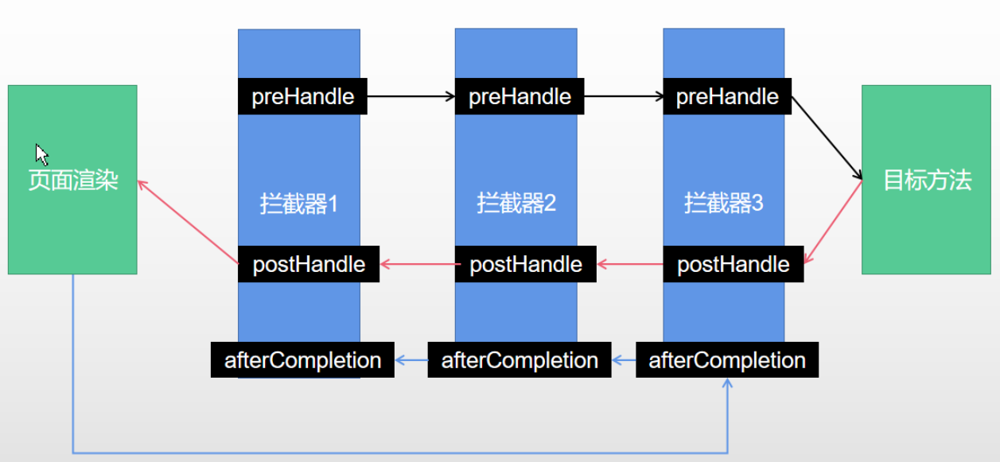

# 47、视图解析-源码分析-视图解析器与视图

**视图解析原理流程**：

1. 目标方法处理的过程中（阅读`DispatcherServlet`源码），所有数据都会被放在 `ModelAndViewContainer` 里面，其中包括数据和视图地址。

2. 方法的参数是一个自定义类型对象（从请求参数中确定的），把他重新放在 `ModelAndViewContainer` 。

3. 任何目标方法执行完成以后都会返回`ModelAndView`（数据和视图地址）。

4. `processDispatchResult()`处理派发结果（页面改如何响应）

   `render(mv, request, response);` 进行页面渲染逻辑

   - 根据方法的`String`返回值得到 `View` 对象【定义了页面的渲染逻辑】
     * 1、所有的视图解析器尝试是否能根据当前返回值得到`View`对象
     * 2、得到了 `redirect:/main.html --> Thymeleaf new RedirectView()`。
     * 3、`ContentNegotiationViewResolver` 里面包含了下面所有的视图解析器，内部还是利用下面所有视图解析器得到视图对象。
     * 4、`view.render(mv.getModelInternal(), request, response);` 视图对象调用自定义的render进行页面渲染工作。
       * `RedirectView` 如何渲染【重定向到一个页面】
       * 获取目标`url地址`
       * `response.sendRedirect(encodedURL);`

**视图解析**：

- 返回值以 `forward:` 开始： `new InternalResourceView(forwardUrl);` --> 转发`request.getRequestDispatcher(path).forward(request, response);`

- 返回值以 `redirect:` 开始： `new RedirectView()` --> render就是重定向

- 返回值是普通字符串：`new ThymeleafView()`—>

# 48-49、拦截器

## 一、登录检查与静态资源放行

1. 编写一个拦截器实现`HandlerInterceptor`接口
2. 拦截器注册到容器中（实现`WebMvcConfigurer`的`addInterceptors()`）
3. 指定拦截规则（注意，如果是拦截所有，静态资源也会被拦截】

编写一个实现`HandlerInterceptor`接口的拦截器：

```java
/**
 * 登录检查
 * 1. 配置好拦截器要拦截哪些请求
 * 2. 把这些配置放在容器中
 */
@Slf4j
public class LoginInterceptor implements HandlerInterceptor {

    /**
     * 目标方法执行之前
     */
    @Override
    public boolean preHandle(HttpServletRequest request, HttpServletResponse response, Object handler) throws Exception {

        String requestURI = request.getRequestURI();
        log.info("preHandle拦截的请求路径是{}",requestURI);

        // 登录检查逻辑
        HttpSession session = request.getSession();

        Object loginUser = session.getAttribute("loginUser");

        if(loginUser != null){
            // 放行
            return true;
        }

        // 拦截住。未登录。跳转到登录页
        request.setAttribute("msg","请先登录");
		// re.sendRedirect("/");
        request.getRequestDispatcher("/").forward(request,response);
        return false;
    }

    /**
     * 目标方法执行完成以后
     */
    @Override
    public void postHandle(HttpServletRequest request, HttpServletResponse response, Object handler, ModelAndView modelAndView) throws Exception {
        log.info("postHandle执行{}",modelAndView);
    }

    /**
     * 页面渲染以后
     */
    @Override
    public void afterCompletion(HttpServletRequest request, HttpServletResponse response, Object handler, Exception ex) throws Exception {
        log.info("afterCompletion执行异常{}",ex);
    }
}
```

拦截器注册到容器中 && 指定拦截规则：

```java
@Configuration
public class AdminWebConfig implements WebMvcConfigurer{
    @Override
    public void addInterceptors(InterceptorRegistry registry) {
        registry.addInterceptor(new LoginInterceptor())//拦截器注册到容器中
                .addPathPatterns("/**")  //所有请求都被拦截包括静态资源
                .excludePathPatterns("/","/login","/css/**","/fonts/**","/images/**",
                        "/js/**","/aa/**"); //放行的请求
}
```

## 二、拦截器的执行时机和原理

1. 根据当前请求，找到`HandlerExecutionChain`（可以处理请求的handler以及handler的所有 拦截器）
2. 先来顺序执行 所有拦截器的 `preHandle()`方法。
   - 如果当前拦截器`preHandle()`返回为`true`。则执行下一个拦截器的`preHandle();`
   - 如果当前拦截器返回为`false`。直接倒序执行所有已经执行了的拦截器的 `afterCompletion();`
3. 如果任何一个拦截器返回`false`，直接跳出不执行目标方法。
4. 所有拦截器都返回`true`，才执行目标方法。
5. 倒序执行所有拦截器的`postHandle()`方法。
6. 前面的步骤有任何异常都会直接倒序触发 `afterCompletion()`。
7. 页面成功渲染完成以后，也会倒序触发 `afterCompletion()`。



`DispatcherServlet`中涉及到`HandlerInterceptor`的地方：

```java
public class DispatcherServlet extends FrameworkServlet {
    
    ...
    
	protected void doDispatch(HttpServletRequest request, HttpServletResponse response) throws Exception {
		HttpServletRequest processedRequest = request;
		HandlerExecutionChain mappedHandler = null;
		boolean multipartRequestParsed = false;

		WebAsyncManager asyncManager = WebAsyncUtils.getAsyncManager(request);

		try {
			ModelAndView mv = null;
			Exception dispatchException = null;

            	...
            
                //该方法内调用HandlerInterceptor的preHandle()
				if (!mappedHandler.applyPreHandle(processedRequest, response)) {
					return;
				}

				// Actually invoke the handler.
				mv = ha.handle(processedRequest, response, mappedHandler.getHandler());

            	...
                //该方法内调用HandlerInterceptor的postHandle()
				mappedHandler.applyPostHandle(processedRequest, response, mv);
			}			
        	processDispatchResult(processedRequest, response, mappedHandler, mv, dispatchException);
		}
		catch (Exception ex) {
            //该方法内调用HandlerInterceptor接口的afterCompletion方法
			triggerAfterCompletion(processedRequest, response, mappedHandler, ex);
		}
		catch (Throwable err) {
            //该方法内调用HandlerInterceptor接口的afterCompletion方法
			triggerAfterCompletion(processedRequest, response, mappedHandler,
					new NestedServletException("Handler processing failed", err));
		}
		finally {
			...
		}
	}

	private void triggerAfterCompletion(HttpServletRequest request, HttpServletResponse response,
			@Nullable HandlerExecutionChain mappedHandler, Exception ex) throws Exception {

		if (mappedHandler != null) {
            //该方法内调用HandlerInterceptor接口的afterCompletion方法
			mappedHandler.triggerAfterCompletion(request, response, ex);
		}
		throw ex;
	}

	private void processDispatchResult(HttpServletRequest request, HttpServletResponse response,
			@Nullable HandlerExecutionChain mappedHandler, @Nullable ModelAndView mv,
			@Nullable Exception exception) throws Exception {

        ...

		if (mappedHandler != null) {
            //该方法内调用HandlerInterceptor接口的afterCompletion方法
			// Exception (if any) is already handled..
			mappedHandler.triggerAfterCompletion(request, response, null);
		}
	}
}
```

```java
public class HandlerExecutionChain {
    
    ...
    
	boolean applyPreHandle(HttpServletRequest request, HttpServletResponse response) throws Exception {
		for (int i = 0; i < this.interceptorList.size(); i++) {
			HandlerInterceptor interceptor = this.interceptorList.get(i);
            //HandlerInterceptor的preHandle方法
			if (!interceptor.preHandle(request, response, this.handler)) {
                
				triggerAfterCompletion(request, response, null);
				return false;
			}
			this.interceptorIndex = i;
		}
		return true;
	}
    
   	void applyPostHandle(HttpServletRequest request, HttpServletResponse response, @Nullable ModelAndView mv)
			throws Exception {

		for (int i = this.interceptorList.size() - 1; i >= 0; i--) {
			HandlerInterceptor interceptor = this.interceptorList.get(i);
            
            //HandlerInterceptor接口的postHandle方法
			interceptor.postHandle(request, response, this.handler, mv);
		}
	}
    
    void triggerAfterCompletion(HttpServletRequest request, HttpServletResponse response, @Nullable Exception ex) {
		for (int i = this.interceptorIndex; i >= 0; i--) {
			HandlerInterceptor interceptor = this.interceptorList.get(i);
			try {
                //HandlerInterceptor接口的afterCompletion方法
				interceptor.afterCompletion(request, response, this.handler, ex);
			}
			catch (Throwable ex2) {
				logger.error("HandlerInterceptor.afterCompletion threw exception", ex2);
			}
		}
	} 
} 
```

# 50-60、文件上传

## 一、单文件与多文件上传的使用

- 页面代码`/static/form/form_layouts.html`

```html
<form role="form" th:action="@{/upload}" method="post" enctype="multipart/form-data">
    <div class="form-group">
        <label for="exampleInputEmail1">邮箱</label>
        <input type="email" name="email" class="form-control" id="exampleInputEmail1" placeholder="Enter email">
    </div>
    
    <div class="form-group">
        <label for="exampleInputPassword1">名字</label>
        <input type="text" name="username" class="form-control" id="exampleInputPassword1" placeholder="Password">
    </div>
    
    <div class="form-group">
        <label for="exampleInputFile">头像</label>
        <input type="file" name="headerImg" id="exampleInputFile">
    </div>
    
    <div class="form-group">
        <label for="exampleInputFile">生活照</label>
        <input type="file" name="photos" multiple>
    </div>
    
    <div class="checkbox">
        <label>
            <input type="checkbox"> Check me out
        </label>
    </div>
    <button type="submit" class="btn btn-primary">提交</button>
</form>
```

- 控制层代码

```java
@Slf4j
@Controller
public class FormTestController {

    @GetMapping("/form_layouts")
    public String form_layouts(){
        return "form/form_layouts";
    }

    @PostMapping("/upload")
    public String upload(@RequestParam("email") String email,
                         @RequestParam("username") String username,
                         @RequestPart("headerImg") MultipartFile headerImg,
                         @RequestPart("photos") MultipartFile[] photos) throws IOException {

        log.info("上传的信息：email={}，username={}，headerImg={}，photos={}",
                 email,username,headerImg.getSize(),photos.length);

        if(!headerImg.isEmpty()){
            //保存到文件服务器，OSS服务器
            String originalFilename = headerImg.getOriginalFilename();
            headerImg.transferTo(new File("H:\\cache\\"+originalFilename));
        }

        if(photos.length > 0){
            for (MultipartFile photo : photos) {
                if(!photo.isEmpty()){
                    String originalFilename = photo.getOriginalFilename();
                    photo.transferTo(new File("H:\\cache\\"+originalFilename));
                }
            }
        }
        return "main";
    }
}
```

文件上传相关的配置类：

- `org.springframework.boot.autoconfigure.web.servlet.MultipartAutoConfiguration`
- `org.springframework.boot.autoconfigure.web.servlet.MultipartProperties`

文件大小相关配置项：

```properties
spring.servlet.multipart.max-file-size=10MB
spring.servlet.multipart.max-request-size=100MB
```

